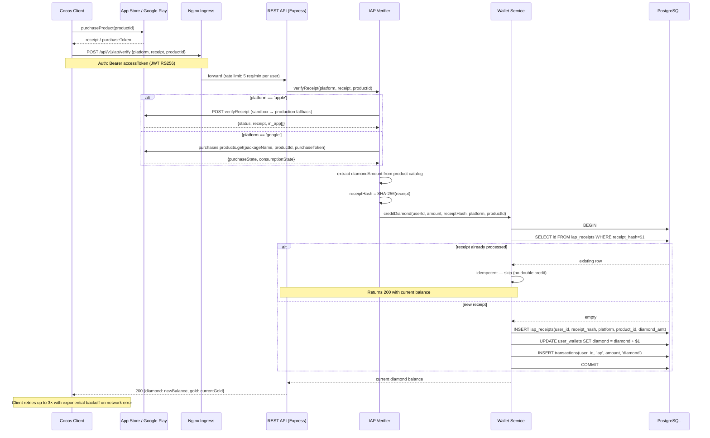
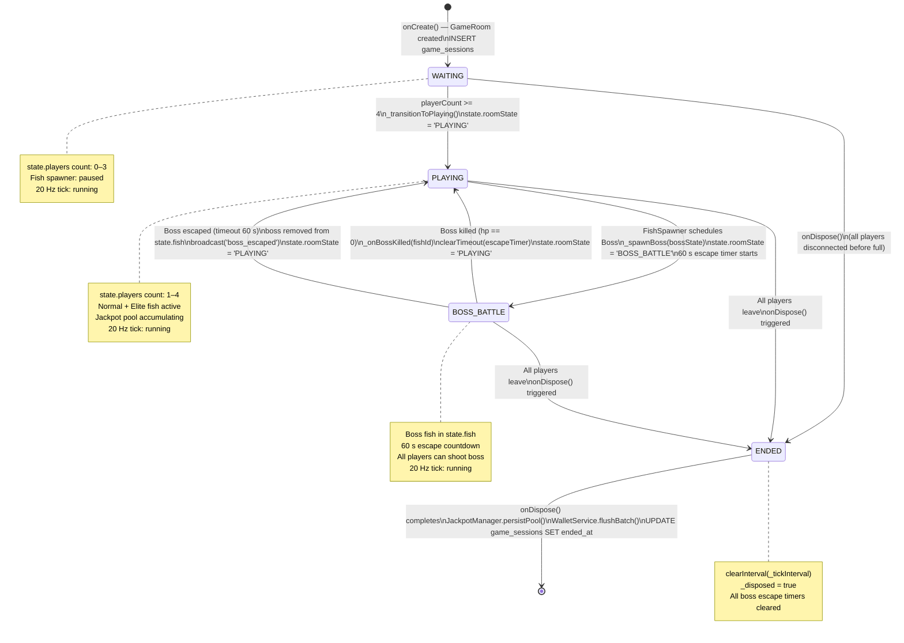

# System Architecture Document — Fishing Arcade Game

<!-- DOC-ID: ARCH-FISHING-ARCADE-GAME-20260422 -->
<!-- Parent: EDD-FISHING-ARCADE-GAME-20260422 (docs/EDD.md) -->
<!-- Stack: TypeScript + Node.js + Colyseus 0.15 + Cocos Creator 4.x -->

---

## Document Control

| Field | Content |
|-------|---------|
| **DOC-ID** | ARCH-FISHING-ARCADE-GAME-20260422 |
| **Project** | fishing-arcade-game |
| **Version** | v1.0 |
| **Status** | DRAFT |
| **Source** | EDD v1.5 (IN_REVIEW) |
| **Date** | 2026-04-22 |

---

## §1 C4 Component Diagram

The following diagram reproduces and enhances the C4 Component view from EDD §1.1. It shows all runtime components, their containers, and communication paths.

```mermaid
C4Component
    title Fishing Arcade Game — Component Architecture (C4 Level 3)

    Container_Boundary(client, "Cocos Creator 4.x Client (iOS / Android)") {
        Component(boot, "Boot Scene", "TypeScript", "Init, orientation lock, landscape lock, persistent node setup")
        Component(netmgr, "NetworkManager", "TypeScript + Colyseus SDK", "WebSocket lifecycle, JWT refresh, reconnect strategy (max 3 × exponential backoff)")
        Component(datamgr, "DataManager", "TypeScript singleton", "Player data cache, wallet state (gold/diamond); invalidated on logout/room leave")
        Component(gamescene, "GameRoom Scene", "TypeScript", "Fish/Bullet ObjectPools, Cannon state machine (IDLE→CHARGING→FIRING→COOLING)")
        Component(uimgr, "UILayer / ModalStack", "TypeScript", "HUD, NumberRoller, PrivacyConsentModal, JackpotOddsModal, AccountDeletionFlow")
        Component(a11y, "AccessibilityHelper", "TypeScript + jsb.reflection", "VoiceOver (iOS Keychain) / TalkBack (Android Keystore) bridge; WCAG AAA contrast")
        Component(secure, "SecureStorage", "TypeScript + jsb.reflection", "Refresh token storage: iOS Keychain / Android EncryptedSharedPreferences")
    }

    Container_Boundary(server, "Node.js Backend (Docker / Kubernetes 1.29)") {
        Component(colyseus, "Colyseus 0.15 Server", "Node.js + TypeScript", "Room lifecycle; state sync 20 Hz tick (50 ms); Schema v2 delta encoding")
        Component(gameroom, "GameRoom Handler", "TypeScript", "onJoin/onLeave/onMessage dispatch; maxClients = 4; 10 s reconnection window")
        Component(rtpeng, "RTP Engine", "TypeScript", "Integer-denominator CSPRNG (crypto.randomInt); dynamic hit-rate adjustment; BigInt accounting")
        Component(spawner, "Fish Spawner", "TypeScript", "Normal/Elite/Boss wave scheduling; deterministic Bezier path generation per fish ID")
        Component(jackpot, "Jackpot Manager", "TypeScript", "Global pool accumulation; Lua atomic GETDEL+SET; PostgreSQL persistence on dispose/restart")
        Component(iapverify, "IAP Verifier", "TypeScript", "Apple receipt + Google purchase token validation; idempotent diamond grant via receipt_hash")
        Component(walletdb, "Wallet Service", "TypeScript", "Atomic gold/diamond transactions; FOR UPDATE row lock; write-behind batch flush on dispose")
        Component(privacysvc, "Privacy Service", "TypeScript", "Consent records; 30-day soft-delete schedule; cron executeScheduledDeletions; PII anonymisation")
        Component(restapi, "REST API", "Express 4.x + TypeScript", "Auth, profile, IAP webhook, PDPA endpoints; Zod schema validation; OpenAPI via swagger-jsdoc")
    }

    Container_Boundary(data, "Data Layer") {
        ComponentDb(pg, "PostgreSQL 15", "RDBMS", "Users, wallets, transactions, consents, sessions — ACID guarantees; JSONB; 7-year audit retention")
        ComponentDb(redis, "Redis 7", "Cache / Atomic Counter", "Jackpot pool (INCRBYFLOAT); session tokens; rate-limit counters; email-confirm tokens (24 h TTL)")
    }

    Container_Boundary(infra, "Kubernetes Cluster (1.29)") {
        Component(ingress, "Nginx Ingress", "Ingress Controller", "TLS 1.3 termination; WebSocket upgrade; sticky-session cookie (colyseus-affinity); proxy timeout 3600 s")
        Component(hpa, "HPA", "autoscaling/v2", "CPU utilisation > 70% trigger; min 2 / max 5 replicas")
        Component(pdb, "PodDisruptionBudget", "policy/v1", "minAvailable: 1 — prevents simultaneous eviction during rolling updates")
        Component(netpol, "NetworkPolicy", "networking.k8s.io/v1", "Ingress: ingress-nginx only on 2567+3000; Egress: PG:5432, Redis:6379, :443 (IAP)")
        Component(crons, "CronJobs", "Kubernetes CronJob", "deletion-executor (daily 02:00); jackpot-persist (*/5); wallet-reconcile (daily 03:00); ip-cleanup (daily 04:00); gold-restore (daily 06:00)")
    }

    Container_Boundary(external, "External Services") {
        Component(applestore, "App Store IAP", "HTTPS / Apple API", "Receipt validation endpoint")
        Component(googleplay, "Google Play IAP", "HTTPS / Google API", "purchases.products.get")
        Component(firebase, "Firebase Analytics", "SDK 10.x", "DAU, retention, event tracking; marketing_* events toggleable per consent")
    }

    Rel(boot, netmgr, "initializes")
    Rel(boot, secure, "stores refresh token")
    Rel(netmgr, colyseus, "WebSocket (Colyseus SDK)", "wss://")
    Rel(netmgr, restapi, "HTTP/REST", "https://")
    Rel(gamescene, netmgr, "state callbacks; send shoot/set_multiplier/start_game")
    Rel(uimgr, datamgr, "reads gold, diamond, nickname")
    Rel(netmgr, datamgr, "updates gold/diamond on state patch")
    Rel(colyseus, gameroom, "routes room messages")
    Rel(gameroom, rtpeng, "hit adjudication per shoot")
    Rel(gameroom, spawner, "fish wave control")
    Rel(gameroom, jackpot, "pool accumulation + tryTrigger")
    Rel(gameroom, walletdb, "debitGold / creditGold")
    Rel(restapi, iapverify, "POST /iap/verify")
    Rel(iapverify, applestore, "verifyReceipt HTTPS")
    Rel(iapverify, googleplay, "purchases.products.get HTTPS")
    Rel(iapverify, walletdb, "creditDiamond [idempotent]")
    Rel(restapi, privacysvc, "PDPA operations")
    Rel(walletdb, pg, "ACID transactions (FOR UPDATE)")
    Rel(jackpot, redis, "INCRBYFLOAT game:jackpot:pool; Lua atomic claim")
    Rel(jackpot, pg, "persist on trigger / server restart")
    Rel(gamescene, firebase, "logEvent()")
    Rel(ingress, colyseus, "WebSocket :2567")
    Rel(ingress, restapi, "REST :3000")
    Rel(hpa, gameroom, "scales pod count")
```



---

## §2 Sequence Diagrams — Critical Flows

### §2.1 Player Join + Matchmaking Flow

```mermaid
sequenceDiagram
    participant C as Cocos Client
    participant NG as Nginx Ingress
    participant API as REST API (Express)
    participant COL as Colyseus Server
    participant GR as GameRoom Handler
    participant WS as Wallet Service
    participant PG as PostgreSQL

    C->>NG: POST /api/v1/auth/login {email, password}
    NG->>API: forward
    API->>PG: SELECT users WHERE email_hash=$1
    PG-->>API: user row (bcrypt verify)
    API-->>C: 200 {accessToken (15 min), refreshToken (30 day)}
    C->>C: SecureStorage.set('refresh_token', ...)

    C->>NG: WebSocket upgrade → wss://game.example.com/
    NG->>COL: WebSocket (sticky cookie: colyseus-affinity)
    C->>COL: joinOrCreate('game_room', {token, nickname})
    COL->>GR: onAuth(client, options, request)
    GR->>GR: verifyJwt(token) — throws if invalid/expired
    GR-->>COL: payload (userId, role)
    COL->>GR: onJoin(client, options)
    GR->>WS: getGold(userId)
    WS->>PG: SELECT gold FROM user_wallets WHERE user_id=$1
    PG-->>WS: gold balance
    WS-->>GR: gold
    GR->>GR: assign slotIndex (0=BL, 1=BR, 2=TL, 3=TR)
    GR->>GR: state.players.set(sessionId, playerState)
    GR->>PG: INSERT game_sessions / UPDATE player_ids, player_count
    GR-->>C: Schema state patch (all players, room state)
    
    Note over GR: When playerCount >= 4 → _transitionToPlaying()
    GR->>GR: state.roomState = 'PLAYING'
    GR-->>C: State patch broadcast (roomState='PLAYING')
    C->>C: UILayer hides WaitingOverlay; game begins
```

### §2.2 Shoot → RTP Adjudicate → Jackpot Check → Wallet Update Flow

```mermaid
sequenceDiagram
    participant C as Cocos Client
    participant GR as GameRoom Handler
    participant RTP as RTP Engine
    participant JP as Jackpot Manager
    participant WS as Wallet Service
    participant PG as PostgreSQL
    participant RD as Redis

    C->>GR: send('shoot', {bulletId, fishId, betAmount, cannonMultiplier})
    
    GR->>GR: 0. Dedup check — bulletId in activeBullets Set?
    alt duplicate bulletId
        GR->>GR: silently drop (no log, no response)
    else new bullet
        GR->>GR: activeBullets.add(bulletId); check size <= 10
        GR->>GR: 1. Validate: player.gold >= betAmount
        GR->>GR: 2. Validate: fishId exists and alive in state.fish
        GR->>WS: debitGold(userId, betAmount)
        WS->>PG: BEGIN; SELECT gold FOR UPDATE; UPDATE -betAmount; INSERT transactions; COMMIT
        PG-->>WS: OK
        WS-->>GR: OK
        GR->>GR: state.players.get(sessionId).gold -= betAmount  [schema update]
        
        GR->>RTP: adjudicate(fishType, betAmount, cannonMultiplier)
        RTP->>RTP: _dynamicAdjust(fishCfg) — scale hitRateNumerator if RTP drifts
        RTP->>RTP: roll = crypto.randomInt(denominator)
        RTP-->>GR: {hit: boolean, payout: number}
        
        alt hit == true
            GR->>GR: FishState.hp -= 1
            alt hp == 0 (fish killed)
                GR->>WS: creditGold(userId, payout, 'earn')
                WS->>PG: BEGIN; UPDATE gold +payout; INSERT transactions; COMMIT
                GR->>GR: state.players.get(sessionId).gold += payout  [schema update]
                GR->>GR: state.fish.delete(fishId)  [auto-broadcasts delta]
                Note over GR,C: fish_killed implicit via schema delta (no separate message)
            else hp > 0
                Note over GR,C: HP decrement auto-synced via schema delta patch
            end
            
            GR->>JP: tryTrigger(cannonMultiplier, userId)
            JP->>JP: odds = JACKPOT_ODDS[multiplier]; roll = crypto.randomInt(odds)
            alt jackpot triggered (roll == 0)
                JP->>RD: EVAL Lua: GETDEL game:jackpot:pool; SET game:jackpot:pool SEED
                RD-->>JP: poolAmount string
                JP->>PG: BEGIN; INSERT jackpot_history; UPDATE user_wallets +poolAmount; INSERT transactions('jackpot'); COMMIT
                JP-->>GR: {winnerId, amount}
                GR->>GR: state.players.get(sessionId).gold += jackpotAmount
                GR->>RTP: addExternalPayout(jackpotAmount)  [RTP accounting]
                GR->>GR: broadcast('jackpot_won', {winnerId, amount})
                GR-->>C: message: jackpot_won → celebration animation
            else no jackpot
                JP-->>GR: null
            end
        end
        
        GR->>PG: INSERT rtp_logs (fire-and-forget, catch+log on error)
        GR-->>C: send('shoot_result', {hit, payout})
        GR->>GR: activeBullets.delete(bulletId)
    end
```

### §2.3 IAP Purchase → Receipt Verify → Diamond Credit Flow



---

## §3 Deployment Architecture

### §3.1 Kubernetes Topology

```
Internet
    │
    ▼ TLS 1.3 (cert-manager / Let's Encrypt)
┌─────────────────────────────────────────────┐
│  Nginx Ingress Controller                   │
│  game.example.com                           │
│  /api/* → :3000 (REST)                      │
│  /*     → :2567 (Colyseus WebSocket)        │
│  Sticky: cookie colyseus-affinity (86400 s) │
└───────────────┬─────────────────────────────┘
                │
    ┌───────────▼──────────────┐
    │  fishing-game-svc        │
    │  (ClusterIP Service)     │
    │  port 2567 + 3000        │
    └───────────┬──────────────┘
                │   NetworkPolicy: ingress-nginx → 2567,3000 only
    ┌───────────▼──────────────────────────────────────────────────┐
    │  Deployment: fishing-game-server (min 2 / max 5 replicas)    │
    │                                                              │
    │  Pod A                        Pod B          ...Pod N        │
    │  ┌─────────────────────┐  ┌──────────────────────────┐      │
    │  │ game-server container│  │ game-server container    │      │
    │  │ image: :${GIT_SHA}  │  │ image: :${GIT_SHA}       │      │
    │  │ :2567 Colyseus WS   │  │ :2567 Colyseus WS        │      │
    │  │ :3000 REST API      │  │ :3000 REST API           │      │
    │  │ CPU req:500m lim:2  │  │ CPU req:500m lim:2       │      │
    │  │ RAM req:512Mi lim:2G│  │ RAM req:512Mi lim:2G     │      │
    │  │ gracePeriod: 60 s   │  │ gracePeriod: 60 s        │      │
    │  └─────────────────────┘  └──────────────────────────┘      │
    │                                                              │
    │  HPA: CPU > 70% → scale up (max 5)                          │
    │  PDB: minAvailable = 1 (rolling update safe)                 │
    └───────────┬──────────────────────────────────────────────────┘
                │  NetworkPolicy: egress → PG:5432, Redis:6379, :443
    ┌───────────┴─────────────────────────────┐
    │                                         │
    ▼                                         ▼
┌──────────────────┐               ┌────────────────────┐
│  PostgreSQL 15   │               │  Redis 7           │
│  (Streaming Rep) │               │  (Sentinel mode)   │
│  game_sessions   │               │  game:jackpot:pool │
│  users, wallets  │               │  session tokens    │
│  transactions    │               │  rate-limit counters│
│  rtp_logs (perm) │               │  email-confirm TTL  │
│  7-yr retention  │               │  AOF persistence    │
└──────────────────┘               └────────────────────┘

Kubernetes CronJobs (separate pods, same cluster):
  deletion-executor   daily 02:00 UTC  → PrivacyService.executeScheduledDeletions()
  jackpot-persist     */5 min          → JackpotManager.persistPool() (Redis → PG)
  wallet-reconcile    daily 03:00 UTC  → cross-check user_wallets vs transactions SUM
  ip-cleanup          daily 04:00 UTC  → NULL ip_address older than 90 days
  gold-restore        daily 06:00 UTC  → WalletService.restoreDailyGold() [threshold: OQ5]
```

### §3.2 Kubernetes Resource Manifest Summary

| Resource | Kind | Key Config |
|----------|------|------------|
| `fishing-game-server` | Deployment | replicas: 2; terminationGracePeriodSeconds: 60; image pinned to `${GIT_SHA}` |
| `fishing-game-svc` | Service | ClusterIP; ports 2567 (ws) + 3000 (rest); sticky-session annotation |
| `fishing-game-ingress` | Ingress | TLS cert `fishing-game-tls`; proxy-read-timeout 3600 s; affinity cookie |
| `fishing-game-hpa` | HorizontalPodAutoscaler | autoscaling/v2; cpu 70%; min 2 / max 5 |
| `fishing-game-pdb` | PodDisruptionBudget | policy/v1; minAvailable: 1 |
| `fishing-game-netpol` | NetworkPolicy | Ingress: ingress-nginx; Egress: PG, Redis, :443 |

### §3.3 Secrets Management

All credentials injected via Kubernetes Secrets (or external Vault). Never hardcoded or committed to VCS.

| Secret Name | Key | Consumer |
|-------------|-----|----------|
| `db-secret` | `url` | DATABASE_URL |
| `redis-secret` | `url` | REDIS_URL |
| `crypto-secret` | `aes-key`, `hmac-key` | AES_KEY, HMAC_SECRET_KEY |
| `jwt-secret` | `private-key`, `public-key` | JWT_PRIVATE_KEY, JWT_PUBLIC_KEY |

Application validates all required env vars at startup and exits with a clear error message if any are missing.

---

## §4 Game Room State Machine



**Dispose guard**: `_tick()` checks `if (this._disposed) return;` as its first line. `setInterval` may fire once more after `clearInterval` within the same event-loop turn.

**JACKPOT** is not a separate room state: jackpot award is an overlay event (message `jackpot_won` broadcast) that occurs within the PLAYING or BOSS_BATTLE state without interrupting room progression.

---

## §5 Technology Decision Rationale

| Layer | Technology | Version | Rationale |
|-------|-----------|---------|-----------|
| Game Client | Cocos Creator | 4.x | User-specified; native iOS/Android build; Spine animation support; TypeScript; hot-update support |
| Realtime Backend | Colyseus | 0.15 | MIT license; room-based isolation; built-in Schema v2 delta serialisation; matches existing `sam-gong-game` stack |
| Backend Language | TypeScript + Node.js | 5.x / 20 LTS | Full-stack TypeScript reduces context switching; team familiarity; async/non-blocking I/O suitable for realtime game server |
| REST Framework | Express | 4.x | Minimal, well-understood; OpenAPI spec generation via swagger-jsdoc; lightweight for game backend |
| Primary Database | PostgreSQL | 15 | ACID guarantees for wallet atomicity; `FOR UPDATE` row-lock prevents double-spend; JSONB for schema evolution; 7-year audit retention |
| Cache / Jackpot State | Redis | 7 | Sub-millisecond atomic `INCRBYFLOAT` for jackpot pool accumulation; session token TTL; rate-limit counters; avoids PG round-trip per shot |
| Schema Validation | Zod | 3.x | Runtime validation at all REST endpoint boundaries; TypeScript type inference eliminates boilerplate; rejects unknown fields |
| RNG | `crypto.randomInt()` | Node built-in | CSPRNG; uniform distribution without floating-point modulo bias; no external dependency |
| Integer RNG Model | Denominator-based | — | Probabilities expressed as `hits_per_N` integers prevent floating-point drift; `_totalBet`/`_totalPaid` as BigInt prevent overflow |
| IAP Verification | apple-receipt-verifier + google-play-library | latest | Battle-tested; handles sandbox vs production endpoint switching automatically |
| Observability | Pino (structured JSON) + Prometheus metrics | latest | Low overhead; structured log fields match PRD §7.7.1; `redact` config masks PII fields |
| Infrastructure | Docker + Kubernetes | k8s 1.29 | Container isolation; CPU-based HPA auto-scale; pod affinity for Colyseus sticky sessions |
| Analytics | Firebase Analytics | SDK 10.x | PRD §7.8; free tier covers DAU 10K target; consent-gated `marketing_*` events |

**Key architectural decisions:**

1. **Server-authoritative design**: ALL game outcome calculations (RTP, fish spawn paths, jackpot trigger, bullet-hit adjudication) execute server-side. Client is display-only. Satisfies US-RTP-001/AC-2 and PRD §7.4 anti-cheat requirements.
2. **Integer-denominator RNG**: Probabilities expressed as `hits_per_N` integers prevent floating-point drift (BRD §0.1 technical risk R2, US-RTP-001/AC-3).
3. **Colyseus Schema v2**: `@type` decorators from `@colyseus/schema` v2. `MapSchema`/`ArraySchema` for fish and player collections; `.onAdd` + per-item `.listen()` on the client.
4. **Redis for jackpot pool hot path**: Atomic `INCRBYFLOAT game:jackpot:pool` avoids PG round-trip per shot. Jackpot claim via Lua script (GETDEL+SET) is atomic. PG remains source of truth, written on trigger or server restart. Redis AOF persistence enabled (risk R2 mitigation).

---

## §6 NFR Mapping

| PRD NFR | Target | EDD Engineering Approach |
|---------|--------|--------------------------|
| WebSocket p99 latency | < 100 ms | Colyseus 20 Hz state tick (50 ms); priority message queue; k6 pressure test gate at month 2 |
| REST API P99 latency | < 500 ms | Express middleware timeout 450 ms; circuit breaker on DB calls; pgBouncer connection pooling |
| Concurrent rooms | 500 rooms | k8s HPA CPU > 70% trigger; Colyseus horizontal pod autoscale (max 5 pods); room affinity via Redis |
| Client FPS | ≥ 30 (2 GB RAM) | ObjectPool pre-warm; ETC2/ASTC texture compression; Low-End Mode auto-activates when FPS < 25 for 5 s |
| RTP accuracy | error < 0.1% | Integer-denominator RNG; 100K simulation CI gate (TC-RTP-001 blocks merge); isolated RTP module (100% unit coverage) |
| Transport security | TLS 1.3 | Ingress controller terminates TLS; internal cluster traffic plain TCP; `HSTS: max-age=31536000` |
| Availability | 99.9% | min 2 Pod replicas; PDB minAvailable=1; PG streaming replication; Redis Sentinel; RTO 30 min |
| Data retention — RTP logs | Permanent | `rtp_logs` never deleted; no cron touches this table |
| Data retention — IP address | 90 days | `ip-cleanup` CronJob NULLs `game_sessions.ip_address` after 90 days |
| Data retention — transactions | 7 years | Transaction rows retained after user deletion (userId UUID reference only); PII anonymised in `users` row |
| PDPA deletion | 30 days | Soft-delete on request; `deletion-executor` cron anonymises PII after 30 days; consent records retained (ON DELETE RESTRICT) |
