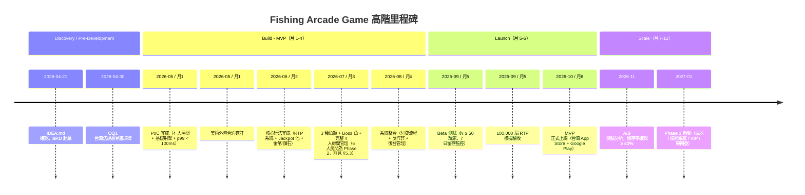

# Business Requirements Document — Fishing Arcade Game

<!-- Document Control -->
<!-- DOC-ID: BRD-FISHING-ARCADE-GAME-20260421 -->
<!-- Parent: IDEA-FISHING-ARCADE-GAME-20260421 -->
<!-- Downstream: PRD.md, PDD.md, EDD.md -->
<!-- Generated by: /devsop-gen-brd (Full-Auto) -->

---

## Document Control

| 欄位 | 內容 |
|------|------|
| **DOC-ID** | BRD-FISHING-ARCADE-GAME-20260421 |
| **專案名稱** | fishing-arcade-game |
| **文件版本** | v0.1-draft |
| **狀態** | DRAFT |
| **作者** | tobala（由 /devsop-gen-brd 自動生成） |
| **建立日期** | 2026-04-21 |
| **最後更新** | 2026-04-21 |
| **上游文件** | IDEA-FISHING-ARCADE-GAME-20260421（docs/IDEA.md） |
| **下游文件** | PRD.md / PDD.md / EDD.md（由本文件產生） |
| **審核狀態** | 待 /devsop-brd-review 審查 |

---

## §0 背景研究（Background Research）

### §0.1 市場研究摘要

捕魚街機遊戲（Fish Shooting Arcade）是亞洲成熟高變現品類，台灣、中國、東南亞市場長期存在穩定需求。市場特點：低學習門檻、高付費轉化率、長生命周期。

**市場規模估算（AI 推斷）：**
- 全球亞洲線上休閒遊戲 TAM：約 $20 億 USD
- 台灣 + 東南亞捕魚遊戲 SAM：約 $2 億 USD
- 12 個月可獲取 SOM：$120,000 USD（DAU 10K × 付費率 5% × ARPPU $20 × 12 個月，同時驗證 SAM × 0.06% 市佔）

**技術生態研究：**
- Colyseus 0.15（MIT 授權，750K+ npm 下載，6.4K GitHub Stars）：成熟即時多人遊戲框架
- Cocos Creator 4.x：亞洲手遊主流引擎，原生支援移動端熱更新
- TypeScript 全棧方案：降低前後端協作摩擦，team 熟悉度高（sam-gong-game 同棧已有實作）

**競品研究摘要：**
- 歡樂捕魚類（台灣手遊廠）：ARPPU 推估 $10-15（每位付費用戶月消費），App Store 評分 4.0-4.3，30 日留存 < 30%（業界口碑，信心水準：中）
- 海底捕魚王 / 電玩城聯網版：DAU > 5,000（台灣電玩城社群），技術架構老舊，移動端體驗差
- taishan6868/Fishing-game-source-code：商業完整度高但已停服，Lua 架構無真實多人能力

**技術風險研究：**
- 主要陷阱：單服務器瓶頸（Colyseus 房間天然隔離可緩解）、DB 非同步阻塞、WebSocket 延遲需補間動畫
- RTP 精度：整數分母 RNG 設計是業界共識，防止浮點誤差累積

---

## §1 Executive Summary（執行摘要）

### §1.1 假設新聞稿（PR-FAQ — Amazon Working Backwards）

---

**【假設新聞稿】Fishing Arcade Game 正式上線——讓台灣及東南亞玩家體驗真正的即時多人捕魚競技**

*2026 年第三季，台灣*

**tobala Games 推出 Fishing Arcade Game，幫助亞洲休閒遊戲玩家解決現有捕魚遊戲社交競爭弱、留存率難以維持的核心問題。**

今日，tobala Games 宣布旗下首款多人即時捕魚街機遊戲《Fishing Arcade Game》正式上線。這款以 Cocos Creator 4.x + Colyseus 0.15 為技術核心的手遊產品，首次將真正的即時多人競技（4-6 人同場搶魚）帶入捕魚遊戲品類，徹底解決現有產品「形式多人、實質單機」的核心痛點。

**為什麼是現在？** 亞洲捕魚遊戲市場已逾 10 年未有技術架構革新。現有 Lua 架構產品因無法支撐真實即時多人同步而停服（如 taishan6868/Fishing-game-source-code），主流競品 30 日留存率低於 30%、玩家快速流失。TypeScript + Colyseus 0.15 的出現，使建立毫秒級同步多人捕魚遊戲成本大幅降低，技術窗口期僅有 12-18 個月。

**如何運作？** 玩家只需三步：（1）選擇砲台等級、加入 4-6 人房間；（2）即時射擊競搶普通魚/精英魚/Boss 魚；（3）觸發 Jackpot 獲得高額獎勵、在排行榜被看見。動態 RTP 系統（85-95%）與 Jackpot 池確保玩家感受到「努力有回報」。

**玩家引言：**
> 「以前玩捕魚遊戲，桌上 6 個人但根本感覺不到他們存在。這個有了，搶 Boss 魚的瞬間真的很緊張！」——台北，33 歲上班族，Beta 測試玩家

---

### §1.2 FAQ（預先回答最困難的問題）

**Q1：為什麼現在要做這款產品？**
A：Colyseus 0.15 已達商業穩定，與 Cocos Creator 4.x 的整合方案成熟。現有競品技術架構老舊（Lua / 非原生移動端），無法快速更新。技術換代窗口期約 12-18 個月，團隊有 sam-gong-game 同棧經驗，是最佳切入時機。

**Q2：為什麼是我們而不是大廠？**
A：大廠捕魚遊戲（電玩城聯網版、台灣大廠手遊）均基於 2015-2020 年架構，要支援真實即時多人競技需要整個後端重寫，成本高、優先級低。我們從零設計，3-6 個月可完成大廠 2-3 年才能完成的架構升級。另外，small team 迭代速度更快，數值調整（RTP / Jackpot 池）可每週優化。

**Q3：最大的風險是什麼？**
A：最大風險是「即時多人競技能否顯著提升留存率」這個核心假設（§5.3 Riskiest Assumption）尚未被市場驗證。若 30 日留存率未比競品高 20%，差異化核心失效。緩解策略：MVP 上線前進行 N ≥ 10 玩家原型測試，上線後 6 週內透過 A/B 測試（多人 vs 單人）取得數據。另一個風險是台灣法規（OQ1），目前正在法務預審（期限：2026-04-30）。

**Q4：與競品的核心差異是什麼？**
A：（1）技術架構差異：Colyseus 0.15 真正即時多人 vs 競品偽多人（輪詢/假同步）；（2）策略深度：4 種武器 + 3 種技能（MVP 後）vs 競品單一武器；（3）數值精算：整數分母 RNG 確保 RTP < 0.1% 誤差 vs 競品浮點累積誤差。

**Q5：商業模式是否可持續？**
A：DAU 10K × 5% 付費率 × $20 ARPPU（付費用戶平均月消費）= 月營收 $10K（注：ARPU = $10K / 10K DAU = $1/用戶，ARPPU = $10K / 500 付費用戶 = $20）。$200K 募資資金下，6 個月開發費用約 $100K，行銷 $60K，運維 $40K。若 DAU 達 10K 且付費率 5%，20 個月回收投資。悲觀情境（DAU 5K，付費率 3%）月營收 $3K，需延長回收期但不虧損。

---

## §2 Problem Statement（問題陳述）

### §2.1 As-Is Narrative（現狀描述）

亞洲市場捕魚遊戲玩家的現狀：

1. **實體街機廳衰退**：疫情後街機廳客流持續下降，地理限制明顯，難以維持長期娛樂習慣
2. **手機端捕魚遊戲**：多為單機或弱聯網，玩家無法獲得真實競爭感，快速失去新鮮感
3. **現有線上多人平台**：4-6 人同場但無真實競爭機制，「形式多人、實質單機」；技能系統淺薄，策略選擇不足；動態 RTP 調整不透明，玩家感覺被系統操控；30 日留存率普遍低於 30%

**玩家的 workaround 行為：**
- 在多個平台間切換，尋找「更刺激」的體驗
- 在社群媒體分享爆金截圖（如 Facebook 遊戲社群），作為缺失社交認同的替代出口
- 將遊戲幣花光後即離開，無長期目標驅動

**量化影響：**

| 指標 | 現況 | 目標改善 |
|------|------|---------|
| 競品 30 日留存率 | < 30%（業界口碑，信心水準：中）| ≥ 40%（+33%） |
| 競品 ARPPU | $10-15 USD/月（每位付費用戶）| $20 USD/月（+33% vs 競品高端 $15；+60% vs 中位 $12.5；計算依據：$20/$15-1=33%）|
| 多人競技感知度 | 形式多人，感覺不到對手 | 真實搶魚張力，每秒有競爭決策 |

---

### §2.2 5 Whys（根本原因分析）

```
問題現象：現有線上捕魚遊戲留存率低、玩家快速流失
  Why 1：遊戲體驗重複感強，缺乏長期目標驅動
    Why 2：技能系統淺薄、武器種類單一，策略選擇空間不足
      Why 3：多人競技機制流於形式，4-6 人同場卻感覺不到對手存在，搶魚張力不足
        Why 4：玩家的每一個決策（瞄準哪條魚、何時用技能）都缺乏真實競爭後果
          Why 5（根本原因）：玩家無法獲得「勝利感」與「被他人看見的社交認同」，
                             於是在沒有情感連結的平台上快速流失
```

**技術根因補充**：現有競品基於 2015-2020 年 Lua / 舊世代架構，無法提供真正即時多人狀態同步（p99 延遲 > 500ms），技術上無法創造真實搶魚張力。這是競品無法快速修補的結構性障礙。

---

### §2.3 問題規模（TAM/SAM/SOM）

| 市場層次 | 規模估算 | 計算依據 | 信心水準 |
|---------|---------|---------|---------|
| **TAM**（亞洲線上休閒遊戲） | $20 億 USD | 公開市場研究（Sensor Tower / Data.ai 需在 BRD 階段引用正式報告） | 低 |
| **SAM**（台灣+東南亞捕魚遊戲） | $2 億 USD | TAM × 10%（台灣+東南亞佔亞洲手遊市場估算）| 低 |
| **SOM**（12 個月可獲取市場） | $120,000 USD | DAU 10K × 付費率 5% × ARPPU $20 × 12 個月；同時以 SAM × 0.06% 市佔雙向驗證 | 中 |

*SOM 計算說明：0.06% 市佔率在亞洲中小型手遊新品首年上線屬保守估算，以台灣為起點市場，東南亞為第二階段擴張。*

---

## §3 Business Objectives（商業目標）

### §3.1 SMART 目標

| # | 目標 | Specific | Measurable | Achievable | Relevant | Time-bound |
|---|------|---------|-----------|-----------|---------|-----------|
| OBJ-1 | DAU 達標 | 月活躍用戶達 10,000 | DAU 追蹤（Firebase Analytics）| 同類新品首年 DAU 5K-20K 範圍內（參考：亞洲超休閒手遊 Y1 中位 DAU 約 8K-15K，業界口碑；路徑：行銷預算 $60K × CPI $3 = 20K 安裝量，假設 D30 留存 40% 持續複利 + 有機口碑，估計 Y1 末 DAU 可達 10K；為假設 A3 待驗證項）| 驗證市場規模假設 | 上線後 12 個月 |
| OBJ-2 | 付費轉化 | 付費率達 5% | 付費人數 / DAU | 業界成熟平台 3-8%，5% 屬中段；本產品達成路徑：（1）即時多人競技提升留存意願（連結假設 A1）；（2）Jackpot 機制鼓勵鑽石消費；（3）Beta 測試（N ≥ 50）作為付費率早期信號驗證點（連結假設 A6）；若 Beta 付費意願 < 2%，需重新評估 OBJ-2 目標值 | 驗證商業模式可持續 | 上線後 6 個月 |
| OBJ-3 | 月營收達標 | 月均 ARPPU $20（= 月收入 / 付費用戶數），月營收 $10K | 月收入（金流後台）| OBJ-1 + OBJ-2 達成即自動達成；ARPPU $20 可達性詳見假設 A6；9 個月時評估中期進展（目標月收入 ≥ $5K） | 驗證財務模型 | 上線後 12 個月（OBJ-1 DAU 達標同步）|
| OBJ-4 | 技術 SLA | p99 延遲 < 100ms，500 並發房間穩定 | Colyseus metrics + k6 壓測 | sam-gong-game 同棧已驗證 | 確保多人競技體驗品質 | 上線前（預生產驗收）|
| OBJ-5 | 留存率 | 30 日留存率 ≥ 40% | 上線後 30 天留存追蹤 | 競品 < 30%，目標比競品高 33% | 驗證核心假設 A1 | 上線後第 5 週 |

---

### §3.2 與公司策略對應

| 公司策略目標 | OBJ 對應 | 說明 |
|-----------|---------|------|
| 驗證 TypeScript + Colyseus 多人遊戲商業化可行性 | OBJ-4 + OBJ-5 | 技術 SLA + 留存率共同驗證技術棧選擇 |
| 建立亞洲市場休閒遊戲產品線 | OBJ-1 + OBJ-3 | 首款產品 DAU + 月營收是後續產品線的基準線 |
| 單個產品驗證 RTP 數值引擎商業可用性 | OBJ-2 + OBJ-5 | 付費率 + 留存率共同驗證 RTP 數值設計 |

---

### §3.3 三情境 ROI 分析

| 情境 | DAU | 付費率 | ARPPU（月/付費用戶）| 月營收 | 年收入 | 回收期 |
|------|:---:|:-----:|:-------------------:|:------:|:------:|:-----:|
| **悲觀** | 5,000 | 3% | $20 | $3,000 | $36K | 66 個月 |
| **基準** | 10,000 | 5% | $20 | $10,000 | $120K | 20 個月 |
| **樂觀** | 25,000 | 7% | $25 | $43,750 | $525K | 5 個月 |

*投資基準：$200,000 USD（開發 $100K + 行銷 $60K + 運維 $40K）*

*回收期計算基數：$200K 全部資本支出（含行銷 $60K + 運維 $40K）；若僅計開發成本 $100K，回收期分別為：悲觀 34 個月、基準 10 個月、樂觀 2.5 個月。*

*ARPPU 說明：基準情境 ARPPU $20 僅計 MVP 道具內購收入，VIP 月訂閱（$8-12 USD）為 Phase 2 額外收入來源，MVP 期 ROI 分析不含此項；Phase 2 啟動後需重新建立財務模型。*

*悲觀情境說明：DAU 5K 時月營收 $3K，年收入 $36K，需 66 個月回收 — 若此情境持續，應在上線第 9 個月觸發 Pivot 決策，勿盲目燒錢。*

*Pivot 觸發條件（量化）：若上線第 3 個月 DAU < 3,000 **且** 付費率 < 2%（月營收 < $1,800），立即召開 Pivot 評估會議，依下列三步驟決策：（1）檢視 A/B 測試數據，若多人 vs 單人 30 日留存率差異 < 10%，則即時多人競技假設 A1 失效，轉向純 RNG 娛樂單機路線；（2）若留存率差異 ≥ 10% 但付費率不足，重新設計付費進入點（如降低基礎砲台單價、增加免費體驗局數）；（3）若 DAU < 3,000 且非行銷問題，評估市場定位重新調整或退出台灣市場轉向東南亞先行。*

---

### §3.4 需求追溯矩陣（RTM）

| 業務目標 | 成功指標 | PRD REQ-ID（預留） | BDD Scenario（預留）|
|---------|---------|:----------------:|:-----------------:|
| OBJ-1 DAU 10K | DAU 達標追蹤（上線後 12 個月）| REQ-001 | BDD-DAU-001 |
| OBJ-2 付費率 5% | 付費轉化率監控（上線後 6 個月）| REQ-002 | BDD-PAY-001 |
| OBJ-3 月營收 $10K | 月收入後台確認（上線後 12 個月；9M 中期目標 $5K）| REQ-003 | BDD-REV-001 |
| 7 日留存率 ≥ 50% | 7 日留存率追蹤（§7.2 Input 指標，Firebase Analytics，上線後第 2 週）| REQ-006 | BDD-RET-002 |
| OBJ-4 技術 SLA | p99 < 100ms，500 並發（上線前）| REQ-004 | BDD-TECH-001 |
| OBJ-5 留存率 40% | 30 日留存追蹤（上線後第 5 週）| REQ-005 | BDD-RET-001 |

*PRD REQ-ID 與 BDD Scenario ID 由 /devsop-gen-prd 與 /devsop-gen-bdd 在下游文件中填入。*

---

### §3.5 Benefits Realization Plan（效益實現計畫）

| 里程碑 | 時間點 | 效益指標 | Baseline（目前競品水準）| 目標值 | 測量方式 |
|--------|--------|---------|:-------------------:|:-----:|---------|
| MVP 技術驗證 | 上線後 3 個月（3M）| 技術 SLA（p99 延遲）| > 500ms（競品估算）| < 100ms | Colyseus metrics |
| 留存驗證 | 上線後 3 個月（3M）| 30 日留存率 | < 30%（競品）| ≥ 40% | Firebase Analytics |
| 商業模式驗證 | 上線後 6 個月（6M）| 付費率 | 3%（競品 ARPPU 推算）| 5% | 金流後台 |
| 規模化驗證 | 上線後 12 個月（12M）| 月營收 | $0（新品）| $10K | 月財務報表 |

---

## §4 Stakeholders & Users（利害關係人）

### §4.1 主要目標使用者

| 群體 | 規模估算 | 核心需求 | 痛點 |
|------|---------|---------|------|
| **核心付費玩家**（22-40 歲，台灣/東南亞社會青年、上班族）| 台灣 10 萬+ 捕魚遊戲愛好者 | 即時競爭感、高倍率獎勵、策略性 | 現有平台缺乏真實競爭、留存動機不足 |
| **休閒一般玩家**（學生、輕度玩家）| 台灣 50 萬+，東南亞 500 萬+ | 短時娛樂（10-30 分鐘/場）、低門檻 | 無長期目標驅動 |
| **VIP 重度付費玩家** | 付費玩家中 30-40% | 高倍率砲台、VIP 專屬特權、社交地位顯示 | 缺乏 VIP 身份識別系統 |

---

### §4.2 非目標使用者（Not Our Users）

| 排除群體 | 排除原因 | 處理方式 |
|---------|---------|---------|
| ❌ 硬核電競玩家（FPS / MOBA 玩家）| 捕魚遊戲本質為概率娛樂，非純技術對決，期待落差大 | 不面向此群體行銷 |
| ❌ 完全反對付費的玩家 | 核心商業模式依賴道具內購，免費體驗有限 | 系統設計時允許非付費玩家參與但收益有限 |
| ❌ 13 歲以下未成年用戶 | 虛擬貨幣系統涉及未成年保護法規，MVP 階段排除 | **MVP 採 App Store / Google Play 平台年齡分級限制**（設定 17+/18+）替代應用層主動驗證；Phase 2 實作應用層年齡驗證機制（上線前法務確認最終設計）。注：「未成年保護分層 UI」列於 §5.3 Won't Have 指 Phase 2 前不實作應用層分層，平台級排除於 MVP 已生效 |
| ❌ 中國大陸用戶（Phase 1）| 需特殊 ICP / 版號申請，Phase 1 不納入 | Phase 3 獨立評估 |

---

### §4.3 Stakeholder Map

| 利害關係人 | 角色 | 關心點 | 影響程度 |
|-----------|------|--------|:-------:|
| tobala（Owner / Founder）| Executive Sponsor | ROI、技術可行性、市場驗證 | HIGH |
| 投資人 / 募資對象 | 財務贊助 | 財務回報、市場競爭風險、ROI 時程 | HIGH |
| 開發工程師（前後端）| 執行 | 技術可行性、工具鏈選擇、工作量 | HIGH |
| 遊戲美術外包 | 執行 | 資源規格清楚、付款條件明確 | MEDIUM |
| 法務顧問（台灣）| Legal Advisory | 虛擬貨幣法規合規性、博彩元素界定 | HIGH |
| 目標玩家 | End User | 遊戲體驗、公平性、獎勵機制 | HIGH |

---

### §4.4 RACI Matrix

| 決策 / 活動 | tobala | 工程師 | 美術外包 | 法務 | 投資人 |
|-----------|:------:|:-----:|:-------:|:----:|:-----:|
| 需求定義（BRD/PRD）| **A** | C | I | C | I |
| 技術可行性（EDD）| I | **A/R** | I | - | - |
| 設計審查（PDD）| **A** | C | **R** | - | - |
| 預算核准 | **A/R** | I | I | I | C |
| 台灣法規審查 | C | - | - | **A/R** | I |
| MVP 上線決策 | **A/R** | C | - | C | I |
| A/B 測試分析 | **A** | **R** | - | - | - |

*R = Responsible / A = Accountable / C = Consulted / I = Informed*

---

## §5 Proposed Solution（提案解決方案）

### §5.1 解法概述

以 **TypeScript + Node.js + Colyseus 0.15 + Cocos Creator 4.x** 為技術核心，打造真正即時多人捕魚街機遊戲。從架構層解決「形式多人、實質單機」的根本問題，同時以精算 RTP（85-95%）+ Jackpot 池 + 成長養成系統建立長期留存與付費飛輪。

**核心創新**：Colyseus 房間機制實現毫秒級多人狀態同步（p99 < 100ms），每位玩家的每一顆砲彈都與對手實時競爭同一批魚，創造真實搶魚張力。

---

### §5.2 核心價值主張（Value Proposition Canvas）

**Customer Jobs（用戶核心任務）：**

| 任務類型 | 用戶任務描述 |
|---------|------------|
| Functional | 碎片時間（通勤/休息）快速開局，10-30 分鐘獲得即時獎勵回饋 |
| Emotional | 命中 Boss 魚、觸發 Jackpot 的強烈爽感與成就感 |
| Social | 多人競技搶魚、排行榜展示、被他人看見的社交認同 |

**Pain Relievers（痛點緩解）：**

| 痛點 | 緩解方式 |
|------|---------|
| 社交競爭弱（核心痛點）| Colyseus 真實即時多人房間（4-6 人），毫秒級狀態同步，搶魚機制讓每顆子彈都與對手競爭 |
| 策略性不足 | 4 種武器系統（基礎砲台→MVP；雷射/散射/鎖定→Phase 2）+ 3 種技能（Phase 2）|
| 留存動機缺失 | 成長養成（砲台升級/技能升級/VIP）+ 每週/節日活動 + 限時 Boss + Jackpot 累積顯示 |
| RTP 不透明（玩家被騙感）| RTP 85-95% 公開數值控管，整數分母 RNG 精度 < 0.1% 誤差，Jackpot 規則透明 |

**Gain Creators（增益創造）：**

| 期望收益 | 創造方式 |
|---------|---------|
| 即時爽感（爆金/Jackpot）| 動態命中率系統 + 全屏視覺特效 + Jackpot 池即時累積顯示 |
| 公平感 | RTP 85-95%，整數分母 RNG，服務器端概率控制，客戶端無法作弊 |
| 長期目標 | 砲台升級路線圖 + VIP 等級 + 成就系統（Phase 2）|

---

### §5.3 MoSCoW 功能清單（MVP 範圍）

#### MVP Must Have（P0）

| 功能 | 說明 | 驗證假設 |
|------|------|---------|
| 即時 4 人房間（Colyseus）| WebSocket 實時同步，p99 < 100ms | A2 技術可行性 |
| 基礎砲台（單一武器）| 倍率調整，整數分母 RNG | A1 多人競技核心 |
| 3 種魚類（普通/精英/Boss）| 不同倍率，Boss 魚特效 | 策略選擇動機 |
| RTP 85-95% 動態命中率系統 | 服務器端概率控制，客戶端無法影響 | A1 付費動機 |
| 金幣 + 鑽石貨幣系統 | 金幣（免費）/ 鑽石（付費）雙軌 | 付費轉化驗證 |
| 基本道具內購 | 高倍率砲台、補充鑽石 | OBJ-2 付費率 |
| Jackpot 池系統 | 累積顯示，觸發條件透明 | 留存動機 |
| **Jackpot 機率揭示 UI**（App Store / Google Play 合規強制要求）| 商店頁面揭示 Jackpot 機率，不合規可能導致下架；依 §13 App Store Jackpot 揭示確認結果（入場門票 Yes）於開發月 1 確認揭示格式後實作 | §9.1 平台政策合規 |
| **隱私政策同意流程 + 帳號刪除申請入口**（台灣 PDPA 最低合規）| 首次啟動顯示隱私政策同意彈窗；設置帳號刪除申請入口（30 天匿名化流程，詳見 §9.2 Data Governance）| §9.1 台灣 PDPA |

#### Should Have（P1，Phase 2）

| 功能 | 說明 | 推遲原因 |
|------|------|---------|
| 雷射炮、散射炮、鎖定炮 | 進階武器系統 | 核心競技架構先驗證，武器多樣性屬體驗優化 |
| 技能系統（冰凍/全屏炸彈/自動鎖定）| 控場技能 | 第二迭代優先項，MVP 先驗架構可行性 |
| VIP 等級系統 | VIP 月訂閱 + 專屬特權 | 需穩定用戶基數才值得設計分層 |
| 6 人房間 | 從 4 人擴展到 6 人 | 先驗 4 人競技，再擴展 |
| 每週 / 節日活動系統 | 限時活動、節日 Boss | 需先有穩定 DAU 才有活動效果 |

#### Could Have（P2，後期）

| 功能 | 說明 |
|------|------|
| MVP 排行榜（房間內即時）| 同場競技排名顯示。注意：若 A1 假設（社交競爭驅動留存）需要排名可視化才能觸發競爭張力，則本功能應升為 P1；目前假設基礎競爭感由「搶魚機制本身」（每顆子彈實時競爭同一批魚）提供，排行榜為強化版留存工具，推遲至 Phase 2 驗證（A/B 測試：有排行榜 vs 無排行榜的 7 日留存率差異）|
| 好友邀請系統 | 口碑推廣機制 |
| 玩家統計歷史 | 個人戰績 |

#### Won't Have（明確排除，MVP 階段）

| 功能 | 排除原因 |
|------|---------|
| ❌ PvP 排行榜聯賽 | 超出 IDEA 原始範疇，需 ECR |
| ❌ NFT / 區塊鏈道具 | 法規風險高，商業模式未驗證 |
| ❌ 未成年保護分層 | MVP 階段通過年齡驗證整體排除 |
| ❌ 中文簡體本地化（中國大陸）| Phase 1 不涵蓋 |

#### Out of Scope（明確範疇外）

- 實體街機硬體整合
- 第三方遊戲平台 SDK 整合（Steam / PlayStation）
- PC 桌面原生應用

---

## §6 Market & Competitive Analysis（市場與競品分析）

### §6.1 競品比較表

| 競品 | 核心定位 | 技術架構 | 30日留存 | ARPPU | 優勢 | 劣勢 | 我們的差異化 |
|------|---------|---------|:-------:|:----:|------|------|------------|
| **歡樂捕魚類**（台灣手遊廠）| 單機/弱聯網，爆金刺激 | 老世代（2015-2020 Lua/Cocos 2.x）| < 30%（業界口碑，信心水準：中）| $10-15 | 本土化運營成熟，App Store 評分 4.0-4.3，付費轉化率高 | 無真實多人競技，技能系統淺薄，架構老舊 | 真即時多人（Colyseus）；武器多樣化（4 種，Phase 2 計畫，MVP 先驗競技核心）；目標 ARPPU $20（較競品高端 $15 高 +33%；計算依據：$20/$15-1=33%）|
| **海底捕魚王 / 電玩城聯網版**（電玩城聯網）| 電玩城品牌，強調爆金特效 | 非原生移動端，PC 優先遷移 | 不詳（電玩城 DAU > 5,000 估算）| 不詳 | 品牌認知度高，老玩家忠誠度 | 移動端體驗差，無法快速迭代，技術架構老舊 | 移動端原生 Cocos Creator 4.x，更流暢體驗，快速迭代能力 |
| **taishan6868 參考源碼**（已停服）| 商業捕魚遊戲完整功能 | Lua + 舊世代 Node.js | 已停服，不計 | 已停服 | 功能完整（Boss魚/換皮/鑽石抽獎）| 已停服，Lua 架構，無真實即時多人能力 | TypeScript 現代化重寫，全棧一致，可維護 |

### §6.2 差異化策略

本產品的三層護城河（詳見 §5.3 Riskiest Assumption 驗證邏輯）：

1. **技術護城河**：Colyseus 0.15 真正即時多人 vs 競品偽多人，大廠重建成本高
2. **數值護城河**：整數分母 RNG 精度 + 動態 RTP 數值積累 → 形成數值設計資料資產
3. **社群護城河**：玩家基礎形成後，社交關係網絡效應讓競品難以快速搶奪

---

## §7 Success Metrics（成功指標）

### §7.1 North Star 指標

> **North Star：月活付費玩家的平均月 ARPPU（ARPPU = 月收入 / 付費用戶數）**

選擇依據：ARPPU 直接反映每位付費玩家的月付費深度，配合付費率（OBJ-2）與 DAU（OBJ-1）三指標共同決定月營收，是「付費用戶價值」的核心體現。目標值：$20 USD/月（換算：月營收 $10K / 付費用戶 500 人 = $20 ARPPU；對比 ARPU = 月營收 $10K / DAU 10K = $1/用戶）。

---

### §7.2 業務指標階層

| 層次 | 指標 | 目標值 | 測量頻率 |
|------|------|:-----:|---------|
| **Outcome（結果）** | 月營收 | $10,000 USD | 月 |
| **Outcome** | 30 日留存率 | ≥ 40% | 週 |
| **Output（產出）** | DAU | 10,000 | 日 |
| **Output** | 付費率 | 5% | 日 |
| **Output** | ARPPU（月收入/付費用戶）| $20/月 | 月 |
| **Input（投入）** | 新增安裝量 | 500/日（上線初期）| 日 |
| **Input** | 行銷 CPI | < $3 USD | 週 |
| **Input** | 7 日留存率 | ≥ 50% | 週 |
| **Input** | 平均局數/人/日（核心付費）| ≥ 5 局 | 日 |
| **Input** | Boss 魚射擊比例 | ≥ 30% | 週 |

*7 日留存率目標 ≥ 50% 的依據：基於典型休閒遊戲留存衰減曲線，若 D30 留存目標 ≥ 40%，則 D7 需達 ≥ 50%（假設 D7→D30 每週留存衰減 ≤ 8%，即 50%→46%→43%→40%，4 週複合衰減係數 ≤ 20%）。具體衰減係數由上線後第一個月數據校正，D7 目標可依實際情況上調。*

---

## §8 Constraints & Assumptions（限制與假設）

### §8.1 硬性限制（Hard Constraints）

| 限制 | 描述 | 影響 |
|------|------|------|
| **技術棧固定** | 必須使用 Cocos Creator 4.x + TypeScript + Colyseus 0.15（Q3 使用者指定）| 架構、EDD、開發工具鏈均以此為前提 |
| **6 個月開發計畫** | 1-2 月核心玩法，3-4 月系統完善，5 月測試，6 月上線（募資企劃書承諾）| 功能範圍必須嚴格控制在 MVP |
| **募資上限 $200K USD** | 預算不可超支（開發 $100K / 行銷 $60K / 運維 $40K）| 外包美術、雲端費用需在預算內 |
| **OQ1 法規門檻** | 台灣法規意見書（OQ1）必須在 BRD 付費模型鎖定前完成（期限：2026-04-30）| BRD 付費模型目前帶條件鎖定 |

### §8.2 軟性限制（Soft Constraints）

| 限制 | 描述 | 可調整空間 |
|------|------|---------|
| **台灣優先上線** | MVP 先在台灣驗證，東南亞為 Phase 2 | 若台灣法規通過，可提前東南亞規劃 |
| **行銷預算 < 月營收 20%** | 初期依賴有機口碑（60%+），CPI < $3 USD | 若留存率高（≥ 40%），可適度增加付費廣告 |
| **美術外包** | 魚類/場景美術依賴外包，需提前 2 個月鎖定合作方 | 若外包延遲，可先用 placeholder 美術開發 |

---

### §8.3 假設驗證矩陣

| # | 假設陳述 | 影響層級 | 不確定性 | 驗證方式 | 驗證期限 | 若錯誤的後果 |
|---|---------|:-------:|:-------:|---------|---------|------------|
| **A1（最高風險）** | 即時多人競技（搶魚）的社交張力能使 30 日留存率較現有競品高 20% 以上 | HIGH | HIGH | MVP 上線 30 日 A/B 測試（多人 vs 單人）+ 付費率比較 | 上線後第 5 週 | 根本性 Pivot（轉向純 RNG 娛樂或重新定義差異化）|
| **A2** | DAU 10K 下，單台 VPS + Colyseus 能穩定支撐 500 並發房間 | HIGH | MEDIUM | k6 壓力測試，模擬 500 並發房間 | EDD 完成後 PoC | 需提前投入 k8s 擴容，成本增加 20-30% |
| **A4** | 台灣市場虛擬貨幣付費機制不存在重大法規障礙 | HIGH | MEDIUM | 法務顧問預審出具初步意見書 | 2026-04-30 | 付費模型需根本性重設，商業模式延期 |
| **A5** | 越南/泰國/印尼目標市場法規允許本產品付費機制 | MEDIUM | HIGH | Phase 2 上市前個別市場法規評估 | 2026 Q3 | Phase 2 特定市場延期或調整付費設計 |
| **A3** | TypeScript + Cocos Creator 4.x 可在 6 個月內完成 MVP | MEDIUM | MEDIUM | 開發月 1 PoC 完成度評估 | 開發月 1 底 | 縮減 MVP 功能範圍，推遲 Phase 2 |
| **A6** | 付費玩家月平均 ARPPU 可達 $20（較競品 ARPPU 高端 $15 高 +33%）| HIGH | MEDIUM | Beta 測試（N ≥ 50 玩家）付費行為觀察：統計 Beta 期間付費用戶人均消費；上線後 3 個月追蹤真實 ARPPU | Beta 測試期間（開發月 5）+ 上線後第 3 個月 | 商業模式再調整：若 ARPPU 僅達 $12-15，需提升付費轉化率至 7-8%（OBJ-2 上調）才能維持 $10K 月營收；或重新設計高消費道具；ROI 回收期延長至 30-40 個月。**量化觸發條件：若上線後第 3 個月 ARPPU < $15 USD，立即觸發 OBJ-3 目標值重審，評估定價策略調整（與 §3.3 Pivot 評估流程一致）** |

---

### §8.4 Mitigation Roadmap（緩解路線圖）

| 風險 | 短期行動（開發月 1-2）| 中期行動（開發月 3-4）| 驗收標準 |
|------|---------------------|---------------------|---------|
| **A1 留存假設**（R5）| 玩法原型測試 N ≥ 10，驗證社交張力 | MVP A/B 測試（多人 vs 單人）| 30 日留存率 ≥ 40% |
| **A2 技術 SLA**（R3）| PoC 4 人房間延遲 < 100ms | k6 500 並發房間壓測 | p99 < 100ms @ 500 rooms |
| **A4 台灣法規**（R4）| 法務顧問預審出具初步意見書（2026-04-30）| 東南亞各市場法規分析（2026 Q3）| 無市場帶法規禁令上線 |
| **RTP 精度**（R2）| 整數分母 RNG 設計完成；10,000 局單元測試 | 100,000 局回歸模擬，RTP 誤差 < 0.1% | 上線前 0 個 RTP 偏差 Bug |

---

## §9 Regulatory & Compliance（法規與合規）

### §9.1 法規 / 標準表

| 法規 / 標準 | 適用範圍 | 影響 | 負責人 | 狀態 |
|-----------|---------|------|--------|:----:|
| 台灣《電子遊戲場業管理條例》| 實體電玩城業者適用，線上 App 適用範圍待確認 | 虛擬貨幣系統是否視為「機台博弈」 | 法務顧問 | 🔲 OQ1 OPEN |
| 台灣《消費者保護法》| 虛擬商品退款、未成年保護 | 鑽石購買後不退款條款合法性 | 法務顧問 | 🔲 預審中 |
| 東南亞各國賭博相關法規（越南/泰國/印尼）| Phase 2 上市前適用 | 虛擬貨幣 + 概率道具是否需要許可 | Legal/PM | 🔲 Phase 2 評估 |
| 個人資料保護法（台灣 PDPA）| 玩家帳號、付費紀錄、遊戲行為 | 資料蒐集、儲存、刪除程序；隱私政策文件（法務起草）| Engineering + 法務顧問 | 🔲 EDD 設計中 |
| App Store / Google Play 政策 | 虛擬貨幣機制、隨機道具揭示率 | 需在商店頁面揭示 Jackpot 機率 | PM | 🔲 上線前確認 |

---

### §9.2 Data Governance（資料治理）

| 資料類型 | 說明 | 擁有人 | 保留期限 | 存取政策 | 刪除程序 |
|---------|------|--------|---------|---------|---------|
| 玩家帳號資料（Email, 暱稱）| PII — 識別個人資料 | Engineering | 帳號存續期間 + 3 年 | 僅後台管理員 | 玩家申請刪除 → 30 天匿名化 |
| 付費紀錄（金流）| PII-adjacent — 財務交易紀錄 | Finance | 7 年（台灣稅法）| 財務主管 + 審計 | 法定保留期後自動刪除 |
| 遊戲行為日誌（局數、砲台、命中率）| 匿名可分析資料 | Analytics | 2 年 | 分析師只讀 | 每年清理 2 年前舊日誌 |
| RTP 隨機種子 / Jackpot 池狀態 | 高敏感性系統資料 | Engineering | 永久保留（稽核用）| 僅 RTP 系統 + 高階管理員 | 不刪除（合規稽核保留）|
| 設備 ID / 行為指紋 | 反作弊用途 | Security | 1 年 | 僅反作弊系統 | 自動過期 |

*PII 定義：依台灣個資法，玩家 Email + 帳號資料屬個人資料，需取得明確同意並提供刪除機制。*

---

### §9.3 IP & Licensing（知識產權與授權）

| 項目 | 說明 | 授權類型 | 風險 | 對策 |
|------|------|---------|------|------|
| Colyseus 0.15 | 即時多人框架 | **MIT License** — 商業使用無限制 | 低 | 保留 MIT 授權聲明 |
| Cocos Creator 4.x | 客戶端引擎 | **Cocos Creator 引擎 MIT License** — 免版稅商業使用 | 低 | 依引擎使用條款合規 |
| 魚類 / 場景美術（外包）| 自行委外製作 | **著作權歸屬合約** — 需在外包合約中約定著作權完全移轉 | 中 | 外包合約加入「著作財產權讓與」條款 |
| taishan6868 參考源碼 | 竟品參考用途 | 參考研究（不複製代碼）| 中 | 僅作架構參考，代碼從零開發 |
| TypeScript 生態套件 | 各種 npm 套件 | 各自 MIT / Apache 2.0 | 低 | 上線前 license 掃描 |
| 遊戲機制（捕魚玩法）| 通用遊戲機制，無法專利保護 | 公共領域 | 低 | 無需額外處理 |

---

## §10 Risk Assessment（風險評估）

### §10.1 風險矩陣

| # | 風險描述 | 類型 | 可能性 | 影響 | 風險等級 | 緩解策略 |
|---|---------|------|:------:|:----:|:------:|---------|
| **R1** | 市場競爭激烈，大廠快速複製即時多人捕魚功能 | 市場 | HIGH | MEDIUM | 🔴 HIGH | 6 個月快速上線建立先發基礎；三層護城河（技術/數值/社群）需同步建立；技術積累難以快速複製 |
| **R2** | RTP 精度問題導致玩家信任崩潰 | 技術 | MEDIUM | HIGH | 🔴 HIGH | 整數分母 RNG 設計；100,000 局模擬測試；上線前 RTP 誤差 < 0.1% 驗收 |
| **R3** | Colyseus 在 DAU 10K 下出現單點瓶頸 | 技術 | MEDIUM | HIGH | 🟡 MEDIUM | 分房間架構天然隔離；提前 k8s 水平擴容測試；p99 < 100ms SLA |
| **R4** | 台灣法規風險：虛擬貨幣 + 博彩元素不合規 | 法規 | MEDIUM | HIGH | 🔴 HIGH | BRD 前法務預審（2026-04-30）；採「娛樂幣」定位。**應急替代方案（若 OQ1 判定鑽石系統不合規）：（A）純訂閱制（$8-12/月）；（B）廣告 + 免費道具模式；（C）優先非台灣市場上線，台灣法規修正後跟進；OQ1 結果出爐後 2 週內完成決策** |
| **R5** | 玩家留存不足，30 日留存 < 30% | 市場 | HIGH | HIGH | 🔴 HIGH | A/B 測試社交競技 vs 單人；每週活動 + 任務系統持續驅動留存 |
| **R6** | Cocos Creator 4.x 美術人才 / 外包稀缺 | 執行 | MEDIUM | MEDIUM | 🟡 MEDIUM | 提前 2 個月鎖定美術外包；使用開源/授權美術資源作 placeholder |
| **R7** | 行銷 CPI 過高，燒光行銷預算 | 市場 | MEDIUM | MEDIUM | 🟡 MEDIUM | 優先社群口碑（60%+ 有機）；延後付費廣告至留存率驗證後；CPI 監控閾值 $3 |

*風險等級計算：HIGH × HIGH = 🔴 HIGH；MEDIUM × HIGH = 🟡 MEDIUM；HIGH × MEDIUM = 🔴 HIGH*

---

## §11 Business Model（商業模式）

### §11.1 商業模式畫布要素

| 要素 | 內容 |
|------|------|
| **價值主張** | 真正即時多人競技捕魚遊戲，RTP 精算的公平娛樂體驗，技能策略豐富的爽感娛樂 |
| **目標客戶** | 台灣 + 東南亞，22-40 歲，社會青年 / 上班族，休閒競技遊戲玩家 |
| **收入來源** | 道具內購（高倍砲台 / 鑽石補充 / 禮包）/ VIP 月訂閱（Phase 2，$8-12 USD）/ 限時活動付費（Phase 2）|
| **定價策略** | 免費入門（基礎砲台 + 初始金幣）+ 虛擬貨幣（鑽石）內購；VIP 月訂閱 $8-12 USD（Phase 2，參考亞洲同類手遊 VIP 月訂閱 $8-12 業界範圍，OQ1 通過後最終定價）|
| **主要成本** | 雲端伺服器（Colyseus 並發房間）/ 美術外包（魚類/場景）/ 行銷獲客（CPI < $3）/ 工程薪資 |
| **核心資源** | Cocos Creator 4.x + Colyseus 技術架構 / RTP 數值引擎 / 魚類美術資源 / 玩家社群 |
| **獲客管道** | 社群媒體（TikTok/抖音爆金影片）/ 口碑推薦（好友邀請）/ 台灣手遊社群；初期 60%+ 有機 |
| **關鍵合作** | 美術外包工作室 / 法務顧問（台灣）/ 雲端服務商（GCP/AWS）/ 台灣 App Store 發行 |

### §11.2 付費機制設計原則（OQ1 前提條件）

> ⚠️ **注意**：以下付費機制設計以 OQ1（台灣法規初步意見書）通過為前提。若法務評估認定特定機制不合規，需在 OQ1 結果確認後修正。

- **鑽石系統**：採「娛樂幣」定位，非真實貨幣兌換，不可提現
- **Jackpot 池**：累積式獎勵池，觸發條件在 App Store 頁面公開揭示
- **RTP 範圍**：85-95%，玩家說明文件中以「回報率範圍」形式揭露
- **未成年保護**：年齡驗證機制，13 歲以下不開放付費功能

---

## §12 High-Level Roadmap（高階路線圖）



---

## §13 Dependencies（依賴項目）

### §13.0 依賴表

| 依賴 | 類型 | 影響 | 負責人 | 期限 |
|------|------|------|--------|------|
| OQ1 台灣法規意見書 | 外部 Legal | 付費模型無法鎖定 BRD | 法務顧問 | 2026-04-30 |
| 美術外包合約 | 外部 Vendor | 魚類/場景美術資源 | tobala | 開發月 1 |
| OQ2 Colyseus + Cocos 整合方案 | 內部 技術 PoC | 客戶端架構設計，影響 EDD | Engineering | 開發月 1 底 |
| 雲端服務商選擇（GCP/AWS）| 外部 Infra | k8s 擴容成本與架構 | Engineering | EDD 完成前 |
| App Store / Google Play 開發者帳號 | 外部 Platform | 上線發行許可 | tobala | 上線前 3 個月 |
| **App Store / Google Play Jackpot 機率揭示確認** | 外部 Platform Policy | 商店政策要求隨機道具（含 Jackpot）觸發機率必須在商店頁面公開揭示，不合規可能導致下架 | PM | **開發月 1**（設計付費道具前確認揭示格式）|
| **Beta 測試玩家招募（N ≥ 50 真實用戶）** | 外部 User Research | A1 假設驗證（留存率 ≥ 40%）與 A6 假設驗證（ARPPU ≥ $20）所需測試樣本；樣本不足將無法驗證核心假設 | PM / tobala | **開發月 3**（Beta 測試開始前 1 個月啟動招募）|

---

### §13.1 Vendor Risk Assessment（廠商風險評估）

| 廠商 / 依賴 | Tier | 替代方案 | 退出計畫 | 風險評估 |
|-----------|:----:|---------|---------|---------|
| **Colyseus 0.15**（MIT 授權）| Tier 1（核心） | Socket.io + 自建狀態同步（成本高，技術風險大）| 如 Colyseus 停止維護，可 fork 自維護（MIT 授權允許）| 低：MIT 授權 + 750K+ 下載，社群活躍，成熟商業案例 |
| **Cocos Creator 4.x**（Cocos 官方）| Tier 1（核心）| Unity + TypeScript（學習成本高，拖延 3-6 個月）| 如 Cocos 停止服務，可整體遷移至 Unity（成本極高，不建議）| 低：Cocos 官方支援，亞洲手遊業界主流；版本 4.x 已穩定 |
| **美術外包工作室**（單一供應商）| Tier 2（重要）| 替換其他外包工作室（需 2-4 週交接）| 合約中明定資源格式標準，降低換供應商成本 | 中：外包換供應商有時程風險；建議與 2 家供應商建立關係 |
| **雲端服務商（GCP / AWS）** | Tier 2（重要）| 對方（AWS ↔ GCP）相互替換，3-4 週遷移 | Infrastructure-as-Code（Terraform）降低鎖定 | 中：服務商鎖定風險低（標準 k8s）；費率變動是主要風險 |
| **台灣法務顧問**（單一顧問）| Tier 2（重要）| 更換其他法律事務所（OQ1 重新評估需 2-4 週）| 保留顧問出具之書面意見書（不依賴口頭建議）| 中：法規解讀可能因顧問不同而異；建議取得 2 家意見 |
| **npm 生態套件**（TypeScript / Node.js）| Tier 3（輔助）| 替換同功能套件（時間成本低）| package-lock.json 固定版本，避免自動升級 | 低：標準 npm 生態，套件替換成本低 |

---

## §14 Open Questions（待解問題）

| # | 問題 | 影響層級 | 若不解決的後果 | 負責人 | BRD 入場門票 | 期限 | 狀態 |
|---|------|:-------:|------------|--------|:----------:|------|:----:|
| **OQ1** | 台灣虛擬貨幣 / 博彩相關法規是否允許「非真實貨幣兌換」的鑽石系統？| 策略 | BRD 付費模型無法鎖定，整個商業模式待定 | 法務 | **Yes** | 2026-04-30 | 🔲 OPEN |
| **OQ2** | Cocos Creator 4.x 與 Colyseus 0.15 的最佳整合模式（WebSocket 直連 vs Colyseus SDK）？| 技術範圍 | 影響客戶端架構設計，可能造成 EDD 返工 | Engineering | No（EDD 前鎖定即可）| 開發月 1 底 | 🔲 OPEN |
| **OQ3** | 東南亞市場（越南、泰國、印尼）法規差異是否需要分市場上架策略？| 法規 | 影響 Phase 2 上市時程與合規成本 | Legal/PM | No（Phase 2 上市前解決）| 2026 Q3 | 🔲 OPEN |

---

## §15 Decision Log（決策記錄）

| 日期 | 決策 | 選項 | 選擇 | 原因 | 決策者 |
|------|------|------|------|------|--------|
| 2026-04-21 | 技術棧選擇 | Unity vs Cocos Creator 4.x | Cocos Creator 4.x | 亞洲手遊主流引擎，sam-gong-game 同棧降低學習成本，Q3 使用者明確指定 | tobala |
| 2026-04-21 | 後端框架選擇 | Colyseus vs Socket.io 自建 | Colyseus 0.15 | MIT 授權商業可用，750K+ 下載成熟方案，與 Cocos 整合文件完整 | tobala |
| 2026-04-21 | MVP 武器範圍 | 全武器（4 種）vs 僅基礎砲台 | 僅基礎砲台（MVP）| 核心假設驗證優先，武器多樣性屬體驗優化，不影響留存率核心假設驗證 | tobala |
| 2026-04-21 | 技能系統時程 | MVP 即含技能 vs Phase 2 | Phase 2 | 核心架構可行性先行，技能系統屬體驗優化，MVP 先驗基礎競技架構 | tobala |
| 2026-04-21 | RTP 精度設計 | 浮點 RNG vs 整數分母 RNG | 整數分母 RNG | 浮點累積誤差在 100,000 局模擬下會超過 0.1% 閾值，整數分母是業界共識 | Engineering |
| 2026-04-21 | OQ1 處理方式 | 鎖定付費模型 vs 帶條件 BRD | 帶條件 BRD（OQ1 = BRD 入場門票）| 法規意見書未取得前鎖定付費模型風險過高；BRD 帶條件前進，OQ1 通過後鎖定 | tobala + 法務 |

---

## §16 Glossary（術語表）

| 術語 | 定義 |
|------|------|
| **RTP**（Return to Player）| 回報率：玩家下注金額中平均可返還的比例，本產品設計為 85-95% |
| **Jackpot 池** | 累積式大獎獎金池，由所有玩家下注金額的固定比例自動累積 |
| **Colyseus 房間** | Colyseus 框架中的隔離多人遊戲實例，支援多個玩家共享遊戲狀態 |
| **DAU**（Daily Active Users）| 日活躍用戶數，本產品目標 10,000 |
| **ARPU**（Average Revenue Per User）| 每位用戶（含未付費）平均月收入 = 月營收 / DAU；本產品基準：$10K / 10K 用戶 = $1 USD/月 |
| **ARPPU**（Average Revenue Per Paying User）| 每位付費用戶平均月收入 = 月營收 / 付費用戶數；本產品目標：$10K / 500 付費用戶 = $20 USD/月（North Star 指標）|
| **整數分母 RNG** | 以整數分母（而非浮點數）表示概率，避免浮點精度誤差累積 |
| **Boss 魚** | 高倍率高難度的特殊魚類，需多人協力或高倍砲台才能捕獲 |
| **鑽石系統** | 付費虛擬貨幣（鑽石），用於購買高倍砲台、技能道具；非真實貨幣，不可提現 |
| **金幣** | 免費虛擬貨幣，由遊戲內捕魚行為獲得，用於基礎遊戲消費 |
| **p99 延遲** | 99th percentile 網路延遲，即 99% 的請求延遲低於此值（目標 < 100ms）|
| **CPI**（Cost Per Install）| 每次安裝成本，本產品目標 < $3 USD |
| **Phase 1** | 台灣市場 MVP 上線階段（月 1-6）|
| **Phase 2** | 武器/技能/VIP 系統 + 東南亞市場擴張（月 7-18）|
| **OQ**（Open Question）| 待解問題，OQ1 為 BRD 入場門票級別問題 |
| **ECR**（Engineering Change Request）| 工程變更請求，範疇外需求需執行 /devsop-change |

---

## §17 References（參考來源）

| 來源 | 說明 | 引用章節 |
|------|------|---------|
| IDEA-FISHING-ARCADE-GAME-20260421（docs/IDEA.md）| 本 BRD 的上游需求文件，所有假設與風險的一級依據 | 全文 |
| docs/req/魚機遊戲募資企劃書.md | 募資企劃書：財務預估（DAU 10K, ARPU $20, $200K 募資）、產品設計（魚群/武器/技能/RTP）| §3 目標、§11 商業模式 |
| docs/req/ref-README.md | taishan6868/Fishing-game-source-code 競品分析來源 | §6 競品分析 |
| Colyseus 官方文件（colyseus.io）| Colyseus 0.15 技術特性、MIT 授權、750K+ npm 下載 | §13.1 Vendor Risk |
| 亞洲線上休閒遊戲市場研究 | TAM $20B、SAM $200M 估算基礎（建議在 BRD 審查後引用 Sensor Tower / Data.ai 正式報告強化可信度）| §2.3 問題規模 |
| 競品 App Store 評測（歡樂捕魚類）| ARPPU 推估 $10-15（付費用戶人均月消費），App Store 評分 4.0-4.3，30 日留存 < 30%（業界口碑，信心水準：中）| §6 競品分析 |

---

## §18 BRD→PRD Handoff Checklist（交接清單）

| # | 項目 | 狀態 | 說明 |
|---|------|:----:|------|
| **H1** | §2 Problem Statement 已通過 Review，問題陳述具體量化 | 🔲 | 待 /devsop-brd-review 確認 |
| **H2** | §3 Business Objectives 均為 SMART 格式（含量化 KPI + 時間框架）| 🔲 | 待 /devsop-brd-review 確認 |
| **H3** | §5 MoSCoW 功能清單已通過 Review，P0/P1/P2/Won't Have 均明確 | 🔲 | 待 /devsop-brd-review 確認 |
| **H4** | OQ1（台灣法規意見書）已取得，BRD 付費模型可完全鎖定 | 🔲 | 期限 2026-04-30，目前 OPEN |
| **H5** | §4.4 RACI Matrix 已通過 stakeholder 確認（至少 tobala 簽核）| 🔲 | 待 tobala 確認 |
| **H6** | §13.1 Vendor Risk 已確認（Colyseus + Cocos 授權無商業障礙）| 🔲 | 待 Engineering 確認 Colyseus 0.15 與 Cocos 4.x 整合方案 |

*全部 H1-H6 通過後，方可啟動 /devsop-gen-prd。*

---

## §19 Organizational Change Management（組織變革管理）

### §19.1 變革影響評估

| 受影響部門 / 群體 | 變革程度 | 主要變革內容 | Change Champion |
|----------------|:-------:|------------|:-------------:|
| 工程團隊 | HIGH | 需掌握 Colyseus 0.15 + Cocos Creator 4.x 雙棧整合，RTP 整數分母 RNG 實作 | tobala |
| 美術外包 | MEDIUM | 需依照 Cocos Creator 4.x 資源規格（sp格式/圖集）交付，格式規格新於習慣格式 | tobala |
| 法務顧問 | LOW | 需理解數位娛樂虛擬貨幣產品，評估台灣法規合規路徑 | tobala |
| 投資人 / 募資對象 | LOW | 需理解 RTP 數值控管模型與留存率驗證策略 | tobala |

---

### §19.2 訓練與溝通計畫

| 受眾 | 訓練內容 | 溝通形式 | 期限 |
|------|---------|---------|------|
| 工程師 | Colyseus 0.15 架構、整數分母 RNG 設計、Cocos 4.x 資源熱更新 | 技術 Workshop（2-3 天）+ EDD 文件 | 開發月 1 前 |
| 美術外包 | Cocos Creator 4.x 資源格式規格書（sp格式/圖集/解析度）| 資源規格文件 + 樣本驗收 | 外包合約簽訂後 1 週 |
| 投資人候選 | BRD 財務模型、留存率驗證計畫、技術風險緩解策略 | BRD.md PDF + 口頭 Pitch（30 分鐘）| BRD 審查後 |

---

### §19.3 抗拒緩解策略

| 抗拒來源 | 預期抗拒 | 緩解策略 |
|---------|---------|---------|
| 工程師 | Colyseus 學習曲線過高，6 個月計畫不可行 | 第一週建立 sam-gong-game 相同棧 PoC，快速建立信心；開發月 1 底前評估進度，必要時縮減 MVP 範圍 |
| 法務顧問 | 虛擬貨幣定性不確定，難以給出明確意見 | 提供 2-3 個類似案例（如手遊虛擬貨幣）作為參考，設定 2026-04-30 明確期限 |
| 投資人 | 市場競爭激烈，差異化不夠顯著 | 以三層護城河（技術/數值/社群）框架呈現，強調競品技術更新成本高 |

---

### §19.4 內部採用成功指標

| 指標 | 目標值 | 測量方式 | 測量時間點 |
|------|:-----:|---------|---------|
| 工程師對 Colyseus 架構熟悉度 | PoC 在月 1 底完成（4 人房間 + 基礎射擊）| PoC Demo 評估 | 開發月 1 底 |
| 法務意見書取得 | OQ1 在 2026-04-30 前完成 | 書面意見書出具 | 2026-04-30 |
| 美術資源規格驗收通過率 | ≥ 90%（初次驗收）| 資源審查 | 開發月 2 中期 |

---

## §20 Approval Sign-off（簽核表）

| 角色 | 姓名 | 簽核日期 | 備註 |
|------|------|---------|------|
| **Executive Sponsor** | tobala | 🔲 待簽核 | 個人創業項目，自主決策 |
| **Product Lead** | tobala | 🔲 待簽核 | Product + 業務決策 |
| **Engineering Lead** | 🔲 待指定 | 🔲 待簽核 | 技術可行性最終確認 |
| **Finance** | tobala | 🔲 待簽核 | $200K 募資預算核准 |
| **Legal** | 法務顧問（台灣）| 🔲 待簽核 | **OQ1 意見書出具後方可簽核**（期限：2026-04-30）|

*Legal 簽核條件：OQ1 台灣法規初步意見書出具後，由法務顧問確認 BRD 付費模型合規性後方可簽核。在 OQ1 OPEN 期間，BRD 帶條件前進，Legal 一欄維持 🔲。*

---

*此 BRD 由 /devsop-gen-brd 自動生成（Full-Auto 模式）。*
*基於 IDEA-FISHING-ARCADE-GAME-20260421，依 templates/BRD.md 全 20 章節結構產出。*
*OQ1（台灣法規意見書）取得後，請更新 §14 OQ1 狀態、§18 H4、§20 Legal 簽核，並執行 /devsop-brd-review 重新審查。*
