# System Diagrams — Fishing Arcade Game

<!-- DOC-ID: DIAGRAMS-FISHING-ARCADE-GAME-20260422 -->
<!-- Parent: EDD-FISHING-ARCADE-GAME-20260422 / ARCH-FISHING-ARCADE-GAME-20260422 -->
<!-- Sources: docs/EDD.md v1.1, docs/ARCH.md v1.0, docs/API.md v1.0, docs/SCHEMA.md v1.0 -->
<!-- Generated: 2026-04-22 (devsop-autodev STEP-13) -->

---

## §1 Context & Component

### §1.1 System Context (C4)

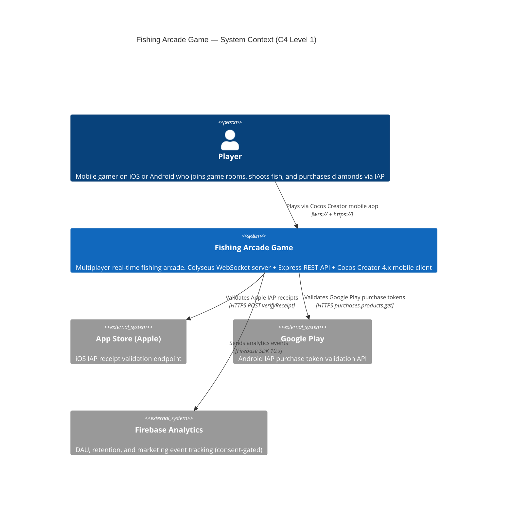

---

### §1.2 Component Architecture (C4)

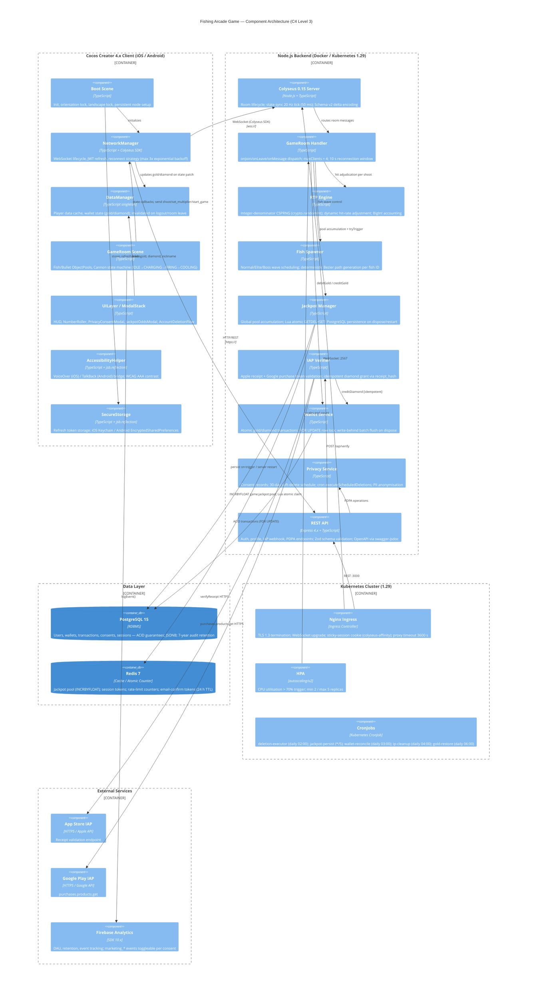

---

## §2 Sequence Diagrams

### §2.1 Player Join + Matchmaking

```mermaid
sequenceDiagram
    participant C as Cocos Client
    participant NG as Nginx Ingress
    participant API as REST API (Express)
    participant COL as Colyseus Server
    participant GR as GameRoom Handler
    participant WS as Wallet Service
    participant PG as PostgreSQL

    C->>NG: POST /api/v1/auth/login {email, password}
    NG->>API: forward
    API->>PG: SELECT users WHERE email_hash=$1
    PG-->>API: user row (bcrypt verify)
    API-->>C: 200 {accessToken (15 min), refreshToken (30 day)}
    C->>C: SecureStorage.set('refresh_token', ...)

    C->>NG: WebSocket upgrade → wss://game.example.com/
    NG->>COL: WebSocket (sticky cookie: colyseus-affinity)
    C->>COL: joinOrCreate('game_room', {token, nickname})
    COL->>GR: onAuth(client, options, request)
    GR->>GR: verifyJwt(token) — throws if invalid/expired
    GR-->>COL: payload {userId, role}
    COL->>GR: onJoin(client, options)
    GR->>WS: getGold(userId)
    WS->>PG: SELECT gold FROM user_wallets WHERE user_id=$1
    PG-->>WS: gold balance
    WS-->>GR: gold
    GR->>GR: assign slotIndex (0=BL, 1=BR, 2=TL, 3=TR)
    GR->>GR: state.players.set(sessionId, playerState)
    GR->>PG: INSERT game_sessions / UPDATE player_ids, player_count

    alt playerCount < 4 (players 1-3 joined)
        GR-->>C: Schema delta patch (new player added; roomState='WAITING')
        Note over C: Client shows WaitingOverlay "Waiting for players (N/4)"
    else playerCount == 4 (4th player triggers start)
        Note over GR: _transitionToPlaying() called
        GR->>GR: state.roomState = 'PLAYING'
        GR->>GR: FishSpawner.start() — begin normal wave schedule
        GR-->>C: Schema delta patch (all players; roomState='PLAYING')
        C->>C: UILayer hides WaitingOverlay; game begins
    end
```

---

### §2.2 Shoot → Adjudicate → Wallet

```mermaid
sequenceDiagram
    participant C as Cocos Client
    participant GR as GameRoom Handler
    participant RTP as RTP Engine
    participant JP as Jackpot Manager
    participant WS as Wallet Service
    participant PG as PostgreSQL
    participant RD as Redis

    C->>GR: send('shoot', {bulletId, fishId, betAmount, cannonMultiplier})

    GR->>GR: 0. Dedup check — bulletId in activeBullets Set?
    alt duplicate bulletId OR Set.size >= 10
        GR->>GR: silently drop (rate-limit / dedup)
    else new bullet
        GR->>GR: activeBullets.add(bulletId)
        GR->>GR: 1. Validate: player.gold >= betAmount
        GR->>GR: 2. Validate: fishId exists and alive in state.fish

        alt validation fails
            GR-->>C: send('shoot_error', {code: 'INVALID_SHOOT', reason})
            GR->>GR: activeBullets.delete(bulletId)
        else validation passes
            GR->>WS: debitGold(userId, betAmount)
            WS->>PG: BEGIN; SELECT gold FOR UPDATE; UPDATE -betAmount; INSERT transactions; COMMIT
            PG-->>WS: OK
            WS-->>GR: OK
            GR->>GR: state.players.get(sessionId).gold -= betAmount

            GR->>RTP: adjudicate(fishType, betAmount, cannonMultiplier)
            RTP->>RTP: _dynamicAdjust(fishCfg) — scale hitRateNumerator if RTP drifts
            RTP->>RTP: roll = crypto.randomInt(denominator)
            RTP-->>GR: {hit: boolean, payout: number}

            alt hit == true
                GR->>GR: FishState.hp -= 1
                alt hp == 0 (fish killed)
                    GR->>WS: creditGold(userId, payout, 'earn')
                    WS->>PG: BEGIN; UPDATE gold +payout; INSERT transactions; COMMIT
                    GR->>GR: state.players.get(sessionId).gold += payout
                    GR->>GR: state.fish.delete(fishId) — auto-broadcasts delta
                else hp > 0
                    Note over GR,C: HP decrement auto-synced via schema delta patch
                end

                GR->>JP: tryTrigger(cannonMultiplier, userId)
                JP->>JP: odds = JACKPOT_ODDS[multiplier]; roll = crypto.randomInt(odds)
                alt jackpot triggered (roll == 0)
                    JP->>RD: EVAL Lua: GETDEL game:jackpot:pool; SET game:jackpot:pool SEED
                    RD-->>JP: poolAmount string
                    JP->>PG: BEGIN; INSERT jackpot_history; UPDATE user_wallets +poolAmount; INSERT transactions('jackpot'); COMMIT
                    JP-->>GR: {winnerId, amount}
                    GR->>GR: state.players.get(sessionId).gold += jackpotAmount
                    GR->>RTP: addExternalPayout(jackpotAmount)
                    GR->>GR: broadcast('jackpot_won', {winnerId, amount})
                    GR-->>C: message jackpot_won → celebration animation
                else no jackpot
                    JP-->>GR: null
                end
            else hit == false (miss)
                Note over GR,C: Gold already debited; no payout; no fish state change
            end

            GR->>PG: INSERT rtp_logs (fire-and-forget)
            GR-->>C: send('shoot_result', {hit, payout})
            GR->>GR: activeBullets.delete(bulletId)
        end
    end
```

---

### §2.3 IAP Purchase

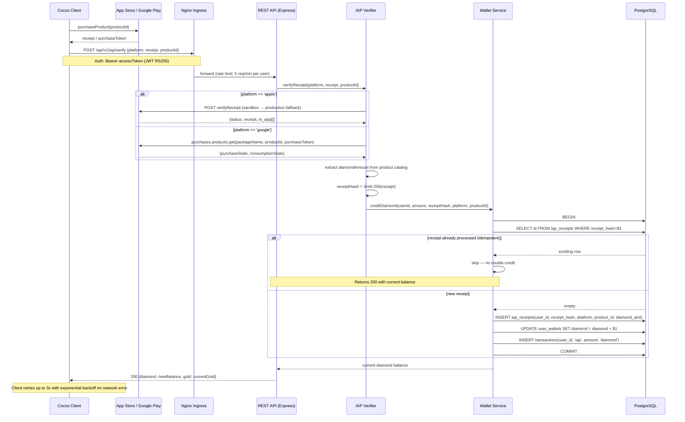

---

### §2.4 PDPA Account Deletion Flow

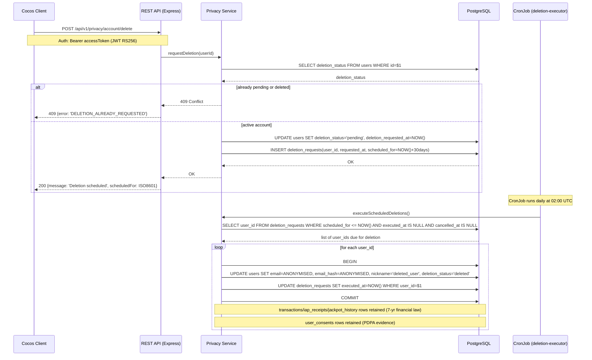

---

## §3 State Machines

### §3.1 GameRoom State Machine

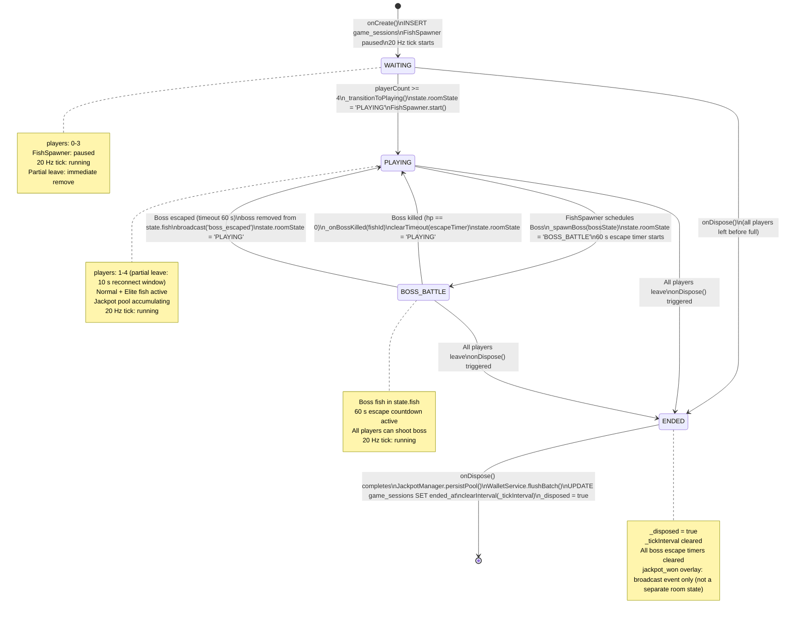

---

### §3.2 NetworkManager State Machine

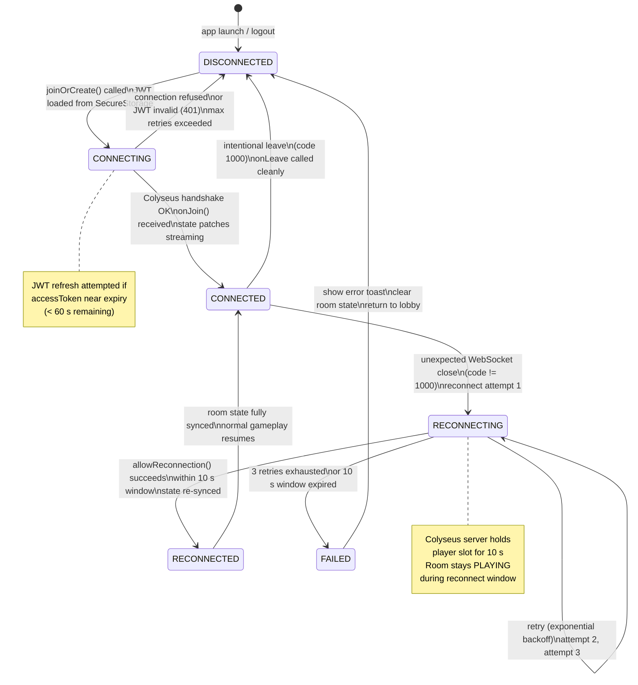

---

## §4 Entity Relationships

### §4.1 Database ER Diagram

```mermaid
erDiagram
    users {
        UUID id PK
        BYTEA email "AES-256-GCM encrypted"
        BYTEA email_hash UK "HMAC-SHA256 for uniqueness lookup"
        VARCHAR50 nickname
        TEXT password_hash "bcrypt"
        VARCHAR64 device_id "SHA-256 hash; original never stored"
        VARCHAR20 deletion_status "active|pending|deleted"
        TIMESTAMPTZ deletion_requested_at
        TIMESTAMPTZ created_at
        TIMESTAMPTZ updated_at
    }

    user_wallets {
        UUID user_id PK_FK "1:1 with users; CASCADE DELETE"
        BIGINT gold "CHECK >= 0"
        INTEGER diamond "CHECK >= 0"
        TIMESTAMPTZ updated_at
    }

    transactions {
        UUID id PK
        UUID user_id FK "no ON DELETE — user row never hard-deleted"
        VARCHAR20 type "earn|spend|iap|jackpot|refund|daily_restore"
        BIGINT amount "positive=credit; negative=debit"
        VARCHAR10 currency "gold|diamond"
        UUID ref_id "optional: session_id or receipt_id"
        TIMESTAMPTZ created_at
    }

    iap_receipts {
        UUID id PK
        UUID user_id FK "no ON DELETE — receipts retained 7 yrs"
        VARCHAR64 receipt_hash UK "SHA-256 hex; idempotency key"
        VARCHAR10 platform "apple|google"
        VARCHAR100 product_id
        INTEGER diamond_amt "CHECK > 0"
        TIMESTAMPTZ created_at
    }

    jackpot_pool {
        INTEGER id PK "singleton; CHECK id = 1"
        BIGINT current_amount "seed = 10000 gold"
        TIMESTAMPTZ updated_at
    }

    jackpot_history {
        UUID id PK
        UUID winner_id FK "no ON DELETE — retained 7 yrs"
        BIGINT amount "CHECK > 0"
        TIMESTAMPTZ triggered_at
        VARCHAR100 room_id
    }

    game_sessions {
        UUID id PK
        VARCHAR100 room_id
        TIMESTAMPTZ started_at
        TIMESTAMPTZ ended_at
        INET ip_address "NULLed after 90 days by ip-cleanup cron"
        UUID_ARRAY player_ids
        INTEGER player_count
        VARCHAR20 room_state "WAITING|PLAYING|ENDED"
    }

    user_consents {
        UUID id PK
        UUID user_id FK "ON DELETE RESTRICT — PDPA evidence"
        VARCHAR100 consent_type "privacy_policy|marketing"
        BOOLEAN granted
        TIMESTAMPTZ granted_at
        TIMESTAMPTZ revoked_at "NULL = not revoked"
        VARCHAR20 policy_version "soft ref to privacy_policies.version"
        INET ip_address
        TEXT user_agent
        TIMESTAMPTZ created_at
    }

    deletion_requests {
        UUID user_id PK_FK "one pending request per user"
        TIMESTAMPTZ requested_at
        TIMESTAMPTZ scheduled_for "requested_at + 30 days"
        TIMESTAMPTZ executed_at "set by executeScheduledDeletions cron"
        TIMESTAMPTZ cancelled_at "set by cancelDeletion API"
    }

    privacy_policies {
        VARCHAR20 version PK "semver e.g. 1.0.0"
        TEXT content_url
        TIMESTAMPTZ effective_at
        TIMESTAMPTZ created_at
    }

    rtp_logs {
        UUID id PK
        VARCHAR100 room_id
        UUID user_id "no FK — user row may be anonymised; UUID retained"
        VARCHAR20 fish_type "normal|elite|boss"
        BIGINT bet_amount "CHECK > 0"
        INTEGER multiplier "CHECK > 0"
        BOOLEAN hit
        BIGINT payout "DEFAULT 0"
        NUMERIC rtp_at_time "5,4 precision — running RTP at adjudication time"
        TIMESTAMPTZ created_at
    }

    users ||--|| user_wallets : "owns (CASCADE)"
    users ||--o{ transactions : "records"
    users ||--o{ iap_receipts : "purchases"
    users ||--o{ jackpot_history : "wins"
    users ||--o{ user_consents : "grants (RESTRICT)"
    users ||--o| deletion_requests : "schedules (RESTRICT)"
```

---

## §5 Class Diagrams

### §5.1 Server Core Classes

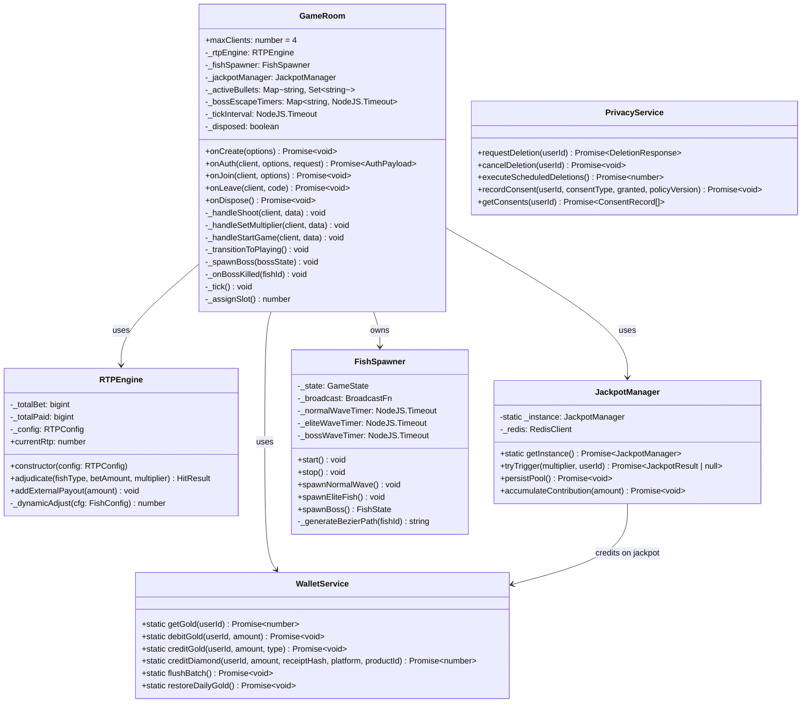

---

### §5.2 Colyseus Schema Classes

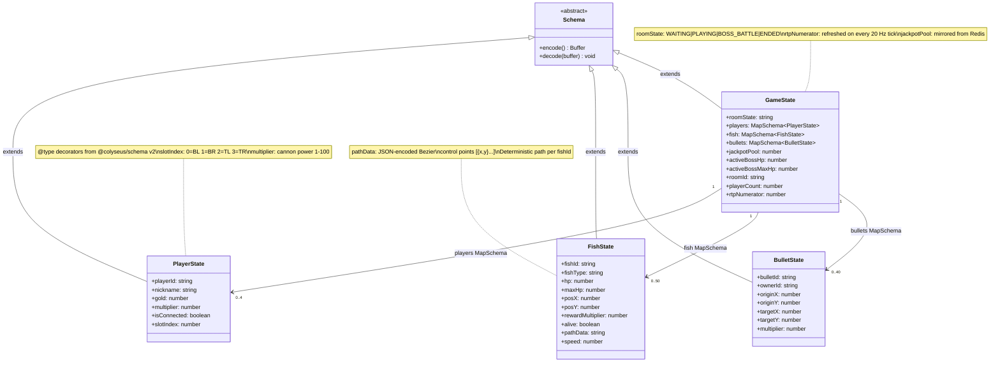

---

## §6 Flowcharts

### §6.1 Bullet Hit Detection

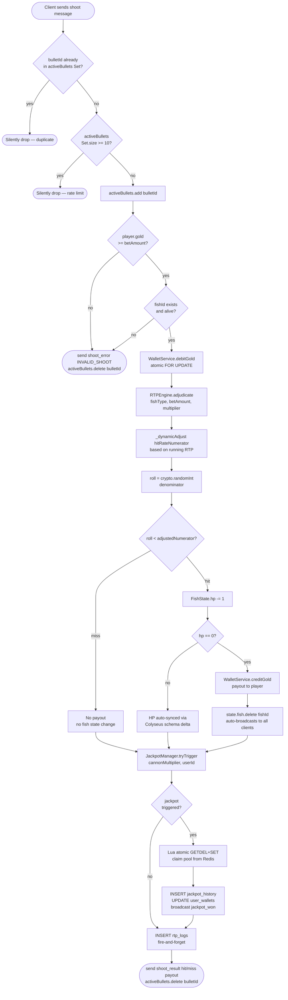

---

### §6.2 RTP Dynamic Adjustment

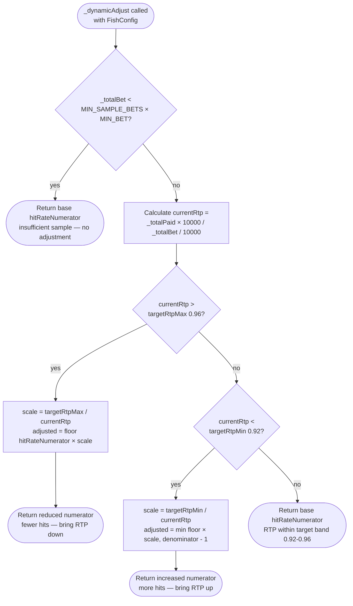

---

## §7 Project Timeline

### §7.1 Development Phases Gantt

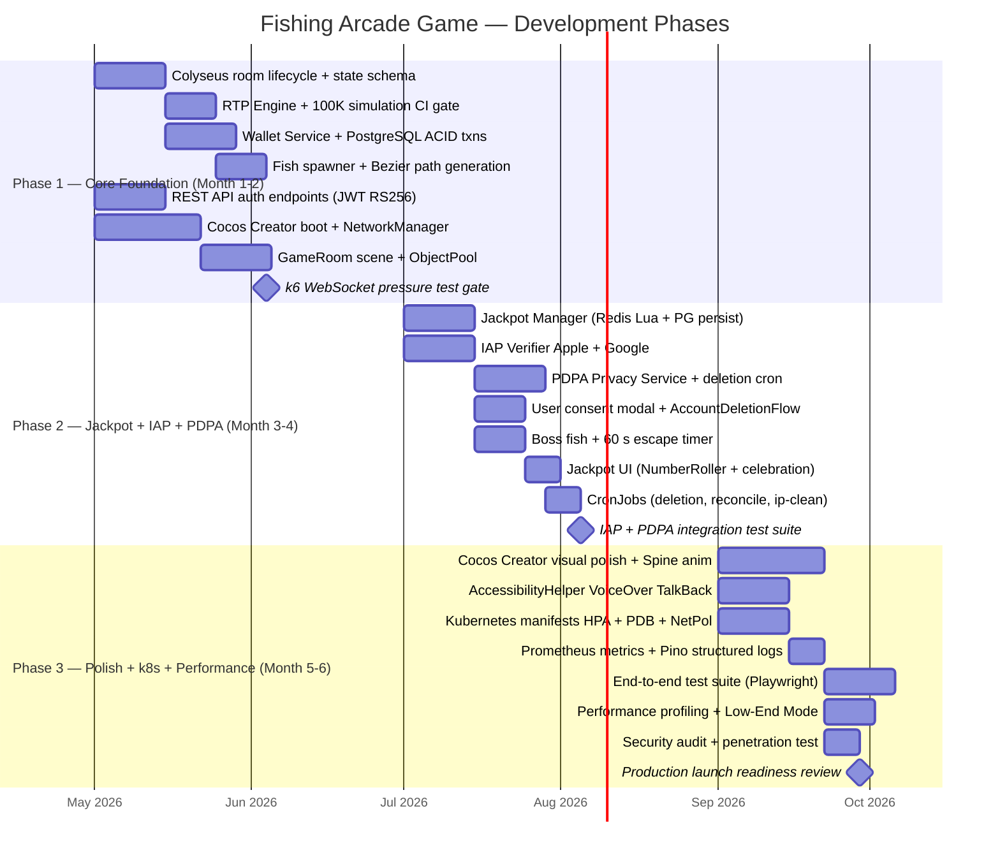
