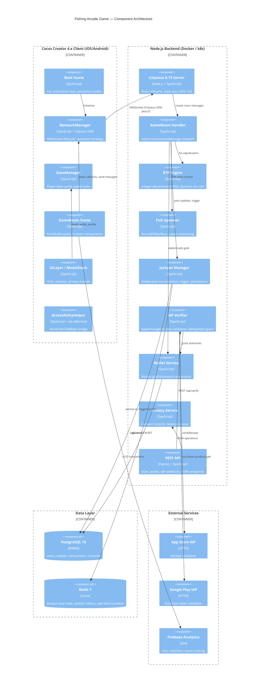

# Engineering Design Document — Fishing Arcade Game

<!-- DOC-ID: EDD-FISHING-ARCADE-GAME-20260422 -->
<!-- Parent: PRD-FISHING-ARCADE-GAME-20260422 / PDD-FISHING-ARCADE-GAME-20260422 -->
<!-- Downstream: TEST-PLAN.md -->

---

## Document Control

| Field | Content |
|-------|---------|
| **DOC-ID** | EDD-FISHING-ARCADE-GAME-20260422 |
| **Project** | fishing-arcade-game |
| **Version** | v1.1 |
| **Status** | IN_REVIEW |
| **Author** | tobala (auto-generated by /devsop-gen-edd) |
| **Date** | 2026-04-22 |
| **Upstream PRD** | PRD-FISHING-ARCADE-GAME-20260422 (docs/PRD.md) v1.1 APPROVED |
| **Upstream PDD** | PDD-FISHING-ARCADE-GAME-20260422 (docs/PDD.md) v1.5 APPROVED |
| **Upstream BRD** | BRD-FISHING-ARCADE-GAME-20260421 (docs/BRD.md) |
| **Downstream** | TEST-PLAN.md |

### Change Log

| Version | Date | Author | Summary |
|---------|------|--------|---------|
| v1.0 | 2026-04-22 | tobala | Initial draft (auto-generated from PRD v1.1 + PDD v1.5) |

---

## §1 Architecture Overview

### §1.1 System Architecture



### §1.2 Technology Stack Decisions

| Layer | Technology | Version | Rationale |
|-------|-----------|---------|-----------|
| Game Client | Cocos Creator | 4.x | User-specified; native iOS/Android; Spine animation; TypeScript; hot-update support |
| Realtime Backend | Colyseus | 0.15 | MIT license; room-based isolation; built-in state serialisation; matches `sam-gong-game` existing stack |
| Backend Language | TypeScript + Node.js | 5.x / 20 LTS | Full-stack TypeScript reduces friction; team familiarity; async/non-blocking I/O |
| REST Framework | Express | 4.x | Minimal, well-understood; OpenAPI spec via swagger-jsdoc |
| Primary Database | PostgreSQL | 15 | ACID guarantees for wallet atomicity; JSONB for flexible schema evolution; 7-year audit retention |
| Cache / Jackpot state | Redis | 7 | Sub-millisecond atomic INCR for jackpot pool; session TTL; rate-limit counters |
| Schema Validation | Zod | 3.x | Runtime validation at all API boundaries; TypeScript type inference |
| IAP Verification | apple-receipt-verifier + google-play-library | latest | Battle-tested; handles sandbox vs production switching |
| Observability | Pino (structured JSON logs) + Prometheus metrics | latest | Low overhead; structured log fields match PRD §7.7.1 requirements |
| Infrastructure | Docker + Kubernetes (minimal HPA) | k8s 1.29 | Container isolation; CPU-based auto-scale per PRD §7.3 |
| Analytics | Firebase Analytics | SDK 10.x | PRD §7.8; free tier covers DAU 10K target |

**Key Decisions:**
- **Server-authoritative design**: ALL game outcome calculations (RTP, fish spawn paths, jackpot trigger, bullet-hit adjudication) execute server-side. Client is display-only. This satisfies US-RTP-001/AC-2 and PRD §7.4 anti-cheat requirements.
- **Integer-denominator RNG**: Probabilities expressed as `hits_per_N` integers to prevent floating-point drift (PRD BRD §0.1 technical risk R2, US-RTP-001/AC-3).
- **Colyseus Schema v2**: `@type` decorators from `@colyseus/schema` v2, not v1 annotations. MapSchema / ArraySchema for fish and player collections.
- **Redis for jackpot pool**: Hot path; atomic `INCRBYFLOAT game:jackpot:pool <contribution>` (plain string key) avoids PostgreSQL round-trip per shot. Jackpot claim uses a Lua script for atomic GETDEL+SET. PostgreSQL remains the source of truth, written on trigger or server restart.

### §1.3 Non-Functional Requirements Mapping

| PRD NFR | Target | Engineering Approach |
|---------|--------|---------------------|
| WebSocket p99 < 100ms | US-ROOM-001/AC-3 | Colyseus 20Hz state tick (50ms); priority message queue; k6 pressure test gate |
| API P99 < 500ms | PRD §7.1 | Express middleware timeout 450ms; circuit breaker on DB calls; PG connection pooling (pgBouncer) |
| 500 concurrent rooms | PRD §7.3 | k8s HPA CPU > 70% trigger; Colyseus horizontal pod autoscale; room affinity via Redis Cluster |
| FPS ≥ 30 (2GB RAM) | PRD §7.5 | ObjectPool pre-warm; ETC2/ASTC texture compression; Low-End Mode auto-detection (§3.5) |
| RTP error < 0.1% | US-RTP-001/AC-1 | Integer-denominator RNG; 100K simulation CI gate; isolated RTP module (100% unit coverage) |
| TLS 1.3 | PRD §7.4 | Ingress controller terminates TLS; internal cluster traffic plain TCP |
| 99.9% availability | PRD §7.2 | 2+ Pod replicas; PG streaming replication; Redis Sentinel; RTO 30min |

---

## §2 Backend Engineering (Node.js + Colyseus 0.15)

### §2.1 Colyseus Room Architecture

#### GameRoom Schema (TypeScript, Colyseus Schema v2)

```typescript
// src/rooms/schema/GameState.ts
import { Schema, type, MapSchema, ArraySchema } from '@colyseus/schema';

export class PlayerState extends Schema {
    @type('string')  playerId: string = '';
    @type('string')  nickname: string = '';
    @type('int64')   gold: number = 0;
    @type('int32')   multiplier: number = 1;         // current cannon multiplier (1–100)
    @type('boolean') isConnected: boolean = true;
    @type('int32')   slotIndex: number = 0;           // 0=P1(BL), 1=P2(BR), 2=P3(TL), 3=P4(TR)
}

export class FishState extends Schema {
    @type('string')  fishId: string = '';
    @type('string')  fishType: string = '';           // 'normal' | 'elite' | 'boss'
    @type('int32')   hp: number = 1;
    @type('int32')   maxHp: number = 1;
    @type('float32') posX: number = 0;
    @type('float32') posY: number = 0;
    @type('int32')   rewardMultiplier: number = 1;
    @type('boolean') alive: boolean = true;
    // JSON-encoded Bezier path control points: [{x,y},{x,y},{x,y}] (3-4 points)
    // All clients reconstruct the identical deterministic path from this server-provided data
    @type('string')  pathData: string = '';
    @type('float32') speed: number = 1.0;
}

export class BulletState extends Schema {
    @type('string')  bulletId: string = '';
    @type('string')  ownerId: string = '';
    @type('float32') originX: number = 0;
    @type('float32') originY: number = 0;
    @type('float32') targetX: number = 0;
    @type('float32') targetY: number = 0;
    @type('int32')   multiplier: number = 1;
}

export class GameState extends Schema {
    @type('string')  roomState: string = 'WAITING';  // WAITING | PLAYING | JACKPOT | BOSS_FIGHT | ENDED
    @type({ map: PlayerState })  players = new MapSchema<PlayerState>();
    @type({ map: FishState })    fish    = new MapSchema<FishState>();
    @type({ map: BulletState })  bullets = new MapSchema<BulletState>();
    @type('int64')   jackpotPool: number = 0;         // gold coins, mirrored from Redis
    @type('int32')   activeBossHp: number = 0;
    @type('int32')   activeBossMaxHp: number = 0;
    @type('string')  roomId: string = '';
    @type('int32')   playerCount: number = 0;
    @type('int32')   rtpNumerator: number = 92;       // current effective RTP %
}
```

#### Room Lifecycle

```typescript
// src/rooms/GameRoom.ts
// NOTE: Phase 1 cap is 4 players (BRD §4 specifies 4-6; Phase 2 will raise to 6 with extra slots)
export class GameRoom extends Room<GameState> {
    maxClients = 4;
    private _rtpEngine: RTPEngine;
    private _fishSpawner: FishSpawner;
    private _jackpotManager: JackpotManager;
    private _tickInterval: ReturnType<typeof setInterval>;
    private _disposed = false;  // guard: setInterval cleared but callback may fire once more in same event loop tick

    // onAuth verifies JWT before onJoin (Colyseus 0.15 — called with request headers)
    async onAuth(client: Client, options: JoinOptions, request: http.IncomingMessage) {
        const token = options.token;
        if (!token) throw new Error('missing_token');
        const payload = verifyJwt(token);   // throws if invalid/expired
        return payload;                      // returned value becomes client.auth
    }

    async onCreate(options: RoomCreateOptions) {
        this.setState(new GameState());
        this.state.roomId = this.roomId;
        this._rtpEngine = new RTPEngine(RTP_CONFIG);
        this._fishSpawner = new FishSpawner(this.state, this.broadcast.bind(this));
        this._jackpotManager = await JackpotManager.getInstance();

        // Register message handlers in onCreate — do NOT override the onMessage base method
        this.onMessage('shoot', this._handleShoot.bind(this));
        this.onMessage('set_multiplier', this._handleSetMultiplier.bind(this));
        this.onMessage('start_game', this._handleStartGame.bind(this));

        // 20Hz state tick (50ms)
        this._tickInterval = setInterval(() => this._tick(), 50);

        // Record room creation in game_sessions (analytics + admin dashboard)
        await db.query(
            `INSERT INTO game_sessions(room_id, started_at, player_count, room_state, ip_address)
             VALUES($1, NOW(), 0, 'WAITING', NULL)`,
            [this.roomId]
        );
    }

    async onJoin(client: Client, options: JoinOptions) {
        // Validate nickname from client: max 50 chars, non-empty
        const nickname = (options.nickname ?? '').slice(0, 50).trim();
        if (!nickname) throw new Error('invalid_nickname');
        const player = new PlayerState();
        player.playerId = client.sessionId;
        // Use verified userId from client.auth (set by onAuth) — NOT unverified options
        player.nickname = nickname;
        player.gold = await WalletService.getGold(client.auth.userId);
        player.slotIndex = this._assignSlot();
        this.state.players.set(client.sessionId, player);
        this.state.playerCount = this.state.players.size;
        if (this.state.playerCount >= 4) this._transitionToPlaying();

        // Update session: append userId to player_ids array + refresh player_count and room_state
        await db.query(
            `UPDATE game_sessions
             SET player_ids   = array_append(player_ids, $1::uuid),
                 player_count = $2,
                 room_state   = $3
             WHERE room_id = $4`,
            [client.auth.userId, this.state.playerCount, this.state.roomState, this.roomId]
        );
    }

    // Colyseus 0.15: second param is a numeric WebSocket close code, NOT a boolean
    // code === 1000 = intentional disconnect (user left); any other code = unexpected disconnect
    async onLeave(client: Client, code: number) {
        const player = this.state.players.get(client.sessionId);
        if (player) { player.isConnected = false; }
        if (code !== 1000) {
            try {
                // allow reconnection within 10s (PRD US-ROOM-001/AC-4)
                // allowReconnection throws if client does not reconnect within timeout
                await this.allowReconnection(client, 10);
                if (player) player.isConnected = true;
            } catch {
                // Reconnection timed out — remove player from room state
                this.state.players.delete(client.sessionId);
                this.state.playerCount = this.state.players.size;
            }
        } else {
            this.state.players.delete(client.sessionId);
            this.state.playerCount = this.state.players.size;
        }
    }

    // NOTE: Do NOT override onMessage(). Use this.onMessage(type, cb) in onCreate() only.

    async onDispose() {
        this._disposed = true;    // prevents any in-flight tick from writing state after dispose begins
        clearInterval(this._tickInterval);
        // Clear boss escape timers to prevent post-dispose callbacks
        this._bossEscapeTimers.forEach(t => clearTimeout(t));
        this._bossEscapeTimers.clear();
        await this._jackpotManager.persistPool();
        await WalletService.flushBatch();
        // Mark session as ended (ended_at + final player count for analytics)
        await db.query(
            `UPDATE game_sessions SET ended_at = NOW(), player_count = $1, room_state = 'ENDED'
             WHERE room_id = $2 AND ended_at IS NULL`,
            [this.state.playerCount, this.roomId]
        );
    }
}
```

#### State Synchronisation Strategy

- **20Hz server tick**: fish position interpolation + room state broadcast via Colyseus delta-encode. Each tick also refreshes `this.state.rtpNumerator = Math.round(this._rtpEngine.currentRtp * 100)` to keep the client-visible RTP indicator current. **Dispose guard**: `_tick()` must check `if (this._disposed) return;` as its first line — `setInterval` can fire once more after `clearInterval` returns within the same event-loop turn.
- **Bullet events**: sent as targeted one-off messages (not state schema), avoiding per-bullet schema overhead.
- **Client-side interpolation**: client moves fish along server-provided Bezier path using elapsed time, correcting on each state patch. Bullet travel is purely client-predicted; server only broadcasts hit/miss outcome.
- **Jackpot pool**: broadcast via GameState schema `jackpotPool` field on every state patch. NumberRoller animates the delta client-side.

### §2.2 Game Logic Engine

#### RTP Engine Design (US-RTP-001)

**Principle**: All hit adjudication is probabilistic, computed server-side using integer-denominator RNG to prevent floating-point drift.

```typescript
// src/engine/RTPEngine.ts
import crypto from 'crypto';
import { db } from '../db';

// Return types
export interface HitResult    { hit: boolean; payout: number; }
export interface JackpotResult { winnerId: string; amount: number; }

export interface RTPConfig {
    targetRtpMin: number;   // 0.92 — BRD §0.1 specifies 92-96% overall RTP
    targetRtpMax: number;   // 0.96
    fishConfigs: FishConfig[];
}

// Shared type — import in RTPEngine, FishSpawner, and schema files
export type FishType = 'normal' | 'elite' | 'boss';

export interface FishConfig {
    fishType: FishType;
    baseMultiplier: number;     // payout = bet * baseMultiplier
    hitRateNumerator: number;   // integer; hit probability = numerator / denominator
    hitRateDenominator: number; // fixed denominator (e.g. 100_000)
}

// Minimum bets before dynamic adjustment activates (prevents near-100% hits early in a room)
const MIN_SAMPLE_BETS = 200;
const MIN_BET_AMOUNT  = 1;    // minimum coin bet; used to gate adjustment

export class RTPEngine {
    private _totalBet = 0n;       // BigInt to avoid float overflow
    private _totalPaid = 0n;
    private _config: RTPConfig;

    constructor(config: RTPConfig) { this._config = config; }

    /** Called when jackpot is paid out — ensures jackpot payouts are included in RTP accounting */
    addExternalPayout(amount: number): void {
        this._totalPaid += BigInt(amount);
    }

    /**
     * Server-authoritative hit adjudication.
     * Returns { hit: boolean, payout: number }
     * Uses integer-denominator RNG (no floating-point probability).
     */
    adjudicate(fishType: FishType, betAmount: number, multiplier: number): HitResult {
        const fishCfg = this._config.fishConfigs.find(f => f.fishType === fishType)!;

        // Dynamic hit-rate adjustment: if actual RTP > targetMax, reduce hit rate temporarily
        const adjustedNumerator = this._dynamicAdjust(fishCfg);

        // CSPRNG: crypto.randomInt() for uniform distribution without floating-point bias
        const roll = crypto.randomInt(fishCfg.hitRateDenominator);
        const hit = roll < adjustedNumerator;

        this._totalBet += BigInt(betAmount);
        if (hit) {
            const payout = betAmount * fishCfg.baseMultiplier * multiplier;
            this._totalPaid += BigInt(payout);
            return { hit: true, payout };
        }
        return { hit: false, payout: 0 };
    }

    // Returns RTP with basis-point precision (0.01% granularity) for dynamic adjustment
    get currentRtp(): number {
        if (this._totalBet === 0n) return this._config.targetRtpMin;
        return Number(this._totalPaid * 10000n / this._totalBet) / 10000;
    }

    private _dynamicAdjust(cfg: FishConfig): number {
        // Suppress adjustment until MIN_SAMPLE_BETS accumulated — prevents extreme swings on room startup
        if (this._totalBet < BigInt(MIN_SAMPLE_BETS * MIN_BET_AMOUNT)) return cfg.hitRateNumerator;
        const rtp = this.currentRtp;
        if (rtp > this._config.targetRtpMax) {
            // Scale numerator down proportionally
            const scale = this._config.targetRtpMax / rtp;
            return Math.floor(cfg.hitRateNumerator * scale);
        }
        if (rtp < this._config.targetRtpMin) {
            const scale = this._config.targetRtpMin / rtp;
            return Math.min(
                Math.floor(cfg.hitRateNumerator * scale),
                cfg.hitRateDenominator - 1
            );
        }
        return cfg.hitRateNumerator;
    }
}
```

**100K Simulation CI Gate** (US-RTP-001/AC-1): Jest test runs 100,000 adjudications per fish type and asserts `|actual_rtp - target_rtp| < 0.001`. This test runs on every PR. RTP module must maintain 100% unit test coverage.

#### Fish Spawn Algorithm

| Fish Type | Spawn Trigger | Frequency | Max Concurrent | HP |
|-----------|--------------|-----------|----------------|-----|
| Normal | Continuous wave scheduler (every 3-5s) | High | 50 / room | 1 |
| Elite (`ff_elite_fish_enabled`) | Random wave (M% chance per wave, configurable) | Medium | N / room (OQ5) | 3-8 |
| Boss (`ff_boss_fish_enabled`) | Timer-based (interval configurable) | Low | 1 / room | 50-200 |

Fish spawn includes a **server-computed Bezier path** (3-4 control points) so all clients see identical paths from the same state broadcast. Paths are generated with deterministic seeding per fish ID.

#### Bullet Hit Detection (Server-Authoritative)

**Bullet deduplication** (per-player in-memory Set):
```typescript
// In GameRoom: per-player in-flight bullet set; capped at 10 (matches rate-limit)
private _activeBullets = new Map<string, Set<string>>();  // sessionId → Set<bulletId>

_handleShoot(client: Client, data: ShootMessage): void {
    const bullets = this._activeBullets.get(client.sessionId) ?? new Set<string>();
    if (bullets.has(data.bulletId)) return;  // duplicate — silently drop
    if (bullets.size >= 10) return;          // rate-limit: max 10 active bullets
    bullets.add(data.bulletId);
    this._activeBullets.set(client.sessionId, bullets);
    // ... adjudication ...
    bullets.delete(data.bulletId);           // release after result sent
}
// onLeave cleanup:
this._activeBullets.delete(client.sessionId);
```

```
Client sends: { bulletId, fishId, cannonMultiplier, betAmount }
Server:
  0. Validate bulletId not in player's active-bullet Set (dedup); reject if duplicate or Set size >= 10
  1. Validate: player has sufficient gold (betAmount <= player.gold — checked against PlayerState.gold)
  2. Validate: fishId exists and is alive
  3. Deduct betAmount from player wallet (atomic, via WalletService.debitGold)
     → Update player.gold in schema: this.state.players.get(sessionId)!.gold -= betAmount
  4. Call RTPEngine.adjudicate(fishType, betAmount, cannonMultiplier)
  5. If hit:
     a. Decrement fish HP by 1 (server tracks HP via FishState.hp in schema)
     b. If HP == 0: call WalletService.creditGold(userId, payout, 'earn');
        → Update player.gold in schema: this.state.players.get(sessionId)!.gold += payout
        Broadcast fish_killed; remove fish from state (triggers automatic schema delta to all clients)
     c. Else: HP decrement auto-synced via schema delta patch (no separate fish_damaged message needed)
  6. Check jackpot trigger (JackpotManager.tryTrigger with verified userId)
     → If jackpot won:
       a. update player.gold in schema += jackpotAmount
       b. Call this._rtpEngine.addExternalPayout(jackpotAmount) to include in RTP accounting
       c. this.broadcast('jackpot_won', { winnerId: client.auth.userId, amount: jackpotAmount })
          — all room clients receive this; client §3.2 NetworkManager._handleJackpotWon() plays celebration animation
  7. Fire-and-forget INSERT INTO rtp_logs (async; does NOT block shoot_result response):
     `db.query('INSERT INTO rtp_logs ...', [...]).catch(err => logger.error('rtp_log_write_failed', err))`
     Queue is drained in onDispose (await all pending rtp log writes before room closes).
     Regulatory audit trail — permanent retention. Out-of-band write cannot lose data on normal shutdown.
  8. Send shoot_result to shooter client (hit/miss, payout amount)
  9. Remove bulletId from player's active-bullet Set
```

**Anti-double-spend**: Wallet deduction is a database transaction with `FOR UPDATE` row lock. Bullet deduplication via in-memory Set prevents concurrent duplicates within the same session.

**Non-shoot message rate limiting**: `set_multiplier` and `start_game` messages have separate per-client throttles enforced at message handler entry:
```typescript
// In GameRoom private state:
private _msgRateLimits = new Map<string, { count: number; windowStart: number }>();

_checkRateLimit(sessionId: string, type: string, maxPerSec: number): boolean {
    const key = `${sessionId}:${type}`;
    const now = Date.now();
    const entry = this._msgRateLimits.get(key) ?? { count: 0, windowStart: now };
    if (now - entry.windowStart > 1000) { entry.count = 0; entry.windowStart = now; }
    entry.count++;
    this._msgRateLimits.set(key, entry);
    return entry.count <= maxPerSec;
}

_handleSetMultiplier(client: Client, data: unknown): void {
    if (!this._checkRateLimit(client.sessionId, 'set_multiplier', 10)) {
        console.warn(`rate_limit set_multiplier ${client.sessionId}`); return;
    }
    // ... multiplier logic ...
}

_handleStartGame(client: Client, data: unknown): void {
    if (!this._checkRateLimit(client.sessionId, 'start_game', 1)) {  // 1/s max
        console.warn(`rate_limit start_game ${client.sessionId}`); return;
    }
    // ... game start logic ...
}
```
Rate limits: `set_multiplier` max 10/s per client; `start_game` max 1/s per client. Exceeding limit: silently drop + WARN log (do not throw — Colyseus throws disconnect the client on unhandled errors).

#### Boss Fish Escape Timeout (US-FISH-002)

```typescript
// Boss fish has a 60-second escape timer; if no player kills it, it escapes (no payout)
private _bossEscapeTimers = new Map<string, NodeJS.Timeout>();  // fishId → timer

_spawnBoss(bossState: FishState): void {
    this.state.fish.set(bossState.fishId, bossState);
    const timer = setTimeout(() => {
        if (this.state.fish.has(bossState.fishId)) {
            this.state.fish.delete(bossState.fishId);   // auto-remove from schema
            this.broadcast('boss_escaped', { fishId: bossState.fishId });
            this.state.roomState = 'PLAYING';
        }
        this._bossEscapeTimers.delete(bossState.fishId);
    }, 60_000);
    this._bossEscapeTimers.set(bossState.fishId, timer);
}

// When boss is killed (hp == 0 in _handleShoot), cancel the timer:
_onBossKilled(fishId: string): void {
    const timer = this._bossEscapeTimers.get(fishId);
    if (timer) { clearTimeout(timer); this._bossEscapeTimers.delete(fishId); }
}

// In onDispose — prevent timer leaks after room is disposed:
this._bossEscapeTimers.forEach(t => clearTimeout(t));
this._bossEscapeTimers.clear();
```

No gold refund for bets spent during a boss that escapes (bets deducted at fire time per normal flow).

#### Jackpot Pool Accumulation and Trigger Logic (US-JACK-001/US-JACK-002)

**Pool Accumulation**: Each valid bet contributes `betAmount × jackpotContribRate` (Y%, configurable). Pool stored as a plain Redis string key `game:jackpot:pool`; incremented atomically with `INCRBYFLOAT game:jackpot:pool <contribution>`. Contribution rate is read from environment config — not hardcoded.

**Trigger Probabilities** (from PDD §3.5 / PRD US-JACK-002):

| Cannon Multiplier | Jackpot Trigger Probability |
|-------------------|-----------------------------|
| 1x | 1 : 500,000 |
| 10x | 1 : 50,000 |
| 50x | 1 : 10,000 |
| 100x | 1 : 5,000 |

```typescript
// src/engine/JackpotManager.ts
export class JackpotManager {
    private static _instance: JackpotManager;
    private static _initPromise: Promise<JackpotManager> | null = null;  // race-condition guard
    private _redis: Redis;

    // Concurrent callers await the same promise — prevents double initialization under HPA multi-pod startup
    public static getInstance(): Promise<JackpotManager> {
        if (!JackpotManager._initPromise) {
            JackpotManager._initPromise = (async () => {
                if (!JackpotManager._instance) {
                    const mgr = new JackpotManager();
                    mgr._redis = new Redis(process.env.REDIS_URL!);
                    await mgr.restorePool();
                    JackpotManager._instance = mgr;
                }
                return JackpotManager._instance;
            })();
        }
        return JackpotManager._initPromise;
    }

    // userId: verified user UUID (from client.auth set by onAuth) — NOT Colyseus sessionId
    async tryTrigger(multiplier: number, userId: string): Promise<JackpotResult | null> {
        const odds = JACKPOT_ODDS[multiplier] ?? JACKPOT_ODDS[1];   // denominator from table above
        // CSPRNG: crypto.randomInt() for financial outcomes
        const roll = crypto.randomInt(odds);
        if (roll !== 0) return null;

        // Atomic claim via Lua script: GETDEL + SET is not atomic in a pipeline.
        // The Lua script runs atomically on the Redis server — prevents multiple concurrent winners.
        const LUA_ATOMIC_CLAIM = `
            local v = redis.call('GETDEL', KEYS[1])
            if not v then return nil end
            redis.call('SET', KEYS[1], ARGV[1])
            return v
        `;
        const poolStr = await this._redis.eval(
            LUA_ATOMIC_CLAIM, 1, 'game:jackpot:pool', String(JACKPOT_SEED_AMOUNT)
        ) as string | null;
        // INCRBYFLOAT stores a float string; Math.round avoids truncation of fractional contributions
        const poolAmount = Math.round(parseFloat(poolStr ?? '0'));
        if (poolAmount <= 0) return null;   // another instance claimed it concurrently

        // Credit winner's wallet and record history in a single DB transaction
        await db.transaction(async (trx) => {
            await trx.query(
                'INSERT INTO jackpot_history (winner_id, amount, triggered_at) VALUES ($1,$2,NOW())',
                [userId, poolAmount]
            );
            await trx.query(
                'UPDATE user_wallets SET gold = gold + $1 WHERE user_id = $2',
                [poolAmount, userId]
            );
            await trx.query(
                "INSERT INTO transactions(user_id,type,amount,currency,created_at) VALUES($1,'jackpot',$2,'gold',NOW())",
                [userId, poolAmount]
            );
        });
        return { winnerId: userId, amount: poolAmount };
    }

    // Called by GameRoom._handleShoot after tryTrigger resolves — must be called from room context
    // to have access to _rtpEngine:
    // if (jackpotResult) { this._rtpEngine.addExternalPayout(jackpotResult.amount); }

    async persistPool() {
        const pool = await this._redis.get('game:jackpot:pool');
        await db.query('UPDATE jackpot_pool SET current_amount=$1, updated_at=NOW() WHERE id=1', [pool]);
    }

    /** Called at server startup to restore pool from PostgreSQL */
    async restorePool() {
        const row = await db.query('SELECT current_amount FROM jackpot_pool WHERE id=1');
        await this._redis.set('game:jackpot:pool', row.rows[0].current_amount);
    }
}
```

**Persistence guarantee** (US-JACK-001/AC-3): `onDispose` persists Redis → PostgreSQL. Startup restores PostgreSQL → Redis. This ensures pool survives server restart.

### §2.3 Dual Currency System (US-CURR-001 / US-CURR-002)

#### Data Model

```
user_wallets:
  - user_id (FK users.id)
  - gold    BIGINT  (free virtual currency; minimum unit 1)
  - diamond INTEGER (paid virtual currency; IAP only)
  - updated_at TIMESTAMPTZ
```

#### Atomic Transaction Design (Prevent Double-Spend)

All wallet mutations go through `WalletService` which wraps PostgreSQL transactions:

```typescript
// src/services/WalletService.ts
export async function debitGold(userId: string, amount: number): Promise<void> {
    await db.transaction(async (trx) => {
        const row = await trx.query(
            'SELECT gold FROM user_wallets WHERE user_id=$1 FOR UPDATE',
            [userId]
        );
        if (row.rows[0].gold < amount) throw new InsufficientFundsError();
        await trx.query(
            'UPDATE user_wallets SET gold = gold - $1 WHERE user_id = $2',
            [amount, userId]
        );
        await trx.query(
            "INSERT INTO transactions(user_id,type,amount,currency,created_at) VALUES($1,'spend',$2,'gold',NOW())",
            [userId, -amount]
        );
    });
}

export async function creditGold(userId: string, amount: number, type: string = 'earn'): Promise<void> {
    await db.transaction(async (trx) => {
        await trx.query(
            'UPDATE user_wallets SET gold = gold + $1 WHERE user_id = $2',
            [amount, userId]
        );
        await trx.query(
            "INSERT INTO transactions(user_id,type,amount,currency,created_at) VALUES($1,$2,$3,'gold',NOW())",
            [userId, type, amount]
        );
    });
}

/** Returns current gold balance for a player (used in onJoin to populate PlayerState) */
export async function getGold(userId: string): Promise<number> {
    const row = await db.query('SELECT gold FROM user_wallets WHERE user_id=$1', [userId]);
    return row.rows[0]?.gold ?? 0;
}

/** Batch-flush any pending async wallet writes (called in onDispose) — placeholder for write-behind cache */
export async function flushBatch(): Promise<void> {
    // No-op in MVP (all mutations are synchronous transactions). Add write-behind cache here if needed.
}

/** Restore daily gold for active users below the free-gold threshold (blocked by OQ5) */
export async function restoreDailyGold(): Promise<void> {
    const DAILY_GOLD_THRESHOLD = parseInt(process.env.DAILY_GOLD_THRESHOLD ?? '0', 10);
    const DAILY_GOLD_AMOUNT    = parseInt(process.env.DAILY_GOLD_AMOUNT    ?? '0', 10);
    if (!DAILY_GOLD_THRESHOLD || !DAILY_GOLD_AMOUNT) return;  // OQ5: values TBD
    // Must INSERT transactions rows so wallet-reconcile cron can cross-check; UPDATE alone leaves no audit trail
    await db.transaction(async (trx) => {
        const eligible = await trx.query(
            `SELECT uw.user_id FROM user_wallets uw
             JOIN users u ON u.id = uw.user_id
             WHERE uw.gold < $1 AND u.deletion_status = 'active'`,
            [DAILY_GOLD_THRESHOLD]
        );
        if (eligible.rowCount === 0) return;
        const ids = eligible.rows.map((r: { user_id: string }) => r.user_id);
        await trx.query(
            `UPDATE user_wallets SET gold = gold + $1 WHERE user_id = ANY($2::uuid[])`,
            [DAILY_GOLD_AMOUNT, ids]
        );
        // Insert one transaction row per user so wallet-reconcile cron matches balance
        await trx.query(
            `INSERT INTO transactions(user_id, type, amount, currency, created_at)
             SELECT unnest($1::uuid[]), 'daily_restore', $2, 'gold', NOW()`,
            [ids, DAILY_GOLD_AMOUNT]
        );
    });
}

// iapVerificationResult contains: platform, productId, diamondAmount from the store receipt
export async function creditDiamond(
    userId: string, amount: number, receiptHash: string,
    platform: 'apple' | 'google', productId: string
): Promise<void> {
    // Idempotency: check receipt_hash uniqueness before credit
    await db.transaction(async (trx) => {
        const existing = await trx.query(
            'SELECT id FROM iap_receipts WHERE receipt_hash=$1', [receiptHash]
        );
        if (existing.rows.length > 0) return;  // already processed, idempotent
        await trx.query(
            'INSERT INTO iap_receipts(user_id, receipt_hash, platform, product_id, diamond_amt, created_at) VALUES($1,$2,$3,$4,$5,NOW())',
            [userId, receiptHash, platform, productId, amount]
        );
        await trx.query(
            'UPDATE user_wallets SET diamond = diamond + $1 WHERE user_id=$2',
            [amount, userId]
        );
        await trx.query(
            "INSERT INTO transactions(user_id,type,amount,currency,created_at) VALUES($1,'iap',$2,'diamond',NOW())",
            [userId, amount]
        );
    });
}
```

**No withdrawal**: API rejects any withdrawal or cash-out request with HTTP 403 and message "鑽石為娛樂虛擬幣，不可提現或折換現金" (US-CURR-001/AC-3).

#### IAP Flow

```
Client (Cocos)            App Store / Google Play          Backend
    |                              |                           |
    |--- purchaseProduct() ------->|                           |
    |<-- receipt/purchaseToken ----|                           |
    |--- POST /api/v1/iap/verify --|-------------------------->|
    |                              |                           |--- validateReceipt(receipt)
    |                              |<--------------------------|
    |                              |--- OK / INVALID ---------->|
    |                              |                           |--- creditDiamond() [idempotent]
    |<--------------------------------------------- 200 + balance|
```

**Retry / failure handling**: Client retries verification up to 3 times with exponential backoff. Server deduplicates via `receipt_hash` (SHA-256). Duplicate submission returns 200 with current balance (idempotent per US-CURR-002/AC-4).

### §2.4 Privacy & PDPA Backend (US-PRIV-001 through US-PRIV-004)

#### Consent Record Schema

```sql
-- Matches PRD §17.4 definition
-- ON DELETE RESTRICT (not CASCADE): PDPA requires consent records to be retained as evidence
-- even after account deletion/anonymisation. executeScheduledDeletions soft-anonymises the users row;
-- it does NOT hard-delete it, so CASCADE would not trigger in the normal flow.
-- However, RESTRICT prevents accidental consent record loss from any future admin hard-delete.
CREATE TABLE user_consents (
    id             UUID         PRIMARY KEY DEFAULT gen_random_uuid(),
    user_id        UUID         NOT NULL REFERENCES users(id) ON DELETE RESTRICT,
    consent_type   VARCHAR(100) NOT NULL,   -- 'privacy_policy' | 'marketing'
    granted        BOOLEAN      NOT NULL,
    granted_at     TIMESTAMPTZ,
    revoked_at     TIMESTAMPTZ,             -- NULL = not revoked
    policy_version VARCHAR(20)  NOT NULL,
    ip_address     INET,
    user_agent     TEXT,                    -- stored; masked in logs
    created_at     TIMESTAMPTZ  NOT NULL DEFAULT NOW()
);
CREATE INDEX idx_user_consents_user_type ON user_consents(user_id, consent_type);
```

**Version tracking**: `policy_version` references a `privacy_policies` table keyed by semver. On login, server compares user's latest `granted_at` policy version against current policy version. If stale, client is forced to re-consent (US-PRIV-001/AC-4).

#### Account Deletion — Soft Delete + 30-Day Hard Delete Job (US-PRIV-002)

```typescript
// src/services/PrivacyService.ts

async requestDeletion(userId: string): Promise<void> {
    await db.query(
        `INSERT INTO deletion_requests(user_id, requested_at, scheduled_for)
         VALUES($1, NOW(), NOW() + INTERVAL '30 days')
         ON CONFLICT (user_id) DO NOTHING`,
        [userId]
    );
    // Immediately set account as pending deletion
    await db.query(
        "UPDATE users SET deletion_status='pending', deletion_requested_at=NOW() WHERE id=$1",
        [userId]
    );
}

async cancelDeletion(userId: string): Promise<void> {
    const result = await db.query(
        `UPDATE deletion_requests
         SET cancelled_at = NOW()
         WHERE user_id = $1 AND executed_at IS NULL AND cancelled_at IS NULL
         RETURNING user_id`,
        [userId]
    );
    if (result.rowCount === 0) {
        // Deletion already executed or no pending request
        throw Object.assign(new Error('deletion_not_cancellable'), { statusCode: 409 });
    }
    await db.query(
        "UPDATE users SET deletion_status='active', deletion_requested_at=NULL WHERE id=$1",
        [userId]
    );
}

// Cron job runs daily (see §2.7): processes deletion_requests WHERE scheduled_for <= NOW()
async executeScheduledDeletions(): Promise<void> {
    const rows = await db.query(
        "SELECT user_id FROM deletion_requests WHERE scheduled_for <= NOW() AND executed_at IS NULL AND cancelled_at IS NULL"
    );
    for (const row of rows.rows) {
        await db.transaction(async (trx) => {
            // Anonymise PII (PDPA hard delete of identifiable data)
            const anon = `deleted_${randomUUID().slice(0, 8)}`;
            const anonEmail = `${anon}@deleted.invalid`;
            // CRITICAL: must update BOTH email (encrypted) AND email_hash (HMAC).
            // Leaving email_hash as HMAC of the original real email would retain a reversible
            // fingerprint of the deleted user's address — a direct PDPA compliance failure.
            await trx.query(
                `UPDATE users
                 SET email = $1, email_hash = $2, nickname = $3, deletion_status = 'deleted'
                 WHERE id = $4`,
                [encrypt(anonEmail), hmac(anonEmail, process.env.HMAC_SECRET_KEY!), anon, row.user_id]
            );
            // Retain transactions for 7 years (tax law) — user_id stays as UUID reference only
            await trx.query(
                "UPDATE deletion_requests SET executed_at=NOW() WHERE user_id=$1",
                [row.user_id]
            );
        });
    }
}
```

#### Data Correction API (US-PRIV-003)

```
PATCH /api/v1/user/profile
Body: { nickname?: string, email?: string }

- nickname: validate ≤50 chars; update immediately; broadcast to Colyseus room via GameRoom.broadcast
- email: validate RFC 5322 format + uniqueness; send confirmation email to NEW address; 
         update effective only after confirmation link clicked (24h TTL token)
```

Email confirmation token stored in Redis with 24-hour TTL: `SET email_confirm:<token> <userId:newEmail> EX 86400`.
On confirmation link click, the server atomically updates **both** columns:
```sql
UPDATE users
SET email = $encryptedNewEmail, email_hash = $hmacNewEmail
WHERE id = $userId AND deletion_status = 'active'
```
Both `email` and `email_hash` must be updated together — updating only `email` without `email_hash` would break future uniqueness lookups.

#### Consent Revocation Flow (US-PRIV-004)

```
POST /api/v1/privacy/consent/revoke
Body: { consentType: 'marketing' }

1. INSERT INTO user_consents(user_id, consent_type, granted, revoked_at, policy_version, created_at)
   VALUES($userId, 'marketing', false, NOW(), $currentPolicyVersion, NOW())
   -- policy_version is NOT NULL; pass the current active version from privacy_policies table
2. Return 200 { success: true }
Client then:
3. Disables all Firebase Analytics marketing_* event logging (client SDK toggle)
4. Updates marketing consent toggle UI to OFF
```

Revoking `privacy_policy` consent: server returns HTTP 409 with `{ redirect: 'account_deletion' }`, instructing client to route user to the account deletion flow (US-PRIV-004/AC-3).

### §2.5 API Design Summary

All endpoints versioned under `/api/v1/`. Auth via JWT Bearer token (15min access + 30-day refresh).

#### Error Response Format

All endpoints return a consistent envelope on error:

```json
{
  "error": {
    "code": "string",       // machine-readable: "invalid_credentials" | "rate_limited" | "not_found" | etc.
    "message": "string",    // human-readable, safe to display
    "details": {}           // optional: validation errors, field-level errors
  }
}
```

Standard HTTP status codes: 400 (validation), 401 (unauthenticated), 403 (forbidden), 409 (conflict/state error), 422 (business rule violation), 429 (rate limit), 500 (server error). Error messages never expose stack traces, SQL errors, or internal system details.

#### Endpoint Table

| Method | Endpoint | Auth | Description | US-ID |
|--------|----------|------|-------------|-------|
| POST | `/api/v1/auth/register` | None | Email+password register; issue JWT pair | — |
| POST | `/api/v1/auth/login` | None | Login; issue JWT pair | — |
| POST | `/api/v1/auth/refresh` | Refresh JWT | Rotate token pair | — |
| GET | `/api/v1/user/profile` | JWT | Get nickname, email (masked), wallet | — |
| PATCH | `/api/v1/user/profile` | JWT | Update nickname / initiate email change | US-PRIV-003 |
| GET | `/api/v1/user/wallet` | JWT | Gold + diamond balance | US-CURR-001 |
| POST | `/api/v1/iap/verify` | JWT | Verify Apple/Google receipt; credit diamond | US-CURR-002 |
| GET | `/api/v1/privacy/consents` | JWT | List user's consent records | US-PRIV-001 |
| POST | `/api/v1/privacy/consent/grant` | JWT | Grant a consent type | US-PRIV-001 |
| POST | `/api/v1/privacy/consent/revoke` | JWT | Revoke marketing consent | US-PRIV-004 |
| POST | `/api/v1/privacy/account/delete` | JWT | Submit deletion request | US-PRIV-002 |
| DELETE | `/api/v1/privacy/account/delete` | JWT | Cancel pending deletion | US-PRIV-002 |
| GET | `/api/v1/game/jackpot` | JWT | Current jackpot pool amount | US-JACK-001 |
| GET | `/api/v1/game/jackpot/odds` | None (public) | Jackpot odds table for disclosure | US-JACK-002 |
| GET | `/health` | None | Liveness probe (k8s livenessProbe) | — |
| GET | `/health/ready` | None | Readiness probe — 200 only after DB+Redis connected (k8s readinessProbe) | — |

#### Auth Endpoint Schemas

**POST `/api/v1/auth/register`**
```
Request:  { email: string, password: string, nickname: string }
          email: RFC 5322; password: ≥8 chars, ≥1 uppercase, ≥1 digit; nickname: ≤50 chars non-empty
Response 201: { accessToken: string, refreshToken: string, expiresIn: 900 }
Error 400: { error: { code: "validation_error", details: { field: "email", message: "invalid format" } } }
Error 409: { error: { code: "email_taken", message: "Email already registered" } }
```

**POST `/api/v1/auth/login`**
```
Request:  { email: string, password: string }
Response 200: { accessToken: string, refreshToken: string, expiresIn: 900 }
Error 401: { error: { code: "invalid_credentials", message: "Email or password incorrect" } }
           (generic message intentional — do not distinguish 'email not found' vs 'wrong password')
```

**POST `/api/v1/auth/refresh`**
```
Request:  { refreshToken: string }
Response 200: { accessToken: string, refreshToken: string, expiresIn: 900 }
             (refresh token is rotated — old token invalidated immediately)
Error 401: { error: { code: "invalid_refresh_token" } }
```

**Rate Limiting**: All auth endpoints: 10 req/min per IP. IAP verify: 5 req/min per user. Profile update: 20 req/min per user. Implemented via `express-rate-limit` + Redis store.

### §2.6 Database Schema (PostgreSQL, Key Tables)

```sql
-- Users
-- email: AES-256-GCM encrypted (non-deterministic); email_hash: HMAC-SHA256(email, server_secret)
-- for uniqueness enforcement (AES-GCM random nonce means same email → different ciphertext each time)
CREATE TABLE users (
    id                    UUID         PRIMARY KEY DEFAULT gen_random_uuid(),
    email                 BYTEA        NOT NULL,          -- AES-256-GCM encrypted; retrieved by app only
    email_hash            BYTEA        NOT NULL UNIQUE,   -- HMAC-SHA256(plaintext_email, SECRET_HMAC_KEY)
    nickname              VARCHAR(50)  NOT NULL,
    password_hash         TEXT         NOT NULL,           -- bcrypt
    device_id             VARCHAR(64),                     -- SHA-256 hash, anti-cheat
    deletion_status       VARCHAR(20)  NOT NULL DEFAULT 'active', -- active|pending|deleted
    deletion_requested_at TIMESTAMPTZ,
    created_at            TIMESTAMPTZ  NOT NULL DEFAULT NOW(),
    updated_at            TIMESTAMPTZ  NOT NULL DEFAULT NOW()
);

-- Wallets (1:1 with users)
CREATE TABLE user_wallets (
    user_id    UUID    PRIMARY KEY REFERENCES users(id) ON DELETE CASCADE,
    gold       BIGINT  NOT NULL DEFAULT 0 CHECK (gold >= 0),
    diamond    INTEGER NOT NULL DEFAULT 0 CHECK (diamond >= 0),
    updated_at TIMESTAMPTZ NOT NULL DEFAULT NOW()
);

-- Transactions (immutable ledger)
CREATE TABLE transactions (
    id         UUID         PRIMARY KEY DEFAULT gen_random_uuid(),
    user_id    UUID         NOT NULL REFERENCES users(id),
    type       VARCHAR(20)  NOT NULL,    -- earn|spend|iap|jackpot|refund
    amount     BIGINT       NOT NULL,    -- positive=credit, negative=debit
    currency   VARCHAR(10)  NOT NULL DEFAULT 'gold',  -- gold|diamond
    ref_id     UUID,                     -- e.g. game_session_id or iap_receipt_id
    created_at TIMESTAMPTZ  NOT NULL DEFAULT NOW()
);
CREATE INDEX idx_transactions_user_created ON transactions(user_id, created_at DESC);

-- IAP Receipts (idempotency table)
CREATE TABLE iap_receipts (
    id           UUID        PRIMARY KEY DEFAULT gen_random_uuid(),
    user_id      UUID        NOT NULL REFERENCES users(id),
    receipt_hash VARCHAR(64) NOT NULL UNIQUE,  -- SHA-256(receipt)
    platform     VARCHAR(10) NOT NULL,          -- apple|google
    product_id   VARCHAR(100) NOT NULL,
    diamond_amt  INTEGER     NOT NULL,
    created_at   TIMESTAMPTZ NOT NULL DEFAULT NOW()
);

-- Jackpot Pool (single-row state table)
CREATE TABLE jackpot_pool (
    id             INTEGER PRIMARY KEY DEFAULT 1 CHECK (id = 1),  -- singleton
    current_amount BIGINT  NOT NULL DEFAULT 10000,  -- seed amount
    updated_at     TIMESTAMPTZ NOT NULL DEFAULT NOW()
);

-- Jackpot History (audit trail)
CREATE TABLE jackpot_history (
    id           UUID        PRIMARY KEY DEFAULT gen_random_uuid(),
    winner_id    UUID        NOT NULL REFERENCES users(id),
    amount       BIGINT      NOT NULL,
    triggered_at TIMESTAMPTZ NOT NULL DEFAULT NOW(),
    room_id      VARCHAR(100)
);

-- Game Sessions (audit / analytics)
CREATE TABLE game_sessions (
    id           UUID         PRIMARY KEY DEFAULT gen_random_uuid(),
    room_id      VARCHAR(100) NOT NULL,
    started_at   TIMESTAMPTZ  NOT NULL DEFAULT NOW(),
    ended_at     TIMESTAMPTZ,
    ip_address   INET,                                    -- logged for anti-cheat; masked in logs; deleted after 90 days
    player_ids   UUID[]       NOT NULL DEFAULT '{}',     -- appended in onJoin; default empty array allows INSERT before any player joins
    player_count INTEGER      NOT NULL DEFAULT 0,        -- maintained by onCreate/onJoin/onDispose for quick analytics queries
    room_state   VARCHAR(20)  NOT NULL DEFAULT 'WAITING' -- WAITING|PLAYING|ENDED; mirrors GameState.roomState
);

-- User Consents (PDPA) — ON DELETE RESTRICT: consent records must be retained for PDPA evidence
CREATE TABLE user_consents (
    id             UUID         PRIMARY KEY DEFAULT gen_random_uuid(),
    user_id        UUID         NOT NULL REFERENCES users(id) ON DELETE RESTRICT,
    consent_type   VARCHAR(100) NOT NULL,
    granted        BOOLEAN      NOT NULL,
    granted_at     TIMESTAMPTZ,
    revoked_at     TIMESTAMPTZ,
    policy_version VARCHAR(20)  NOT NULL,
    ip_address     INET,
    user_agent     TEXT,
    created_at     TIMESTAMPTZ  NOT NULL DEFAULT NOW()
);

-- Deletion Requests
CREATE TABLE deletion_requests (
    user_id      UUID        PRIMARY KEY REFERENCES users(id),
    requested_at TIMESTAMPTZ NOT NULL DEFAULT NOW(),
    scheduled_for TIMESTAMPTZ NOT NULL,
    executed_at  TIMESTAMPTZ,
    cancelled_at TIMESTAMPTZ
);

-- Privacy Policies (version registry for consent tracking)
CREATE TABLE privacy_policies (
    version      VARCHAR(20)  PRIMARY KEY,    -- semver e.g. '1.0.0'
    content_url  TEXT         NOT NULL,        -- URL to hosted policy text
    effective_at TIMESTAMPTZ  NOT NULL,
    created_at   TIMESTAMPTZ  NOT NULL DEFAULT NOW()
);

-- RTP Audit Logs (permanent retention)
CREATE TABLE rtp_logs (
    id          UUID        PRIMARY KEY DEFAULT gen_random_uuid(),
    room_id     VARCHAR(100) NOT NULL,
    user_id     UUID        NOT NULL,
    fish_type   VARCHAR(20) NOT NULL,
    bet_amount  BIGINT      NOT NULL,
    multiplier  INTEGER     NOT NULL,
    hit         BOOLEAN     NOT NULL,
    payout      BIGINT      NOT NULL DEFAULT 0,
    rtp_at_time NUMERIC(5,4) NOT NULL,   -- running RTP at time of adjudication
    created_at  TIMESTAMPTZ NOT NULL DEFAULT NOW()
);
CREATE INDEX idx_rtp_logs_room ON rtp_logs(room_id, created_at DESC);
CREATE INDEX idx_rtp_logs_user ON rtp_logs(user_id, created_at DESC);  -- regulatory 'all bets by user' query
CREATE INDEX idx_jackpot_history_winner ON jackpot_history(winner_id, triggered_at DESC);  -- player jackpot history query
CREATE INDEX idx_game_sessions_started_at ON game_sessions(started_at);
CREATE INDEX idx_game_sessions_room_id ON game_sessions(room_id);
```

**Email encryption**: `users.email` stored as `BYTEA` (AES-256-GCM with server-managed KEK via environment variable or Vault). `users.email_hash` stores `HMAC-SHA256(plaintext_email, HMAC_SECRET_KEY)` for uniqueness lookup (since AES-GCM is non-deterministic). Decryption occurs only in application layer; never logged.

**Indexing strategy**: `user_id + created_at DESC` on transactions for wallet reconciliation; `receipt_hash` unique index on IAP receipts for idempotency; `jackpot_pool` singleton enforced via CHECK constraint.

### §2.7 Infrastructure & Deployment

```yaml
# k8s minimal spec (HPA-enabled)
# NOTE: Replace ${GIT_SHA} with the actual commit hash via CI/CD (never use :latest in production)
apiVersion: apps/v1
kind: Deployment
metadata:
  name: fishing-game-server
spec:
  replicas: 2                    # minimum 2 for 99.9% SLA
  selector:
    matchLabels: { app: fishing-game }
  template:
    spec:
      terminationGracePeriodSeconds: 60   # allows onDispose (pool persist, session UPDATE) to complete before SIGKILL
      containers:
        - name: game-server
          image: fishing-game-server:${GIT_SHA}   # injected by CI/CD pipeline; never :latest
          imagePullPolicy: Always
          ports:
            - containerPort: 2567     # Colyseus WebSocket
            - containerPort: 3000     # REST API
          env:
            - name: DATABASE_URL
              valueFrom: { secretKeyRef: { name: db-secret, key: url } }
            - name: REDIS_URL
              valueFrom: { secretKeyRef: { name: redis-secret, key: url } }
            - name: AES_KEY
              valueFrom: { secretKeyRef: { name: crypto-secret, key: aes-key } }
            - name: HMAC_SECRET_KEY
              valueFrom: { secretKeyRef: { name: crypto-secret, key: hmac-key } }
            - name: JWT_PRIVATE_KEY
              valueFrom: { secretKeyRef: { name: jwt-secret, key: private-key } }
            - name: JWT_PUBLIC_KEY
              valueFrom: { secretKeyRef: { name: jwt-secret, key: public-key } }
          resources:
            requests: { cpu: "500m", memory: "512Mi" }
            limits:   { cpu: "2",    memory: "2Gi" }
          livenessProbe:
            httpGet: { path: /health, port: 3000 }
            initialDelaySeconds: 10
            periodSeconds: 10
          readinessProbe:
            httpGet: { path: /health/ready, port: 3000 }  # returns 200 only after DB+Redis connected
            initialDelaySeconds: 5
            periodSeconds: 5
            failureThreshold: 6
---
# Service with sticky sessions required for Colyseus multi-pod WebSocket routing
apiVersion: v1
kind: Service
metadata:
  name: fishing-game-svc
  annotations:
    # Nginx Ingress sticky session for WebSocket — ensures client always reconnects to same pod
    nginx.ingress.kubernetes.io/affinity: "cookie"
    nginx.ingress.kubernetes.io/session-cookie-name: "colyseus-affinity"
    nginx.ingress.kubernetes.io/session-cookie-max-age: "86400"
spec:
  selector: { app: fishing-game }
  ports:
    - name: ws
      port: 2567
      targetPort: 2567
    - name: rest
      port: 3000
      targetPort: 3000
---
---
# PodDisruptionBudget — ensures at least 1 replica is available during node drain / rolling update
# Prevents both replicas being evicted simultaneously (which would break 99.9% SLA)
apiVersion: policy/v1
kind: PodDisruptionBudget
metadata:
  name: fishing-game-pdb
spec:
  minAvailable: 1
  selector:
    matchLabels: { app: fishing-game }
---
# NetworkPolicy — restrict ingress/egress to named peers only (defence-in-depth for wallet data)
apiVersion: networking.k8s.io/v1
kind: NetworkPolicy
metadata:
  name: fishing-game-netpol
spec:
  podSelector:
    matchLabels: { app: fishing-game }
  policyTypes: [Ingress, Egress]
  ingress:
    - from:
        - namespaceSelector:
            matchLabels: { kubernetes.io/metadata.name: ingress-nginx }
      ports:
        - port: 2567    # Colyseus WebSocket
        - port: 3000    # REST API
  egress:
    - to:
        - podSelector:
            matchLabels: { app: postgresql }
      ports: [{ port: 5432 }]
    - to:
        - podSelector:
            matchLabels: { app: redis }
      ports: [{ port: 6379 }]
    - ports: [{ port: 443 }]   # Apple/Google IAP validation outbound
---
# Ingress — TLS termination + WebSocket upgrade + sticky session routing
apiVersion: networking.k8s.io/v1
kind: Ingress
metadata:
  name: fishing-game-ingress
  annotations:
    nginx.ingress.kubernetes.io/proxy-read-timeout: "3600"    # keep WebSocket connections alive
    nginx.ingress.kubernetes.io/proxy-send-timeout: "3600"
    nginx.ingress.kubernetes.io/affinity: "cookie"
    nginx.ingress.kubernetes.io/session-cookie-name: "colyseus-affinity"
    nginx.ingress.kubernetes.io/session-cookie-max-age: "86400"
spec:
  tls:
    - hosts: [game.example.com]
      secretName: fishing-game-tls   # cert-manager TLS secret (Let's Encrypt or purchased cert)
  rules:
    - host: game.example.com
      http:
        paths:
          - path: /api/
            pathType: Prefix
            backend:
              service: { name: fishing-game-svc, port: { number: 3000 } }
          - path: /
            pathType: Prefix
            backend:
              service: { name: fishing-game-svc, port: { number: 2567 } }
---
apiVersion: autoscaling/v2
kind: HorizontalPodAutoscaler
metadata:
  name: fishing-game-hpa
spec:
  scaleTargetRef:
    apiVersion: apps/v1     # required by autoscaling/v2
    kind: Deployment
    name: fishing-game-server
  minReplicas: 2
  maxReplicas: 5
  metrics:
    - type: Resource
      resource:
        name: cpu
        target: { type: Utilization, averageUtilization: 70 }
```

**Cron Jobs** (Kubernetes CronJob):
- `deletion-executor`: runs daily at 02:00 UTC; calls `PrivacyService.executeScheduledDeletions()`
- `jackpot-persist`: runs every 5 minutes; calls `JackpotManager.persistPool()` as secondary checkpoint
- `wallet-reconcile`: runs daily at 03:00 UTC; cross-checks `user_wallets` balance against `transactions` sum
- `ip-cleanup`: runs daily at 04:00 UTC; `UPDATE game_sessions SET ip_address=NULL WHERE started_at < NOW() - INTERVAL '90 days' AND ip_address IS NOT NULL` (§4.3 data retention policy)
- `gold-restore`: runs daily at 06:00 UTC; calls `WalletService.restoreDailyGold()` for active users below threshold (threshold value: configurable constant, blocked by OQ5)

**Secrets management**: All credentials in k8s Secrets (or external Vault). Never hardcoded. `.env` file excluded from VCS via `.gitignore`. Application validates required env vars at startup and exits with clear error if missing.

---

## §3 Client Engineering (Cocos Creator 4.x + TypeScript)

### §3.1 Project Structure

```
client/
├── assets/
│   ├── scenes/
│   │   ├── Boot.scene
│   │   ├── MainMenu.scene
│   │   ├── GameRoom.scene
│   │   └── Shop.scene
│   ├── prefabs/
│   │   ├── fish/
│   │   │   ├── NormalFish.prefab
│   │   │   ├── EliteFish.prefab
│   │   │   └── BossFish.prefab
│   │   ├── ui/
│   │   │   ├── JackpotDisplay.prefab
│   │   │   ├── PrivacyConsentModal.prefab
│   │   │   ├── JackpotOddsModal.prefab
│   │   │   └── CoinInsufficientToast.prefab
│   │   └── cannon/
│   │       └── Cannon.prefab
│   ├── scripts/
│   │   ├── components/
│   │   │   ├── cannon/
│   │   │   │   └── CannonComponent.ts
│   │   │   ├── fish/
│   │   │   │   ├── NormalFish.ts
│   │   │   │   ├── EliteFish.ts
│   │   │   │   └── BossFish.ts
│   │   │   ├── ui/
│   │   │   │   ├── NumberRoller.ts
│   │   │   │   ├── PrivacyConsentModal.ts
│   │   │   │   ├── JackpotOddsModal.ts
│   │   │   │   └── CoinInsufficientToast.ts
│   │   │   └── layout/
│   │   │       └── SafeAreaAdapter.ts
│   │   ├── network/
│   │   │   ├── NetworkManager.ts
│   │   │   └── RoomMessageHandler.ts
│   │   ├── managers/
│   │   │   ├── DataManager.ts
│   │   │   └── AudioManager.ts
│   │   └── utils/
│   │       ├── ObjectPoolManager.ts
│   │       ├── AccessibilityHelper.ts
│   │       └── MotionPreference.ts
│   └── atlases/
│       ├── ui_common.atlas
│       ├── fish_normal.atlas
│       ├── fish_elite.atlas
│       ├── fish_boss.atlas
│       └── effects_common.atlas
└── native/
    ├── ios/
    │   └── AppController+Accessibility.mm   # jsb bridge for VoiceOver
    └── android/
        └── Cocos2dxHelper+Accessibility.java # jsb bridge for TalkBack
```

### §3.2 Network Layer (WebSocket → Colyseus SDK)

#### Connection Management

```typescript
// scripts/network/NetworkManager.ts
// Persistent node: created in Boot.scene, preserved across scenes via director.addPersistRootNode()

@ccclass('NetworkManager')
export class NetworkManager extends Component {
    private _client: Client;
    private _room: Room<GameState> | null = null;
    private _reconnectAttempts = 0;
    private static readonly MAX_RECONNECT = 3;
    private static readonly RECONNECT_DELAYS = [1000, 2000, 4000]; // exponential backoff

    async connect(serverUrl: string) {
        this._client = new Client(serverUrl);
    }

    async joinOrCreateRoom(options: RoomJoinOptions): Promise<void> {
        this._room = await this._client.joinOrCreate<GameState>('game_room', options);
        this._room.onStateChange(this._handleStateChange.bind(this));
        this._room.onLeave(this._handleDisconnect.bind(this));
        this._room.onMessage('shoot_result', this._handleShootResult.bind(this));
        this._room.onMessage('jackpot_won', this._handleJackpotWon.bind(this));
        this._reconnectAttempts = 0;
    }

    private async _handleDisconnect(code: number) {
        // Capture token before the loop — _room may be nulled by SDK during disconnect handling
        const reconnectToken = this._room?.reconnectionToken;
        if (!reconnectToken) { this._emitEvent('reconnect_failed'); return; }

        // Use iterative loop (not recursion) to avoid stack overflow across multiple retries
        while (this._reconnectAttempts < NetworkManager.MAX_RECONNECT) {
            this._emitEvent('reconnecting', { attempt: this._reconnectAttempts + 1 });
            const delay = NetworkManager.RECONNECT_DELAYS[this._reconnectAttempts];
            await new Promise(r => setTimeout(r, delay));
            try {
                this._room = await this._client.reconnect(reconnectToken);
                this._reconnectAttempts = 0;
                this._emitEvent('reconnected');
                return;
            } catch {
                this._reconnectAttempts++;
            }
        }
        this._emitEvent('reconnect_failed');
    }

    sendShoot(fishId: string, betAmount: number, cannonMultiplier: number) {
        const bulletId = crypto.randomUUID();  // client-generated for dedup; server validates uniqueness
        this._room?.send('shoot', { bulletId, fishId, betAmount, cannonMultiplier });
    }

    /**
     * Internal event bus using Cocos cc.EventTarget (inherited by Component).
     * Consumers attach: networkMgr.node.on('reconnected', cb, target)
     * Internal emit: this._emitEvent('reconnected') → this.node.emit('reconnected', data)
     */
    private _emitEvent(type: string, data?: unknown): void {
        this.node.emit(type, data);
    }
}
```

**Event names and payloads** emitted by NetworkManager:
| Event | Payload | Consumer |
|-------|---------|---------|
| `reconnecting` | `{ attempt: number }` | UI overlay: "Reconnecting (1/3)…" |
| `reconnected` | — | Hide overlay, resume game |
| `reconnect_failed` | — | Show "Connection lost" dialog; route to lobby |

#### §3.2.1 JWT Refresh Token — Mobile Secure Storage

Access tokens (HS256, 15-min TTL) are obtained via `POST /api/v1/auth/login` and refreshed by `POST /api/v1/auth/refresh` using a long-lived refresh token (30-day TTL, HTTP-only cookie on web; native Keychain/Keystore on mobile).

**iOS — Keychain via jsb.reflection:**
```typescript
// scripts/native/SecureStorage.ts
declare const jsb: { reflection: { callStaticMethod: (cls: string, method: string, sig: string, ...args: string[]) => string } };

export class SecureStorage {
    static set(key: string, value: string): void {
        if (sys.isNative && sys.platform === sys.Platform.IOS) {
            // Calls Swift: SecureStorage.set(key:value:) which stores in kSecClassGenericPassword
            jsb.reflection.callStaticMethod('SecureStorage', 'setKey:value:', '(NSString*,NSString*)V', key, value);
        } else {
            // Web fallback: sessionStorage only (access token) — refresh token via HTTP-only cookie
            sessionStorage.setItem(key, value);
        }
    }

    static get(key: string): string {
        if (sys.isNative && sys.platform === sys.Platform.IOS) {
            return jsb.reflection.callStaticMethod('SecureStorage', 'getKey:', '(NSString*)NSString*', key);
        }
        return sessionStorage.getItem(key) ?? '';
    }
}
```

**Android — Keystore via jsb.reflection:**
```typescript
if (sys.isNative && sys.platform === sys.Platform.ANDROID) {
    // Calls Java: SecureStorageHelper.set(key, value) — stores encrypted in EncryptedSharedPreferences
    // backed by Android Keystore hardware-backed key (API 23+)
    jsb.reflection.callStaticMethod('com/example/fishing/SecureStorageHelper', 'set',
        '(Ljava/lang/String;Ljava/lang/String;)V', key, value);
}
```

**Usage in NetworkManager:**
```typescript
// On login success:
SecureStorage.set('refresh_token', response.refreshToken);

// On access token expiry (401):
const refreshToken = SecureStorage.get('refresh_token');
const { accessToken } = await this._http.post('/api/auth/refresh', { refreshToken });
// Re-join room with fresh token
```

**Security constraints:**
- Refresh tokens are single-use; server invalidates on use (rotation).
- `kSecAttrAccessibleWhenUnlockedThisDeviceOnly` (iOS) — token cannot be migrated to another device via iCloud backup.
- Android EncryptedSharedPreferences backed by hardware-backed key (Keystore API 23+); no software fallback in production.

#### State Sync Handling (onStateChange Callbacks)

- **Fish pool updates**: `state.fish.onAdd((fish, key) => FishPool.spawn(fish))`; `state.fish.onRemove((fish, key) => FishPool.recycle(fish.fishId))`
- **Player state changes**: `state.players.onAdd((player, key) => { player.listen('gold', newVal => updateHUD(key, newVal)); player.listen('nickname', ...) })` — Colyseus Schema v2 MapSchema uses `.onAdd` + per-item `.listen()`, NOT `.onChange`
- **Jackpot pool**: `state.listen('jackpotPool', (newVal) => NumberRoller.updateValue(newVal))` — Colyseus Schema v2 uses `state.listen('fieldName', cb)` for primitive field listeners, NOT `state.onChange('fieldName', cb)`
- **Room state transitions**: `state.listen('roomState', (newVal) => ...)` → trigger scene-level state machine (WaitingOverlay, BossAnnouncement, etc.)

### §3.3 Core Game Components

#### DataManager

`DataManager` is a persistent singleton (added to `director.persistRootNode` alongside `NetworkManager`) that caches local copies of player state for UI consumption without querying Colyseus schema on every frame.

```typescript
// scripts/managers/DataManager.ts
export class DataManager {
    private static _instance: DataManager;
    static getInstance(): DataManager { ... }

    // Profile
    get nickname(): string;
    get userId(): string;
    updateFromAuth(payload: JWTPayload): void;  // called after login/refresh

    // Wallet — updated from Colyseus state patches via state.players.onAdd + player.listen()
    get gold(): number;
    get diamond(): number;
    updateGold(newVal: number): void;    // called by NetworkManager on state patch
    updateDiamond(newVal: number): void;

    // Cache invalidation: call reset() on logout or room leave
    reset(): void;
}
```

**Invalidation rules:**
- Wallet: updated on every `player.listen('gold', cb)` / `player.listen('diamond', cb)` Colyseus callback in NetworkManager — no polling needed.
- Profile: updated on `POST /api/v1/auth/login` response and `POST /api/v1/auth/refresh`; re-fetched from `GET /api/v1/user/profile` if stale flag is set after PATCH.
- UILayer reads from DataManager only — never directly from Colyseus schema.

#### CannonComponent Implementation Notes

Full state machine: `IDLE → CHARGING → FIRING → COOLING`. Key implementation rules:
- **No client-side RTP logic**: `CannonComponent.onFireTap()` sends `shoot` message to server. Client displays firing animation immediately (optimistic) but only shows payout or miss after receiving `shoot_result` message.
- **Aim line rendering**: `Graphics` component redraws every frame (`update()`). Use `cc.Graphics.moveTo / lineTo / stroke`. Dashed line via manual segment iteration.
- **Reduce Motion**: call `MotionPreference.isReduceMotionEnabled()` at `onLoad`. If true, skip idle barrel sway, muzzle pulse, and charging vibration animations. (PDD §3.1 F8 spec)

#### ObjectPoolManager + BaseFish Contract

```typescript
// scripts/utils/ObjectPoolManager.ts — singleton, manages CC4.x ObjectPool<Node> instances

export class ObjectPoolManager {
    private static _instance: ObjectPoolManager;
    private _pools = new Map<string, NodePool>();
    private _prefabs = new Map<string, Prefab>();

    static getInstance(): ObjectPoolManager { ... }

    /** Register a prefab under a key; must be called before getPool() for that key */
    registerPrefab(key: string, prefab: Prefab): void;

    /**
     * Get (or create) a pool for the given key.
     * @param prewarmCount  If > 0 and pool is new, pre-instantiate this many nodes immediately.
     */
    getPool(key: string, prewarmCount?: number): NodePool;

    /** Release all pools and destroy all pooled nodes — call before scene transition */
    clearAllPools(): void;
}

// scripts/components/fish/BaseFish.ts — abstract base component every fish variant extends
export abstract class BaseFish extends Component {
    /** Called by spawnFish() immediately after pool.get(). Syncs node to server state. */
    abstract initWithServerData(data: FishState): void;

    /** Called each frame; advances fish along its pre-computed Bezier path */
    abstract updatePath(dt: number): void;
}
```

#### Fish ObjectPool Implementation

```typescript
// Uses ObjectPoolManager above; CC4.x ObjectPool<Node> handler: { onFree, reuse }
// handler: { onFree: node => node.active = false, reuse: node => node.active = true }

// In GameRoom scene onLoad:
const poolMgr = ObjectPoolManager.getInstance();
poolMgr.registerPrefab('NormalFish', this.normalFishPrefab);
poolMgr.registerPrefab('EliteFish', this.eliteFishPrefab);
poolMgr.registerPrefab('BossFish', this.bossFishPrefab);

// Warm-up (avoid GC spike during gameplay):
poolMgr.getPool('NormalFish', 20);   // 20 pre-warmed
poolMgr.getPool('EliteFish', 5);
poolMgr.getPool('BossFish', 2);
poolMgr.getPool('Bullet', 40);
poolMgr.getPool('HitEffect', 20);

// Spawn (called from state.fish.onAdd callback):
// FishState.fishType is lowercase ('normal'|'elite'|'boss'); capitalize first letter to match registered key
const FISH_COMP_MAP: Record<string, typeof BaseFish> = {
    NormalFish, EliteFish, BossFish
};
function spawnFish(data: FishState) {
    const poolKey = data.fishType.charAt(0).toUpperCase() + data.fishType.slice(1) + 'Fish';
    const pool = poolMgr.getPool(poolKey, 0);
    const node = pool.get();
    const CompClass = FISH_COMP_MAP[poolKey];
    const comp = node.getComponent(CompClass)!;  // each fish type has its own component class
    comp.initWithServerData(data);
    gameLayer.addChild(node);
}
```

**Scene cleanup**: `director.on(Director.EVENT_BEFORE_SCENE_LAUNCH, () => poolMgr.clearAllPools())` — releases all pooled nodes and Bundle assets before transitioning away from GameRoom.

#### NumberRoller Implementation

See PDD §3.3 for full implementation. Key constraint: CC4.x `tween()` only animates **public** properties. `currentValue` must be declared `public`. `displayLabel.string` updated in `onUpdate` callback with `toLocaleString('zh-TW')` formatting.

### §3.4 Safe Area & Responsive Layout

`SafeAreaAdapter` (PDD §4.1.1) uses `sys.getSafeAreaRect()` + `screen.windowSize` in physical pixels, divided by `screen.devicePixelRatio` to produce logical pixel insets for `UITransform.setContentSize()`. All four insets (top, bottom, left, right) are applied to `SafeAreaAdapter` child nodes that act as margin spacers.

**Landscape lock**: `screen.setOrientation(ScreenOrientation.LANDSCAPE_RIGHT)` in Boot.scene. Also declared in `AndroidManifest.xml` (`sensorLandscape`) and iOS `Info.plist`. Android Display Cutout: `android:windowLayoutInDisplayCutoutMode="shortEdges"` (PDD §4.1.2 F11).

**Design resolution**: 1334×750 (iPhone landscape baseline), with `FIXED_WIDTH` fit strategy so width is always 1334 logical units and height scales.

### §3.5 Performance Budget (2GB RAM Target, PRD §7.5)

| Resource | Budget | Control Mechanism |
|----------|--------|-------------------|
| Texture VRAM | < 128 MB | ETC2 (Android) / ASTC 4×4 (iOS) per atlas; Boss atlas loads on-demand 2s before spawn |
| JS heap | < 64 MB | ObjectPool eliminates allocation churn; no leaking event listeners |
| FPS | ≥ 30 | Low-End Mode auto-activates when FPS < 25 for 5s (halves particles, disables Bloom) |
| Network messages / s | ≤ 10,000 msg/s aggregate (500 rooms × 4 players × 5/s) | Colyseus state delta encoding; shoot messages are point-to-point not broadcast |
| Asset bundle: `game_room` | ≤ 30 MB download | Atlas compression; Spine skeleton binary format |

**Profiling checkpoints** (CI): weekly memory snapshot test on iPhone 12 (3GB RAM), Samsung Galaxy A54 (6GB RAM). Gate: no OOM crash in 30-minute stress run.

### §3.6 Privacy UI Components

| Component | Trigger | Key Behaviour |
|-----------|---------|---------------|
| `PrivacyConsentModal` | First app launch; policy version change | Blocks all input; requires explicit tap "同意並繼續遊戲"; calls `POST /api/v1/privacy/consent/grant`; stores version locally |
| `JackpotOddsModal` | Shop page; Settings → Jackpot odds | Displays odds table from `GET /api/v1/game/jackpot/odds`; date-stamped; meets App Store/Google Play disclosure requirement |
| `ConsentManagementUI` | Settings → Privacy | Toggle for marketing consent; calls `POST /api/v1/privacy/consent/revoke`; disables Firebase `marketing_*` events client-side |
| `AccountDeletionFlow` | Settings → Delete Account | Two-step: explanation + "DELETE" confirmation; calls `POST /api/v1/privacy/account/delete`; shows 30-day countdown |
| `ProfileEditModal` | Settings → Nickname / Email edit | Nickname: immediate; Email: sends confirmation link via server |

All privacy modals use WCAG AAA contrast (white text on `#0B2447`). Accessibility labels set via `AccessibilityHelper.setAccessibilityLabel()` using `jsb.reflection` bridge (PDD §5.1.3 F12 spec). `PrivacyConsentModal` focus order: consent checkbox → view-policy link → agree button → disagree button.

---

## §4 Security Design

### §4.1 Server-Authoritative Design

All game outcomes computed server-side. Client cannot influence:
- Hit/miss result (RTP engine on server)
- Fish HP deduction (server state `FishState.hp`)
- Jackpot trigger (server-side RNG in `JackpotManager.tryTrigger`)
- Payout amounts (server emits exact gold amount in `shoot_result` message)
- Fish spawn paths (server generates Bezier control points per fish)

**Client validation**: Server validates every `shoot` message: (1) session authenticated, (2) `fishId` exists in room state, (3) player gold ≥ bet amount, (4) bullet rate-limit (max 10 active bullets per player). Invalid messages are silently dropped with a WARN log entry.

### §4.2 API Security

| Control | Implementation |
|---------|----------------|
| Authentication | JWT (HS256); Access Token 15min TTL; Refresh Token 30 days; stored in memory (not localStorage) |
| Authorization | RBAC: `player` role for all game endpoints; `admin` role for operational endpoints |
| HTTPS | TLS 1.3+ at Ingress; internal cluster traffic plain TCP |
| Rate Limiting | `express-rate-limit` + Redis store; per-IP for auth; per-user for IAP |
| CORS | Allowlist: app bundle ID (mobile); no wildcard |
| Input Validation | Zod schemas at every REST endpoint boundary; reject unknown fields |
| IAP Idempotency | `receipt_hash` unique index prevents double diamond grant |
| STRIDE coverage | Required Go/No-Go gate (PRD §9.3); must cover: RTP manipulation, IAP receipt forgery, packet replay |

### §4.3 PII Protection

| Data | Protection |
|------|-----------|
| `users.email` | AES-256-GCM encrypted in DB (`BYTEA`); KEK in k8s Secret / Vault; never logged in plaintext |
| `users.nickname` | Plaintext; partial mask in logs (`阿凱***`) |
| `users.device_id` | SHA-256 hash stored; original never persisted |
| `game_sessions.ip_address` | Stored; last 2 octets masked in logs; auto-deleted after 90 days via cron |
| `user_consents.user_agent` | Stored for PDPA evidence; OS version and beyond masked in logs |
| JWT claims | Never include PII beyond `userId` (UUID) and `role` |
| Log masking | Pino `redact` config: `['*.email', '*.password', '*.receiptData']`; `user_id` displayed as `user-****-<last4>` |

### §4.4 Test Strategy — EDD-Level Test Anchors

This section maps each US-ID to its primary test type, test case ID, and a concrete test description. These anchors are consumed by `TEST-PLAN.md` (downstream) for full test case expansion.

| REQ-ID | Test Case ID | Type | Description / Key Assertion |
|--------|-------------|------|------------------------------|
| US-ROOM-001 | TC-ROOM-001 | Integration | Join 4 clients; verify room transitions to PLAYING; 5th client gets rejected with capacity error |
| US-ROOM-001 | TC-ROOM-002 | Integration | Disconnect client (code ≠ 1000); verify allowReconnection holds state 10s; reconnect within window; verify gold restored |
| US-FISH-001 | TC-FISH-001 | Integration | Send `shoot` with sufficient gold; verify gold debited, `shoot_result` received, rtp_log row inserted |
| US-FISH-001 | TC-FISH-002 | Integration | Send duplicate `bulletId`; verify silently dropped (no double-debit, no double rtp_log row) |
| US-FISH-001 | TC-FISH-003 | Integration | Send `shoot` with gold < betAmount; verify HTTP 400 / message dropped; gold unchanged |
| US-FISH-002 | TC-FISH-004 | Integration | Spawn boss; send no kill messages for 60s; verify boss removed from state and `boss_escaped` broadcast |
| US-RTP-001 | TC-RTP-001 | Simulation | Run 100,000 adjudications at each fish type; verify aggregate RTP stays within 92%–96% band |
| US-RTP-001 | TC-RTP-002 | Unit | Verify `_dynamicAdjust` returns base hitRateNumerator with no adjustment when totalBet < MIN_SAMPLE_BETS |
| US-JACK-001 | TC-JACK-001 | Integration | Accumulate jackpot to trigger threshold; verify pool claimed, `jackpot_won` broadcast, winner_id in `jackpot_history`; second concurrent claim rejected (Lua script atomicity) |
| US-JACK-001 | TC-JACK-002 | Integration | Kill server mid-room; restart; verify Redis pool restored from PostgreSQL seed value |
| US-CURR-001 | TC-CURR-001 | Integration | Concurrent shoot from same player with same betAmount × 2; verify `FOR UPDATE` lock prevents double-debit (wallet never goes negative) |
| US-CURR-002 | TC-CURR-002 | Integration | Submit IAP receipt twice with same `receipt_hash`; verify idempotent response (200 on repeat, no duplicate diamond credit) |
| US-PRIV-001 | TC-PRIV-001 | Integration | Grant consent → revoke consent → verify `user_consents` table has correct `revoked_at`; Firebase marketing events disabled flag set |
| US-PRIV-002 | TC-PRIV-002 | Integration | Submit deletion → run `executeScheduledDeletions` cron (fast-forward to scheduled_for) → verify email anonymised, `deletion_requests.executed_at` set |
| US-PRIV-002 | TC-PRIV-003 | Integration | Submit deletion → call `cancelDeletion` → verify `cancelled_at` set, `deletion_status=active`; cron skips this user |
| US-PRIV-003 | TC-PRIV-004 | Integration | PATCH email → verify confirmation token in Redis → simulate click → verify both `email` and `email_hash` updated atomically |
| US-PRIV-004 | TC-PRIV-005 | Integration | Revoke `privacy_policy` consent; verify HTTP 409 returned with `{ redirect: 'account_deletion' }` |

**RTP simulation gate** (CI mandatory): `TC-RTP-001` runs in CI on every PR touching `RTPEngine.ts`. Gate: all fish types within 92%–96%. Failure blocks merge.
**Wallet double-spend gate** (CI mandatory): `TC-CURR-001` uses a dedicated concurrency test harness (2 concurrent requests, pg `FOR UPDATE`). Failure blocks merge.

---

## §5 Requirements Traceability (REQ-ID → EDD Section Mapping)

| REQ-ID | User Story Title | EDD Section | Implementation Notes |
|--------|-----------------|-------------|---------------------|
| US-ROOM-001 | 即時 4 人房間 | §2.1 (GameRoom lifecycle) | Colyseus 4-player room; reconnection 10s window; matchmaking via `joinOrCreate` |
| US-FISH-001 | 基礎砲台射擊 | §2.2 (bullet hit detection, RTP engine) | Server-authoritative; deduct gold before adjudication; broadcast result |
| US-FISH-002 | Boss 魚系統 | §2.2 (fish spawn algorithm, FishState.hp) | HP tracked in FishState; boss spawn timer server-side; 60s escape timeout |
| US-FISH-003 | 精英魚系統 | §2.2 (fish spawn algorithm) | Gated by `ff_elite_fish_enabled`; HP 3-8; separate spawn probability M% per wave |
| US-RTP-001 | RTP 動態命中率系統 | §2.2 (RTPEngine) | Integer-denominator RNG; 100K CI simulation; dynamic adjustment algorithm; 100% unit coverage |
| US-CURR-001 | 金幣雙軌貨幣 | §2.3 (WalletService, DB schema) | Atomic PG transactions; free gold restoration via cron; no withdrawal endpoint |
| US-CURR-002 | 鑽石道具內購 | §2.3 (IAP flow, iap_receipts idempotency) | Receipt hash dedup; Apple+Google dual verification; 2s balance update SLA |
| US-JACK-001 | Jackpot 池系統 | §2.2 (JackpotManager) | Redis atomic accumulation; PG persistence; 30-day seed restore |
| US-JACK-002 | Jackpot 機率揭示 UI | §2.2 (Jackpot trigger table), §3.6 (JackpotOddsModal) | Public `GET /game/jackpot/odds` endpoint; odds not hardcoded; date-stamped; App Store compliant |
| US-PRIV-001 | 隱私政策同意流程 | §2.4 (PrivacyService, user_consents schema), §3.6 (PrivacyConsentModal) | Policy version tracking; re-consent on version change; timestamp+IP+user_agent recorded |
| US-PRIV-002 | 帳號刪除申請入口 | §2.4 (soft delete, 30-day cron), §3.6 (AccountDeletionFlow) | Soft delete → 30-day scheduled hard anonymisation; transactions retained 7 years |
| US-PRIV-003 | 更正個人資料 | §2.4 (Data Correction API), §3.6 (ProfileEditModal) | Nickname immediate; email requires confirmation link (24h TTL); Colyseus broadcast on nickname change |
| US-PRIV-004 | 同意撤回 | §2.4 (consent revocation flow), §3.6 (ConsentManagementUI) | `revoked_at` timestamp; client disables Firebase `marketing_*` events; no kill switch (PDPA mandatory) |

---

## §6 Open Questions & Risks

| # | Question / Risk | Impact | Owner | Deadline | Mitigation |
|---|----------------|--------|-------|----------|-----------|
| OQ1 | 台灣虛擬貨幣/博彩法規允許鑽石系統？ | HIGH — entire payment model | Legal | 2026-04-30 | OQ1 gates Go/No-Go; fallback: gold-only model without IAP |
| OQ2 | Cocos Creator 4.x + Colyseus 0.15 best integration pattern? | MEDIUM — client arch | Engineering | Dev Month 1 | PoC by month 1 end; use `@colyseus/cocos-sdk` if available, else raw WebSocket + manual deserialization |
| OQ4 | App Store / Google Play exact Jackpot disclosure format? | MEDIUM — UI design | PM | Dev Month 1 | Use 1:X,XXX format (PDD §3.5) as placeholder; update before submission |
| OQ5 | 初始金幣數量 + 免費恢復數值? | HIGH — blocks US-CURR-001/AC-1,2; US-RTP-001/AC-4; US-FISH-002/AC-1; US-FISH-003/AC-1 | PM + Numeric Designer | Dev Month 1 end | Use placeholders; all blocked ACs cannot pass Go/No-Go until resolved |
| R1 | Colyseus single-process GC pause under 500 rooms | HIGH — p99 SLA | Engineering | Dev Month 2 | k6 pressure test at month 2; HPA as mitigation; Node.js --max-old-space-size tuning |
| R2 | Redis jackpot pool loss on crash before persist | MEDIUM — financial integrity | Engineering | Dev Month 1 | 5-minute persist cron + onDispose hook; Redis AOF persistence enabled |
| R3 | Apple IAP sandbox vs production receipt routing | MEDIUM — IAP verification | Engineering | Dev Month 3 | Environment-based endpoint switching; test both in Beta phase |
| R4 | PDPA cross-border transfer (GCP US region) | LOW/MEDIUM | Legal | 2026 Q3 | Prefer GCP Asia region (Taiwan/Singapore); legal review if US region required |
| R5 | Per-room RTPEngine isolation means short-session rooms (<200 bets) cannot guarantee ±0.1% RTP accuracy required for regulatory reporting | MEDIUM — regulatory | Engineering | Dev Month 1 | Persist `totalBet`/`totalPaid` to PostgreSQL on `onDispose`; restore on `onCreate`; OR use Redis `HSET game:rtp:<roomType>` for cross-room aggregate. Cross-room aggregate RTP is the reportable metric — single-room accuracy is not the requirement. |

---

## §7 Change Log

| Version | Date | Author | Summary |
|---------|------|--------|---------|
| v1.0 | 2026-04-22 | tobala | Initial EDD generated from PRD v1.1 + PDD v1.5. Covers full backend (Colyseus room, RTPEngine, JackpotManager, WalletService, PrivacyService, PostgreSQL schema, k8s spec) and client (ObjectPool, NetworkManager, SafeAreaAdapter, privacy UI components) architecture. 13 US-IDs traced. |
| v1.1 | 2026-04-22 | tobala | Review Round 1 fix — 26 findings resolved: onMessage override removed; allowReconnection try/catch added; onAuth JWT guard added; Jackpot Lua atomic claim + missing creditGold; iap_receipts missing NOT NULL columns; AES-256-GCM UNIQUE→HMAC-SHA256; shoot message field alignment; RTP 85-95%→92-96%; BigInt basis-point precision; state.listen API correction; ObjectPool key capitalisation; spawnFish component map; fish_damaged removed (schema delta); NetworkManager recursive→loop; privacy_policies table added; 2 missing cron jobs added; creditGold function added; Math.random()→crypto.randomInt() |
| v1.2 | 2026-04-22 | tobala | Review Round 2 fix — 20 findings resolved: §1.2 HINCRBYFLOAT stale ref; JackpotManager _initPromise singleton guard; executeScheduledDeletions filters cancelled_at; parseInt→parseFloat for INCRBYFLOAT result; PlayerState.gold updated after wallet mutations; FishState pathData+speed fields added; onLeave boolean→numeric close code; nickname validation in onJoin; state.players.onChange→onAdd+listen; k8s :latest→${GIT_SHA}+imagePullPolicy; readinessProbe added; HPA apiVersion added; JWT+HMAC secrets in env; email confirmation updates both email+email_hash; rtp_logs INSERT in hit flow; game_sessions indexes added; Service+sticky session annotation added; FishType exported; WalletService stubs added; reconnect token captured before loop |
| v1.5 | 2026-04-22 | tobala | Review Round 5 fix — 5 findings resolved: executeScheduledDeletions now anonymises email_hash (PDPA compliance — prevents reversible fingerprint surviving deletion); jackpot_won broadcast added to shoot step 6 documentation; refresh token TTL unified to 30-day across §2.5 and §3.2.1; API path /api/v1/ prefix fixed in 5 remaining §2.4+§3.6 locations (IAP diagram, Data Correction, Consent Revocation, 3 client component calls); user_consents ON DELETE CASCADE → ON DELETE RESTRICT with PDPA retention rationale |
| v1.4 | 2026-04-22 | tobala | Review Round 4 fix — 15 findings resolved: game_sessions DDL added player_count+room_state columns; player_ids DEFAULT '{}'; onJoin uses array_append; PodDisruptionBudget minAvailable=1 added; terminationGracePeriodSeconds=60 in Deployment; NetworkPolicy restricting ingress/egress; Ingress resource with TLS+WebSocket upgrade annotations; standard error response envelope in §2.5; API table paths prefixed with /api/v1/; auth register+login+refresh request/response schemas documented; /health/ready added to endpoint table; WebSocket non-shoot message rate limiting (_checkRateLimit); rtp_logs INSERT moved to async fire-and-forget; ObjectPoolManager+BaseFish TypeScript interface contracts; NetworkManager._emitEvent() defined with Cocos cc.EventTarget; _disposed boolean guard in GameRoom; rtp_logs user index; jackpot_history winner index; DataManager singleton described; §4.4 Test Strategy with 17 test case anchors |
| v1.3 | 2026-04-22 | tobala | Review Round 3 fix — 10 findings resolved: HitResult/JackpotResult TypeScript interfaces added; RTPEngine addExternalPayout() for jackpot inclusion in _totalPaid; MIN_SAMPLE_BETS=200 guard in _dynamicAdjust; bullet deduplication (_activeBullets Map); boss fish 60s escape timeout (_bossEscapeTimers Map + clearTimeout in onDispose); per-room RTP isolation risk added as R5; cancelDeletion() added to PrivacyService; restoreDailyGold() now INSERTs transactions rows for wallet-reconcile; §3.2.1 JWT refresh token mobile secure storage (iOS Keychain + Android Keystore via jsb.reflection); game_sessions INSERT in onCreate + UPDATE in onJoin + UPDATE in onDispose |
