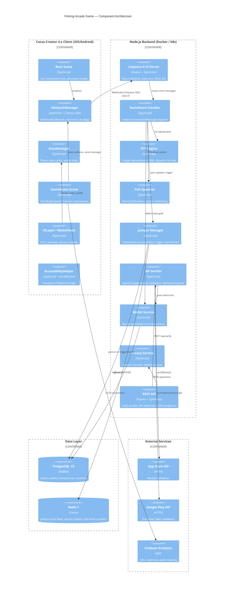

# Engineering Design Document — Fishing Arcade Game

<!-- DOC-ID: EDD-FISHING-ARCADE-GAME-20260422 -->
<!-- Parent: PRD-FISHING-ARCADE-GAME-20260422 / PDD-FISHING-ARCADE-GAME-20260422 -->
<!-- Downstream: TEST-PLAN.md -->

---

## Document Control

| Field | Content |
|-------|---------|
| **DOC-ID** | EDD-FISHING-ARCADE-GAME-20260422 |
| **Project** | fishing-arcade-game |
| **Version** | v1.0 |
| **Status** | DRAFT |
| **Author** | tobala (auto-generated by /devsop-gen-edd) |
| **Date** | 2026-04-22 |
| **Upstream PRD** | PRD-FISHING-ARCADE-GAME-20260422 (docs/PRD.md) v1.1 APPROVED |
| **Upstream PDD** | PDD-FISHING-ARCADE-GAME-20260422 (docs/PDD.md) v1.5 APPROVED |
| **Upstream BRD** | BRD-FISHING-ARCADE-GAME-20260421 (docs/BRD.md) |
| **Downstream** | TEST-PLAN.md |

### Change Log

| Version | Date | Author | Summary |
|---------|------|--------|---------|
| v1.0 | 2026-04-22 | tobala | Initial draft (auto-generated from PRD v1.1 + PDD v1.5) |

---

## §1 Architecture Overview

### §1.1 System Architecture



### §1.2 Technology Stack Decisions

| Layer | Technology | Version | Rationale |
|-------|-----------|---------|-----------|
| Game Client | Cocos Creator | 4.x | User-specified; native iOS/Android; Spine animation; TypeScript; hot-update support |
| Realtime Backend | Colyseus | 0.15 | MIT license; room-based isolation; built-in state serialisation; matches `sam-gong-game` existing stack |
| Backend Language | TypeScript + Node.js | 5.x / 20 LTS | Full-stack TypeScript reduces friction; team familiarity; async/non-blocking I/O |
| REST Framework | Express | 4.x | Minimal, well-understood; OpenAPI spec via swagger-jsdoc |
| Primary Database | PostgreSQL | 15 | ACID guarantees for wallet atomicity; JSONB for flexible schema evolution; 7-year audit retention |
| Cache / Jackpot state | Redis | 7 | Sub-millisecond atomic INCR for jackpot pool; session TTL; rate-limit counters |
| Schema Validation | Zod | 3.x | Runtime validation at all API boundaries; TypeScript type inference |
| IAP Verification | apple-receipt-verifier + google-play-library | latest | Battle-tested; handles sandbox vs production switching |
| Observability | Pino (structured JSON logs) + Prometheus metrics | latest | Low overhead; structured log fields match PRD §7.7.1 requirements |
| Infrastructure | Docker + Kubernetes (minimal HPA) | k8s 1.29 | Container isolation; CPU-based auto-scale per PRD §7.3 |
| Analytics | Firebase Analytics | SDK 10.x | PRD §7.8; free tier covers DAU 10K target |

**Key Decisions:**
- **Server-authoritative design**: ALL game outcome calculations (RTP, fish spawn paths, jackpot trigger, bullet-hit adjudication) execute server-side. Client is display-only. This satisfies US-RTP-001/AC-2 and PRD §7.4 anti-cheat requirements.
- **Integer-denominator RNG**: Probabilities expressed as `hits_per_N` integers to prevent floating-point drift (PRD BRD §0.1 technical risk R2, US-RTP-001/AC-3).
- **Colyseus Schema v2**: `@type` decorators from `@colyseus/schema` v2, not v1 annotations. MapSchema / ArraySchema for fish and player collections.
- **Redis for jackpot pool**: Hot path; atomic `HINCRBYFLOAT` (integer cents) avoids PostgreSQL round-trip per shot. PostgreSQL remains the source of truth, written on trigger or server restart.

### §1.3 Non-Functional Requirements Mapping

| PRD NFR | Target | Engineering Approach |
|---------|--------|---------------------|
| WebSocket p99 < 100ms | US-ROOM-001/AC-3 | Colyseus 20Hz state tick (50ms); priority message queue; k6 pressure test gate |
| API P99 < 500ms | PRD §7.1 | Express middleware timeout 450ms; circuit breaker on DB calls; PG connection pooling (pgBouncer) |
| 500 concurrent rooms | PRD §7.3 | k8s HPA CPU > 70% trigger; Colyseus horizontal pod autoscale; room affinity via Redis Cluster |
| FPS ≥ 30 (2GB RAM) | PRD §7.5 | ObjectPool pre-warm; ETC2/ASTC texture compression; Low-End Mode auto-detection (§3.5) |
| RTP error < 0.1% | US-RTP-001/AC-1 | Integer-denominator RNG; 100K simulation CI gate; isolated RTP module (100% unit coverage) |
| TLS 1.3 | PRD §7.4 | Ingress controller terminates TLS; internal cluster traffic plain TCP |
| 99.9% availability | PRD §7.2 | 2+ Pod replicas; PG streaming replication; Redis Sentinel; RTO 30min |

---

## §2 Backend Engineering (Node.js + Colyseus 0.15)

### §2.1 Colyseus Room Architecture

#### GameRoom Schema (TypeScript, Colyseus Schema v2)

```typescript
// src/rooms/schema/GameState.ts
import { Schema, type, MapSchema, ArraySchema } from '@colyseus/schema';

export class PlayerState extends Schema {
    @type('string')  playerId: string = '';
    @type('string')  nickname: string = '';
    @type('int64')   gold: number = 0;
    @type('int32')   multiplier: number = 1;         // current cannon multiplier (1–100)
    @type('boolean') isConnected: boolean = true;
    @type('int32')   slotIndex: number = 0;           // 0=P1(BL), 1=P2(BR), 2=P3(TL), 3=P4(TR)
}

export class FishState extends Schema {
    @type('string')  fishId: string = '';
    @type('string')  fishType: string = '';           // 'normal' | 'elite' | 'boss'
    @type('int32')   hp: number = 1;
    @type('int32')   maxHp: number = 1;
    @type('float32') posX: number = 0;
    @type('float32') posY: number = 0;
    @type('int32')   rewardMultiplier: number = 1;
    @type('boolean') alive: boolean = true;
}

export class BulletState extends Schema {
    @type('string')  bulletId: string = '';
    @type('string')  ownerId: string = '';
    @type('float32') originX: number = 0;
    @type('float32') originY: number = 0;
    @type('float32') targetX: number = 0;
    @type('float32') targetY: number = 0;
    @type('int32')   multiplier: number = 1;
}

export class GameState extends Schema {
    @type('string')  roomState: string = 'WAITING';  // WAITING | PLAYING | JACKPOT | BOSS_FIGHT | ENDED
    @type({ map: PlayerState })  players = new MapSchema<PlayerState>();
    @type({ map: FishState })    fish    = new MapSchema<FishState>();
    @type({ map: BulletState })  bullets = new MapSchema<BulletState>();
    @type('int64')   jackpotPool: number = 0;         // gold coins, mirrored from Redis
    @type('int32')   activeBossHp: number = 0;
    @type('int32')   activeBossMaxHp: number = 0;
    @type('string')  roomId: string = '';
    @type('int32')   playerCount: number = 0;
    @type('int32')   rtpNumerator: number = 92;       // current effective RTP %
}
```

#### Room Lifecycle

```typescript
// src/rooms/GameRoom.ts
export class GameRoom extends Room<GameState> {
    maxClients = 4;
    private _rtpEngine: RTPEngine;
    private _fishSpawner: FishSpawner;
    private _jackpotManager: JackpotManager;
    private _tickInterval: ReturnType<typeof setInterval>;

    async onCreate(options: RoomCreateOptions) {
        this.setState(new GameState());
        this.state.roomId = this.roomId;
        this._rtpEngine = new RTPEngine(RTP_CONFIG);
        this._fishSpawner = new FishSpawner(this.state, this.broadcast.bind(this));
        this._jackpotManager = await JackpotManager.getInstance();

        this.onMessage('shoot', this._handleShoot.bind(this));
        this.onMessage('set_multiplier', this._handleSetMultiplier.bind(this));
        this.onMessage('start_game', this._handleStartGame.bind(this));

        // 20Hz state tick (50ms)
        this._tickInterval = setInterval(() => this._tick(), 50);
    }

    async onJoin(client: Client, options: JoinOptions) {
        const player = new PlayerState();
        player.playerId = client.sessionId;
        player.nickname = options.nickname;
        player.gold = await WalletService.getGold(options.userId);
        player.slotIndex = this._assignSlot();
        this.state.players.set(client.sessionId, player);
        this.state.playerCount = this.state.players.size;
        if (this.state.playerCount >= 4) this._transitionToPlaying();
    }

    async onLeave(client: Client, consented: boolean) {
        const player = this.state.players.get(client.sessionId);
        if (player) { player.isConnected = false; }
        if (!consented) {
            // allow reconnection within 10s (PRD US-ROOM-001/AC-4)
            await this.allowReconnection(client, 10);
            player && (player.isConnected = true);
        } else {
            this.state.players.delete(client.sessionId);
            this.state.playerCount = this.state.players.size;
        }
    }

    onMessage(type: string, client: Client, message: unknown) { /* dispatched above */ }

    async onDispose() {
        clearInterval(this._tickInterval);
        await this._jackpotManager.persistPool();
        // flush pending wallet writes
        await WalletService.flushBatch();
    }
}
```

#### State Synchronisation Strategy

- **20Hz server tick**: fish position interpolation + room state broadcast via Colyseus delta-encode.
- **Bullet events**: sent as targeted one-off messages (not state schema), avoiding per-bullet schema overhead.
- **Client-side interpolation**: client moves fish along server-provided Bezier path using elapsed time, correcting on each state patch. Bullet travel is purely client-predicted; server only broadcasts hit/miss outcome.
- **Jackpot pool**: broadcast via GameState schema `jackpotPool` field on every state patch. NumberRoller animates the delta client-side.

### §2.2 Game Logic Engine

#### RTP Engine Design (US-RTP-001)

**Principle**: All hit adjudication is probabilistic, computed server-side using integer-denominator RNG to prevent floating-point drift.

```typescript
// src/engine/RTPEngine.ts
export interface RTPConfig {
    targetRtpMin: number;   // 0.85
    targetRtpMax: number;   // 0.95 (overall 92-96 per Jackpot odds table)
    fishConfigs: FishConfig[];
}

export interface FishConfig {
    fishType: 'normal' | 'elite' | 'boss';
    baseMultiplier: number;     // payout = bet * baseMultiplier
    hitRateNumerator: number;   // integer; hit probability = numerator / denominator
    hitRateDenominator: number; // fixed denominator (e.g. 100_000)
}

export class RTPEngine {
    private _totalBet = 0n;       // BigInt to avoid float overflow
    private _totalPaid = 0n;
    private _config: RTPConfig;

    constructor(config: RTPConfig) { this._config = config; }

    /**
     * Server-authoritative hit adjudication.
     * Returns { hit: boolean, payout: number }
     * Uses integer-denominator RNG (no floating-point probability).
     */
    adjudicate(fishType: FishType, betAmount: number, multiplier: number): HitResult {
        const fishCfg = this._config.fishConfigs.find(f => f.fishType === fishType)!;

        // Dynamic hit-rate adjustment: if actual RTP > targetMax, reduce hit rate temporarily
        const adjustedNumerator = this._dynamicAdjust(fishCfg);

        // Integer RNG: roll in [0, denominator)
        const roll = Math.floor(Math.random() * fishCfg.hitRateDenominator);
        const hit = roll < adjustedNumerator;

        this._totalBet += BigInt(betAmount);
        if (hit) {
            const payout = betAmount * fishCfg.baseMultiplier * multiplier;
            this._totalPaid += BigInt(payout);
            return { hit: true, payout };
        }
        return { hit: false, payout: 0 };
    }

    get currentRtp(): number {
        if (this._totalBet === 0n) return this._config.targetRtpMin;
        return Number(this._totalPaid * 100n / this._totalBet) / 100;
    }

    private _dynamicAdjust(cfg: FishConfig): number {
        const rtp = this.currentRtp;
        if (rtp > this._config.targetRtpMax) {
            // Scale numerator down proportionally
            const scale = this._config.targetRtpMax / rtp;
            return Math.floor(cfg.hitRateNumerator * scale);
        }
        if (rtp < this._config.targetRtpMin) {
            const scale = this._config.targetRtpMin / rtp;
            return Math.min(
                Math.floor(cfg.hitRateNumerator * scale),
                cfg.hitRateDenominator - 1
            );
        }
        return cfg.hitRateNumerator;
    }
}
```

**100K Simulation CI Gate** (US-RTP-001/AC-1): Jest test runs 100,000 adjudications per fish type and asserts `|actual_rtp - target_rtp| < 0.001`. This test runs on every PR. RTP module must maintain 100% unit test coverage.

#### Fish Spawn Algorithm

| Fish Type | Spawn Trigger | Frequency | Max Concurrent | HP |
|-----------|--------------|-----------|----------------|-----|
| Normal | Continuous wave scheduler (every 3-5s) | High | 50 / room | 1 |
| Elite (`ff_elite_fish_enabled`) | Random wave (M% chance per wave, configurable) | Medium | N / room (OQ5) | 3-8 |
| Boss (`ff_boss_fish_enabled`) | Timer-based (interval configurable) | Low | 1 / room | 50-200 |

Fish spawn includes a **server-computed Bezier path** (3-4 control points) so all clients see identical paths from the same state broadcast. Paths are generated with deterministic seeding per fish ID.

#### Bullet Hit Detection (Server-Authoritative)

```
Client sends: { bulletId, fishId, cannonMultiplier, betAmount }
Server:
  1. Validate: player has sufficient gold (betAmount <= player.gold)
  2. Validate: fishId exists and is alive
  3. Deduct betAmount from player wallet (atomic, via WalletService)
  4. Call RTPEngine.adjudicate(fishType, betAmount, multiplier)
  5. If hit:
     a. Decrement fish HP by 1 (server tracks HP)
     b. If HP == 0: award payout, broadcast fish_killed, remove fish from state
     c. Else: broadcast fish_damaged (HP update only)
  6. Check jackpot trigger (JackpotManager.tryTrigger)
  7. Broadcast shoot_result to all clients in room
```

**Anti-double-spend**: Wallet deduction is a database transaction with `FOR UPDATE` row lock. Bullet validation rejects concurrent duplicate `bulletId` values within the same session.

#### Jackpot Pool Accumulation and Trigger Logic (US-JACK-001/US-JACK-002)

**Pool Accumulation**: Each valid bet contributes `betAmount × jackpotContribRate` (Y%, configurable, stored in Redis `HINCRBYFLOAT game:jackpot:pool`). Contribution rate is read from environment config — not hardcoded.

**Trigger Probabilities** (from PDD §3.5 / PRD US-JACK-002):

| Cannon Multiplier | Jackpot Trigger Probability |
|-------------------|-----------------------------|
| 1x | 1 : 500,000 |
| 10x | 1 : 50,000 |
| 50x | 1 : 10,000 |
| 100x | 1 : 5,000 |

```typescript
// src/engine/JackpotManager.ts
export class JackpotManager {
    private static _instance: JackpotManager;
    private _redis: Redis;

    async tryTrigger(multiplier: number, sessionId: string): Promise<JackpotResult | null> {
        const odds = JACKPOT_ODDS[multiplier] ?? JACKPOT_ODDS[1];   // denominator from table above
        const roll = Math.floor(Math.random() * odds);
        if (roll !== 0) return null;

        // Atomic claim: GETDEL + SET seed in single pipeline (prevents concurrent winners)
        const pipeline = this._redis.pipeline();
        pipeline.getdel('game:jackpot:pool');
        pipeline.set('game:jackpot:pool', JACKPOT_SEED_AMOUNT);
        const [[, poolStr]] = await pipeline.exec() as [[null, string]];
        const poolAmount = parseInt(poolStr ?? '0', 10);
        if (poolAmount <= 0) return null;   // race condition guard

        // Persist trigger event to PostgreSQL
        await db.query(
            'INSERT INTO jackpot_history (winner_id, amount, triggered_at) VALUES ($1,$2,NOW())',
            [sessionId, poolAmount]
        );
        return { winnerId: sessionId, amount: poolAmount };
    }

    async persistPool() {
        const pool = await this._redis.get('game:jackpot:pool');
        await db.query('UPDATE jackpot_pool SET current_amount=$1, updated_at=NOW() WHERE id=1', [pool]);
    }

    /** Called at server startup to restore pool from PostgreSQL */
    async restorePool() {
        const row = await db.query('SELECT current_amount FROM jackpot_pool WHERE id=1');
        await this._redis.set('game:jackpot:pool', row.rows[0].current_amount);
    }
}
```

**Persistence guarantee** (US-JACK-001/AC-3): `onDispose` persists Redis → PostgreSQL. Startup restores PostgreSQL → Redis. This ensures pool survives server restart.

### §2.3 Dual Currency System (US-CURR-001 / US-CURR-002)

#### Data Model

```
user_wallets:
  - user_id (FK users.id)
  - gold    BIGINT  (free virtual currency; minimum unit 1)
  - diamond INTEGER (paid virtual currency; IAP only)
  - updated_at TIMESTAMPTZ
```

#### Atomic Transaction Design (Prevent Double-Spend)

All wallet mutations go through `WalletService` which wraps PostgreSQL transactions:

```typescript
// src/services/WalletService.ts
export async function debitGold(userId: string, amount: number): Promise<void> {
    await db.transaction(async (trx) => {
        const row = await trx.query(
            'SELECT gold FROM user_wallets WHERE user_id=$1 FOR UPDATE',
            [userId]
        );
        if (row.rows[0].gold < amount) throw new InsufficientFundsError();
        await trx.query(
            'UPDATE user_wallets SET gold = gold - $1 WHERE user_id = $2',
            [amount, userId]
        );
        await trx.query(
            'INSERT INTO transactions(user_id,type,amount,created_at) VALUES($1,$2,$3,NOW())',
            [userId, 'spend', -amount]
        );
    });
}

export async function creditDiamond(userId: string, amount: number, receiptHash: string): Promise<void> {
    // Idempotency: check receipt_hash uniqueness before credit
    await db.transaction(async (trx) => {
        const existing = await trx.query(
            'SELECT id FROM iap_receipts WHERE receipt_hash=$1', [receiptHash]
        );
        if (existing.rows.length > 0) return;  // already processed, idempotent
        await trx.query(
            'INSERT INTO iap_receipts(user_id, receipt_hash, created_at) VALUES($1,$2,NOW())',
            [userId, receiptHash]
        );
        await trx.query(
            'UPDATE user_wallets SET diamond = diamond + $1 WHERE user_id=$2',
            [amount, userId]
        );
        await trx.query(
            'INSERT INTO transactions(user_id,type,amount,created_at) VALUES($1,$2,$3,NOW())',
            [userId, 'iap', amount]
        );
    });
}
```

**No withdrawal**: API rejects any withdrawal or cash-out request with HTTP 403 and message "鑽石為娛樂虛擬幣，不可提現或折換現金" (US-CURR-001/AC-3).

#### IAP Flow

```
Client (Cocos)            App Store / Google Play          Backend
    |                              |                           |
    |--- purchaseProduct() ------->|                           |
    |<-- receipt/purchaseToken ----|                           |
    |--- POST /api/iap/verify -----|-------------------------->|
    |                              |                           |--- validateReceipt(receipt)
    |                              |<--------------------------|
    |                              |--- OK / INVALID ---------->|
    |                              |                           |--- creditDiamond() [idempotent]
    |<--------------------------------------------- 200 + balance|
```

**Retry / failure handling**: Client retries verification up to 3 times with exponential backoff. Server deduplicates via `receipt_hash` (SHA-256). Duplicate submission returns 200 with current balance (idempotent per US-CURR-002/AC-4).

### §2.4 Privacy & PDPA Backend (US-PRIV-001 through US-PRIV-004)

#### Consent Record Schema

```sql
-- Matches PRD §17.4 definition
CREATE TABLE user_consents (
    id             UUID         PRIMARY KEY DEFAULT gen_random_uuid(),
    user_id        UUID         NOT NULL REFERENCES users(id) ON DELETE CASCADE,
    consent_type   VARCHAR(100) NOT NULL,   -- 'privacy_policy' | 'marketing'
    granted        BOOLEAN      NOT NULL,
    granted_at     TIMESTAMPTZ,
    revoked_at     TIMESTAMPTZ,             -- NULL = not revoked
    policy_version VARCHAR(20)  NOT NULL,
    ip_address     INET,
    user_agent     TEXT,                    -- stored; masked in logs
    created_at     TIMESTAMPTZ  NOT NULL DEFAULT NOW()
);
CREATE INDEX idx_user_consents_user_type ON user_consents(user_id, consent_type);
```

**Version tracking**: `policy_version` references a `privacy_policies` table keyed by semver. On login, server compares user's latest `granted_at` policy version against current policy version. If stale, client is forced to re-consent (US-PRIV-001/AC-4).

#### Account Deletion — Soft Delete + 30-Day Hard Delete Job (US-PRIV-002)

```typescript
// src/services/PrivacyService.ts

async requestDeletion(userId: string): Promise<void> {
    await db.query(
        `INSERT INTO deletion_requests(user_id, requested_at, scheduled_for)
         VALUES($1, NOW(), NOW() + INTERVAL '30 days')
         ON CONFLICT (user_id) DO NOTHING`,
        [userId]
    );
    // Immediately set account as pending deletion
    await db.query(
        "UPDATE users SET deletion_status='pending', deletion_requested_at=NOW() WHERE id=$1",
        [userId]
    );
}

// Cron job runs daily (see §2.7): processes deletion_requests WHERE scheduled_for <= NOW()
async executeScheduledDeletions(): Promise<void> {
    const rows = await db.query(
        "SELECT user_id FROM deletion_requests WHERE scheduled_for <= NOW() AND executed_at IS NULL"
    );
    for (const row of rows.rows) {
        await db.transaction(async (trx) => {
            // Anonymise PII (PDPA hard delete of identifiable data)
            const anon = `deleted_${randomUUID().slice(0, 8)}`;
            await trx.query(
                "UPDATE users SET email=$1, nickname=$2, deletion_status='deleted' WHERE id=$3",
                [encrypt(`${anon}@deleted.invalid`), anon, row.user_id]
            );
            // Retain transactions for 7 years (tax law) — user_id stays as UUID reference only
            await trx.query(
                "UPDATE deletion_requests SET executed_at=NOW() WHERE user_id=$1",
                [row.user_id]
            );
        });
    }
}
```

#### Data Correction API (US-PRIV-003)

```
PATCH /api/user/profile
Body: { nickname?: string, email?: string }

- nickname: validate ≤50 chars; update immediately; broadcast to Colyseus room via GameRoom.broadcast
- email: validate RFC 5322 format + uniqueness; send confirmation email to NEW address; 
         update effective only after confirmation link clicked (24h TTL token)
```

Email confirmation token stored in Redis with 24-hour TTL: `SET email_confirm:<token> <userId:newEmail> EX 86400`.

#### Consent Revocation Flow (US-PRIV-004)

```
POST /api/privacy/consent/revoke
Body: { consentType: 'marketing' }

1. INSERT INTO user_consents(user_id, consent_type, granted=false, revoked_at=NOW(), ...)
2. Return 200 { success: true }
Client then:
3. Disables all Firebase Analytics marketing_* event logging (client SDK toggle)
4. Updates marketing consent toggle UI to OFF
```

Revoking `privacy_policy` consent: server returns HTTP 409 with `{ redirect: 'account_deletion' }`, instructing client to route user to the account deletion flow (US-PRIV-004/AC-3).

### §2.5 API Design Summary

All endpoints versioned under `/api/v1/`. Auth via JWT Bearer token (15min access + 30-day refresh).

| Method | Endpoint | Auth | Description | US-ID |
|--------|----------|------|-------------|-------|
| POST | `/auth/register` | None | Email+password register; issue JWT | — |
| POST | `/auth/login` | None | Login; issue JWT pair | — |
| POST | `/auth/refresh` | Refresh JWT | Rotate token pair | — |
| GET | `/user/profile` | JWT | Get nickname, email (masked), wallet | — |
| PATCH | `/user/profile` | JWT | Update nickname / initiate email change | US-PRIV-003 |
| GET | `/user/wallet` | JWT | Gold + diamond balance | US-CURR-001 |
| POST | `/iap/verify` | JWT | Verify Apple/Google receipt; credit diamond | US-CURR-002 |
| GET | `/privacy/consents` | JWT | List user's consent records | US-PRIV-001 |
| POST | `/privacy/consent/grant` | JWT | Grant a consent type | US-PRIV-001 |
| POST | `/privacy/consent/revoke` | JWT | Revoke marketing consent | US-PRIV-004 |
| POST | `/privacy/account/delete` | JWT | Submit deletion request | US-PRIV-002 |
| DELETE | `/privacy/account/delete` | JWT | Cancel pending deletion | US-PRIV-002 |
| GET | `/game/jackpot` | JWT | Current jackpot pool amount | US-JACK-001 |
| GET | `/game/jackpot/odds` | None (public) | Jackpot odds table for disclosure | US-JACK-002 |
| GET | `/health` | None | Liveness probe | — |

**Rate Limiting**: All auth endpoints: 10 req/min per IP. IAP verify: 5 req/min per user. Profile update: 20 req/min per user. Implemented via `express-rate-limit` + Redis store.

### §2.6 Database Schema (PostgreSQL, Key Tables)

```sql
-- Users
CREATE TABLE users (
    id                    UUID         PRIMARY KEY DEFAULT gen_random_uuid(),
    email                 BYTEA        NOT NULL UNIQUE,   -- AES-256-GCM encrypted
    nickname              VARCHAR(50)  NOT NULL,
    password_hash         TEXT         NOT NULL,           -- bcrypt
    device_id             VARCHAR(64),                     -- SHA-256 hash, anti-cheat
    deletion_status       VARCHAR(20)  NOT NULL DEFAULT 'active', -- active|pending|deleted
    deletion_requested_at TIMESTAMPTZ,
    created_at            TIMESTAMPTZ  NOT NULL DEFAULT NOW(),
    updated_at            TIMESTAMPTZ  NOT NULL DEFAULT NOW()
);

-- Wallets (1:1 with users)
CREATE TABLE user_wallets (
    user_id    UUID    PRIMARY KEY REFERENCES users(id) ON DELETE CASCADE,
    gold       BIGINT  NOT NULL DEFAULT 0 CHECK (gold >= 0),
    diamond    INTEGER NOT NULL DEFAULT 0 CHECK (diamond >= 0),
    updated_at TIMESTAMPTZ NOT NULL DEFAULT NOW()
);

-- Transactions (immutable ledger)
CREATE TABLE transactions (
    id         UUID         PRIMARY KEY DEFAULT gen_random_uuid(),
    user_id    UUID         NOT NULL REFERENCES users(id),
    type       VARCHAR(20)  NOT NULL,    -- earn|spend|iap|jackpot|refund
    amount     BIGINT       NOT NULL,    -- positive=credit, negative=debit
    currency   VARCHAR(10)  NOT NULL DEFAULT 'gold',  -- gold|diamond
    ref_id     UUID,                     -- e.g. game_session_id or iap_receipt_id
    created_at TIMESTAMPTZ  NOT NULL DEFAULT NOW()
);
CREATE INDEX idx_transactions_user_created ON transactions(user_id, created_at DESC);

-- IAP Receipts (idempotency table)
CREATE TABLE iap_receipts (
    id           UUID        PRIMARY KEY DEFAULT gen_random_uuid(),
    user_id      UUID        NOT NULL REFERENCES users(id),
    receipt_hash VARCHAR(64) NOT NULL UNIQUE,  -- SHA-256(receipt)
    platform     VARCHAR(10) NOT NULL,          -- apple|google
    product_id   VARCHAR(100) NOT NULL,
    diamond_amt  INTEGER     NOT NULL,
    created_at   TIMESTAMPTZ NOT NULL DEFAULT NOW()
);

-- Jackpot Pool (single-row state table)
CREATE TABLE jackpot_pool (
    id             INTEGER PRIMARY KEY DEFAULT 1 CHECK (id = 1),  -- singleton
    current_amount BIGINT  NOT NULL DEFAULT 10000,  -- seed amount
    updated_at     TIMESTAMPTZ NOT NULL DEFAULT NOW()
);

-- Jackpot History (audit trail)
CREATE TABLE jackpot_history (
    id           UUID        PRIMARY KEY DEFAULT gen_random_uuid(),
    winner_id    UUID        NOT NULL REFERENCES users(id),
    amount       BIGINT      NOT NULL,
    triggered_at TIMESTAMPTZ NOT NULL DEFAULT NOW(),
    room_id      VARCHAR(100)
);

-- Game Sessions (audit / analytics)
CREATE TABLE game_sessions (
    id          UUID        PRIMARY KEY DEFAULT gen_random_uuid(),
    room_id     VARCHAR(100) NOT NULL,
    started_at  TIMESTAMPTZ NOT NULL DEFAULT NOW(),
    ended_at    TIMESTAMPTZ,
    ip_address  INET,       -- logged for anti-cheat; masked in logs; deleted after 90 days
    player_ids  UUID[]      NOT NULL
);

-- User Consents (PDPA)
CREATE TABLE user_consents (
    id             UUID         PRIMARY KEY DEFAULT gen_random_uuid(),
    user_id        UUID         NOT NULL REFERENCES users(id) ON DELETE CASCADE,
    consent_type   VARCHAR(100) NOT NULL,
    granted        BOOLEAN      NOT NULL,
    granted_at     TIMESTAMPTZ,
    revoked_at     TIMESTAMPTZ,
    policy_version VARCHAR(20)  NOT NULL,
    ip_address     INET,
    user_agent     TEXT,
    created_at     TIMESTAMPTZ  NOT NULL DEFAULT NOW()
);

-- Deletion Requests
CREATE TABLE deletion_requests (
    user_id      UUID        PRIMARY KEY REFERENCES users(id),
    requested_at TIMESTAMPTZ NOT NULL DEFAULT NOW(),
    scheduled_for TIMESTAMPTZ NOT NULL,
    executed_at  TIMESTAMPTZ,
    cancelled_at TIMESTAMPTZ
);

-- RTP Audit Logs (permanent retention)
CREATE TABLE rtp_logs (
    id          UUID        PRIMARY KEY DEFAULT gen_random_uuid(),
    room_id     VARCHAR(100) NOT NULL,
    user_id     UUID        NOT NULL,
    fish_type   VARCHAR(20) NOT NULL,
    bet_amount  BIGINT      NOT NULL,
    multiplier  INTEGER     NOT NULL,
    hit         BOOLEAN     NOT NULL,
    payout      BIGINT      NOT NULL DEFAULT 0,
    rtp_at_time NUMERIC(5,4) NOT NULL,   -- running RTP at time of adjudication
    created_at  TIMESTAMPTZ NOT NULL DEFAULT NOW()
);
CREATE INDEX idx_rtp_logs_room ON rtp_logs(room_id, created_at DESC);
```

**Email encryption**: `users.email` stored as `BYTEA` (AES-256-GCM with server-managed KEK via environment variable or Vault). Decryption occurs only in application layer; never logged.

**Indexing strategy**: `user_id + created_at DESC` on transactions for wallet reconciliation; `receipt_hash` unique index on IAP receipts for idempotency; `jackpot_pool` singleton enforced via CHECK constraint.

### §2.7 Infrastructure & Deployment

```yaml
# k8s minimal spec (HPA-enabled)
apiVersion: apps/v1
kind: Deployment
metadata:
  name: fishing-game-server
spec:
  replicas: 2                    # minimum 2 for 99.9% SLA
  selector:
    matchLabels: { app: fishing-game }
  template:
    spec:
      containers:
        - name: game-server
          image: fishing-game-server:latest
          ports:
            - containerPort: 2567     # Colyseus WebSocket
            - containerPort: 3000     # REST API
          env:
            - name: DATABASE_URL
              valueFrom: { secretKeyRef: { name: db-secret, key: url } }
            - name: REDIS_URL
              valueFrom: { secretKeyRef: { name: redis-secret, key: url } }
            - name: AES_KEY
              valueFrom: { secretKeyRef: { name: crypto-secret, key: aes-key } }
          resources:
            requests: { cpu: "500m", memory: "512Mi" }
            limits:   { cpu: "2",    memory: "2Gi" }
          livenessProbe:
            httpGet: { path: /health, port: 3000 }
            initialDelaySeconds: 10
            periodSeconds: 10
---
apiVersion: autoscaling/v2
kind: HorizontalPodAutoscaler
metadata:
  name: fishing-game-hpa
spec:
  scaleTargetRef: { kind: Deployment, name: fishing-game-server }
  minReplicas: 2
  maxReplicas: 5
  metrics:
    - type: Resource
      resource:
        name: cpu
        target: { type: Utilization, averageUtilization: 70 }
```

**Cron Jobs** (Kubernetes CronJob):
- `deletion-executor`: runs daily at 02:00 UTC; calls `PrivacyService.executeScheduledDeletions()`
- `jackpot-persist`: runs every 5 minutes; calls `JackpotManager.persistPool()` as secondary checkpoint
- `wallet-reconcile`: runs daily at 03:00 UTC; cross-checks `user_wallets` balance against `transactions` sum

**Secrets management**: All credentials in k8s Secrets (or external Vault). Never hardcoded. `.env` file excluded from VCS via `.gitignore`. Application validates required env vars at startup and exits with clear error if missing.

---

## §3 Client Engineering (Cocos Creator 4.x + TypeScript)

### §3.1 Project Structure

```
client/
├── assets/
│   ├── scenes/
│   │   ├── Boot.scene
│   │   ├── MainMenu.scene
│   │   ├── GameRoom.scene
│   │   └── Shop.scene
│   ├── prefabs/
│   │   ├── fish/
│   │   │   ├── NormalFish.prefab
│   │   │   ├── EliteFish.prefab
│   │   │   └── BossFish.prefab
│   │   ├── ui/
│   │   │   ├── JackpotDisplay.prefab
│   │   │   ├── PrivacyConsentModal.prefab
│   │   │   ├── JackpotOddsModal.prefab
│   │   │   └── CoinInsufficientToast.prefab
│   │   └── cannon/
│   │       └── Cannon.prefab
│   ├── scripts/
│   │   ├── components/
│   │   │   ├── cannon/
│   │   │   │   └── CannonComponent.ts
│   │   │   ├── fish/
│   │   │   │   ├── NormalFish.ts
│   │   │   │   ├── EliteFish.ts
│   │   │   │   └── BossFish.ts
│   │   │   ├── ui/
│   │   │   │   ├── NumberRoller.ts
│   │   │   │   ├── PrivacyConsentModal.ts
│   │   │   │   ├── JackpotOddsModal.ts
│   │   │   │   └── CoinInsufficientToast.ts
│   │   │   └── layout/
│   │   │       └── SafeAreaAdapter.ts
│   │   ├── network/
│   │   │   ├── NetworkManager.ts
│   │   │   └── RoomMessageHandler.ts
│   │   ├── managers/
│   │   │   ├── DataManager.ts
│   │   │   └── AudioManager.ts
│   │   └── utils/
│   │       ├── ObjectPoolManager.ts
│   │       ├── AccessibilityHelper.ts
│   │       └── MotionPreference.ts
│   └── atlases/
│       ├── ui_common.atlas
│       ├── fish_normal.atlas
│       ├── fish_elite.atlas
│       ├── fish_boss.atlas
│       └── effects_common.atlas
└── native/
    ├── ios/
    │   └── AppController+Accessibility.mm   # jsb bridge for VoiceOver
    └── android/
        └── Cocos2dxHelper+Accessibility.java # jsb bridge for TalkBack
```

### §3.2 Network Layer (WebSocket → Colyseus SDK)

#### Connection Management

```typescript
// scripts/network/NetworkManager.ts
// Persistent node: created in Boot.scene, preserved across scenes via director.addPersistRootNode()

@ccclass('NetworkManager')
export class NetworkManager extends Component {
    private _client: Client;
    private _room: Room<GameState> | null = null;
    private _reconnectAttempts = 0;
    private static readonly MAX_RECONNECT = 3;
    private static readonly RECONNECT_DELAYS = [1000, 2000, 4000]; // exponential backoff

    async connect(serverUrl: string) {
        this._client = new Client(serverUrl);
    }

    async joinOrCreateRoom(options: RoomJoinOptions): Promise<void> {
        this._room = await this._client.joinOrCreate<GameState>('game_room', options);
        this._room.onStateChange(this._handleStateChange.bind(this));
        this._room.onLeave(this._handleDisconnect.bind(this));
        this._room.onMessage('shoot_result', this._handleShootResult.bind(this));
        this._room.onMessage('jackpot_won', this._handleJackpotWon.bind(this));
        this._reconnectAttempts = 0;
    }

    private async _handleDisconnect(code: number) {
        if (this._reconnectAttempts >= NetworkManager.MAX_RECONNECT) {
            this._emitEvent('reconnect_failed');
            return;
        }
        this._emitEvent('reconnecting', { attempt: this._reconnectAttempts + 1 });
        const delay = NetworkManager.RECONNECT_DELAYS[this._reconnectAttempts];
        await new Promise(r => setTimeout(r, delay));
        try {
            this._room = await this._client.reconnect(this._room!.reconnectionToken);
            this._reconnectAttempts = 0;
            this._emitEvent('reconnected');
        } catch {
            this._reconnectAttempts++;
            this._handleDisconnect(code);
        }
    }

    sendShoot(fishId: string, betAmount: number, multiplier: number) {
        this._room?.send('shoot', { fishId, betAmount, multiplier });
    }
}
```

#### State Sync Handling (onStateChange Callbacks)

- **Fish pool updates**: `state.fish.onAdd` → `FishPool.spawn(fishData)`; `state.fish.onRemove` → `FishPool.recycle(fishId)`
- **Player state changes**: `state.players.onChange` → update CannonHUD labels (gold, nickname)
- **Jackpot pool**: `state.onChange('jackpotPool', newVal)` → `NumberRoller.updateValue(newVal)`
- **Room state transitions**: `state.onChange('roomState', newVal)` → trigger scene-level state machine (WaitingOverlay, BossAnnouncement, etc.)

### §3.3 Core Game Components

#### CannonComponent Implementation Notes

Full state machine: `IDLE → CHARGING → FIRING → COOLING`. Key implementation rules:
- **No client-side RTP logic**: `CannonComponent.onFireTap()` sends `shoot` message to server. Client displays firing animation immediately (optimistic) but only shows payout or miss after receiving `shoot_result` message.
- **Aim line rendering**: `Graphics` component redraws every frame (`update()`). Use `cc.Graphics.moveTo / lineTo / stroke`. Dashed line via manual segment iteration.
- **Reduce Motion**: call `MotionPreference.isReduceMotionEnabled()` at `onLoad`. If true, skip idle barrel sway, muzzle pulse, and charging vibration animations. (PDD §3.1 F8 spec)

#### Fish ObjectPool Implementation

```typescript
// Uses ObjectPoolManager (PDD §4.3.2) with CC4.x ObjectPool<Node>
// handler: { onFree: node => node.active = false, reuse: node => node.active = true }

// In GameRoom scene onLoad:
const poolMgr = ObjectPoolManager.getInstance();
poolMgr.registerPrefab('NormalFish', this.normalFishPrefab);
poolMgr.registerPrefab('EliteFish', this.eliteFishPrefab);
poolMgr.registerPrefab('BossFish', this.bossFishPrefab);

// Warm-up (avoid GC spike during gameplay):
poolMgr.getPool('NormalFish', 20);   // 20 pre-warmed
poolMgr.getPool('EliteFish', 5);
poolMgr.getPool('BossFish', 2);
poolMgr.getPool('Bullet', 40);
poolMgr.getPool('HitEffect', 20);

// Spawn (called from state.fish.onAdd callback):
function spawnFish(data: FishState) {
    const pool = poolMgr.getPool(data.fishType + 'Fish', 0);
    const node = pool.get();
    const comp = node.getComponent(NormalFish)!;
    comp.initWithServerData(data);
    gameLayer.addChild(node);
}
```

**Scene cleanup**: `director.on(Director.EVENT_BEFORE_SCENE_LAUNCH, () => poolMgr.clearAllPools())` — releases all pooled nodes and Bundle assets before transitioning away from GameRoom.

#### NumberRoller Implementation

See PDD §3.3 for full implementation. Key constraint: CC4.x `tween()` only animates **public** properties. `currentValue` must be declared `public`. `displayLabel.string` updated in `onUpdate` callback with `toLocaleString('zh-TW')` formatting.

### §3.4 Safe Area & Responsive Layout

`SafeAreaAdapter` (PDD §4.1.1) uses `sys.getSafeAreaRect()` + `screen.windowSize` in physical pixels, divided by `screen.devicePixelRatio` to produce logical pixel insets for `UITransform.setContentSize()`. All four insets (top, bottom, left, right) are applied to `SafeAreaAdapter` child nodes that act as margin spacers.

**Landscape lock**: `screen.setOrientation(ScreenOrientation.LANDSCAPE_RIGHT)` in Boot.scene. Also declared in `AndroidManifest.xml` (`sensorLandscape`) and iOS `Info.plist`. Android Display Cutout: `android:windowLayoutInDisplayCutoutMode="shortEdges"` (PDD §4.1.2 F11).

**Design resolution**: 1334×750 (iPhone landscape baseline), with `FIXED_WIDTH` fit strategy so width is always 1334 logical units and height scales.

### §3.5 Performance Budget (2GB RAM Target, PRD §7.5)

| Resource | Budget | Control Mechanism |
|----------|--------|-------------------|
| Texture VRAM | < 128 MB | ETC2 (Android) / ASTC 4×4 (iOS) per atlas; Boss atlas loads on-demand 2s before spawn |
| JS heap | < 64 MB | ObjectPool eliminates allocation churn; no leaking event listeners |
| FPS | ≥ 30 | Low-End Mode auto-activates when FPS < 25 for 5s (halves particles, disables Bloom) |
| Network messages / s | ≤ 10,000 msg/s aggregate (500 rooms × 4 players × 5/s) | Colyseus state delta encoding; shoot messages are point-to-point not broadcast |
| Asset bundle: `game_room` | ≤ 30 MB download | Atlas compression; Spine skeleton binary format |

**Profiling checkpoints** (CI): weekly memory snapshot test on iPhone 12 (3GB RAM), Samsung Galaxy A54 (6GB RAM). Gate: no OOM crash in 30-minute stress run.

### §3.6 Privacy UI Components

| Component | Trigger | Key Behaviour |
|-----------|---------|---------------|
| `PrivacyConsentModal` | First app launch; policy version change | Blocks all input; requires explicit tap "同意並繼續遊戲"; calls `POST /api/privacy/consent/grant`; stores version locally |
| `JackpotOddsModal` | Shop page; Settings → Jackpot odds | Displays odds table from `GET /game/jackpot/odds`; date-stamped; meets App Store/Google Play disclosure requirement |
| `ConsentManagementUI` | Settings → Privacy | Toggle for marketing consent; calls `POST /api/privacy/consent/revoke`; disables Firebase `marketing_*` events client-side |
| `AccountDeletionFlow` | Settings → Delete Account | Two-step: explanation + "DELETE" confirmation; calls `POST /api/privacy/account/delete`; shows 30-day countdown |
| `ProfileEditModal` | Settings → Nickname / Email edit | Nickname: immediate; Email: sends confirmation link via server |

All privacy modals use WCAG AAA contrast (white text on `#0B2447`). Accessibility labels set via `AccessibilityHelper.setAccessibilityLabel()` using `jsb.reflection` bridge (PDD §5.1.3 F12 spec). `PrivacyConsentModal` focus order: consent checkbox → view-policy link → agree button → disagree button.

---

## §4 Security Design

### §4.1 Server-Authoritative Design

All game outcomes computed server-side. Client cannot influence:
- Hit/miss result (RTP engine on server)
- Fish HP deduction (server state `FishState.hp`)
- Jackpot trigger (server-side RNG in `JackpotManager.tryTrigger`)
- Payout amounts (server emits exact gold amount in `shoot_result` message)
- Fish spawn paths (server generates Bezier control points per fish)

**Client validation**: Server validates every `shoot` message: (1) session authenticated, (2) `fishId` exists in room state, (3) player gold ≥ bet amount, (4) bullet rate-limit (max 10 active bullets per player). Invalid messages are silently dropped with a WARN log entry.

### §4.2 API Security

| Control | Implementation |
|---------|----------------|
| Authentication | JWT (RS256); Access Token 15min TTL; Refresh Token 30 days; stored in memory (not localStorage) |
| Authorization | RBAC: `player` role for all game endpoints; `admin` role for operational endpoints |
| HTTPS | TLS 1.3+ at Ingress; internal cluster traffic plain TCP |
| Rate Limiting | `express-rate-limit` + Redis store; per-IP for auth; per-user for IAP |
| CORS | Allowlist: app bundle ID (mobile); no wildcard |
| Input Validation | Zod schemas at every REST endpoint boundary; reject unknown fields |
| IAP Idempotency | `receipt_hash` unique index prevents double diamond grant |
| STRIDE coverage | Required Go/No-Go gate (PRD §9.3); must cover: RTP manipulation, IAP receipt forgery, packet replay |

### §4.3 PII Protection

| Data | Protection |
|------|-----------|
| `users.email` | AES-256-GCM encrypted in DB (`BYTEA`); KEK in k8s Secret / Vault; never logged in plaintext |
| `users.nickname` | Plaintext; partial mask in logs (`阿凱***`) |
| `users.device_id` | SHA-256 hash stored; original never persisted |
| `game_sessions.ip_address` | Stored; last 2 octets masked in logs; auto-deleted after 90 days via cron |
| `user_consents.user_agent` | Stored for PDPA evidence; OS version and beyond masked in logs |
| JWT claims | Never include PII beyond `userId` (UUID) and `role` |
| Log masking | Pino `redact` config: `['*.email', '*.password', '*.receiptData']`; `user_id` displayed as `user-****-<last4>` |

---

## §5 Requirements Traceability (REQ-ID → EDD Section Mapping)

| REQ-ID | User Story Title | EDD Section | Implementation Notes |
|--------|-----------------|-------------|---------------------|
| US-ROOM-001 | 即時 4 人房間 | §2.1 (GameRoom lifecycle) | Colyseus 4-player room; reconnection 10s window; matchmaking via `joinOrCreate` |
| US-FISH-001 | 基礎砲台射擊 | §2.2 (bullet hit detection, RTP engine) | Server-authoritative; deduct gold before adjudication; broadcast result |
| US-FISH-002 | Boss 魚系統 | §2.2 (fish spawn algorithm, FishState.hp) | HP tracked in FishState; boss spawn timer server-side; 60s escape timeout |
| US-FISH-003 | 精英魚系統 | §2.2 (fish spawn algorithm) | Gated by `ff_elite_fish_enabled`; HP 3-8; separate spawn probability M% per wave |
| US-RTP-001 | RTP 動態命中率系統 | §2.2 (RTPEngine) | Integer-denominator RNG; 100K CI simulation; dynamic adjustment algorithm; 100% unit coverage |
| US-CURR-001 | 金幣雙軌貨幣 | §2.3 (WalletService, DB schema) | Atomic PG transactions; free gold restoration via cron; no withdrawal endpoint |
| US-CURR-002 | 鑽石道具內購 | §2.3 (IAP flow, iap_receipts idempotency) | Receipt hash dedup; Apple+Google dual verification; 2s balance update SLA |
| US-JACK-001 | Jackpot 池系統 | §2.2 (JackpotManager) | Redis atomic accumulation; PG persistence; 30-day seed restore |
| US-JACK-002 | Jackpot 機率揭示 UI | §2.2 (Jackpot trigger table), §3.6 (JackpotOddsModal) | Public `GET /game/jackpot/odds` endpoint; odds not hardcoded; date-stamped; App Store compliant |
| US-PRIV-001 | 隱私政策同意流程 | §2.4 (PrivacyService, user_consents schema), §3.6 (PrivacyConsentModal) | Policy version tracking; re-consent on version change; timestamp+IP+user_agent recorded |
| US-PRIV-002 | 帳號刪除申請入口 | §2.4 (soft delete, 30-day cron), §3.6 (AccountDeletionFlow) | Soft delete → 30-day scheduled hard anonymisation; transactions retained 7 years |
| US-PRIV-003 | 更正個人資料 | §2.4 (Data Correction API), §3.6 (ProfileEditModal) | Nickname immediate; email requires confirmation link (24h TTL); Colyseus broadcast on nickname change |
| US-PRIV-004 | 同意撤回 | §2.4 (consent revocation flow), §3.6 (ConsentManagementUI) | `revoked_at` timestamp; client disables Firebase `marketing_*` events; no kill switch (PDPA mandatory) |

---

## §6 Open Questions & Risks

| # | Question / Risk | Impact | Owner | Deadline | Mitigation |
|---|----------------|--------|-------|----------|-----------|
| OQ1 | 台灣虛擬貨幣/博彩法規允許鑽石系統？ | HIGH — entire payment model | Legal | 2026-04-30 | OQ1 gates Go/No-Go; fallback: gold-only model without IAP |
| OQ2 | Cocos Creator 4.x + Colyseus 0.15 best integration pattern? | MEDIUM — client arch | Engineering | Dev Month 1 | PoC by month 1 end; use `@colyseus/cocos-sdk` if available, else raw WebSocket + manual deserialization |
| OQ4 | App Store / Google Play exact Jackpot disclosure format? | MEDIUM — UI design | PM | Dev Month 1 | Use 1:X,XXX format (PDD §3.5) as placeholder; update before submission |
| OQ5 | 初始金幣數量 + 免費恢復數值? | HIGH — blocks US-CURR-001/AC-1,2; US-RTP-001/AC-4; US-FISH-002/AC-1; US-FISH-003/AC-1 | PM + Numeric Designer | Dev Month 1 end | Use placeholders; all blocked ACs cannot pass Go/No-Go until resolved |
| R1 | Colyseus single-process GC pause under 500 rooms | HIGH — p99 SLA | Engineering | Dev Month 2 | k6 pressure test at month 2; HPA as mitigation; Node.js --max-old-space-size tuning |
| R2 | Redis jackpot pool loss on crash before persist | MEDIUM — financial integrity | Engineering | Dev Month 1 | 5-minute persist cron + onDispose hook; Redis AOF persistence enabled |
| R3 | Apple IAP sandbox vs production receipt routing | MEDIUM — IAP verification | Engineering | Dev Month 3 | Environment-based endpoint switching; test both in Beta phase |
| R4 | PDPA cross-border transfer (GCP US region) | LOW/MEDIUM | Legal | 2026 Q3 | Prefer GCP Asia region (Taiwan/Singapore); legal review if US region required |

---

## §7 Change Log

| Version | Date | Author | Summary |
|---------|------|--------|---------|
| v1.0 | 2026-04-22 | tobala | Initial EDD generated from PRD v1.1 + PDD v1.5. Covers full backend (Colyseus room, RTPEngine, JackpotManager, WalletService, PrivacyService, PostgreSQL schema, k8s spec) and client (ObjectPool, NetworkManager, SafeAreaAdapter, privacy UI components) architecture. 13 US-IDs traced. |
