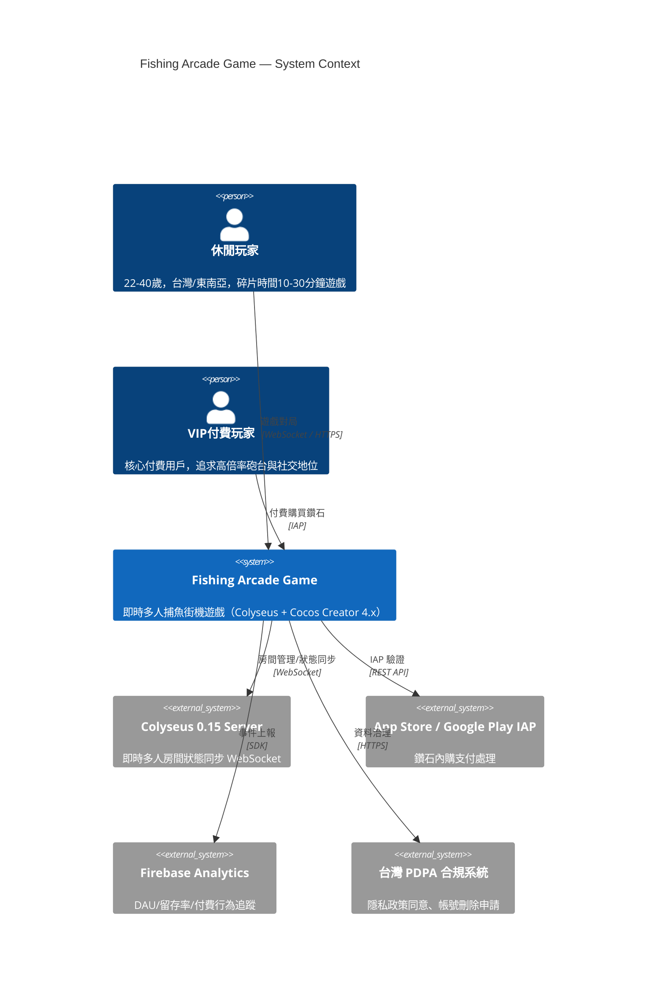
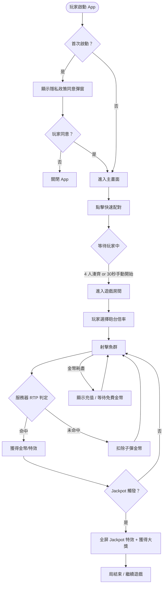
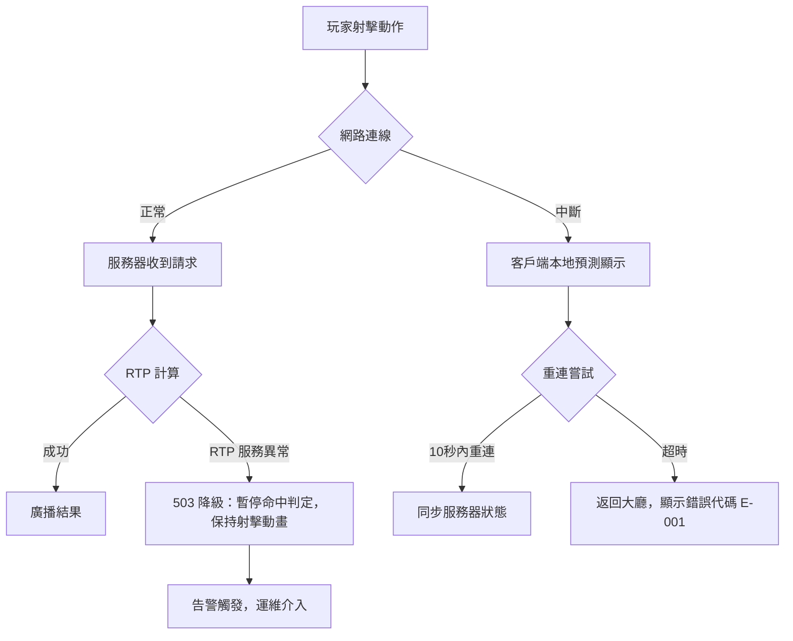
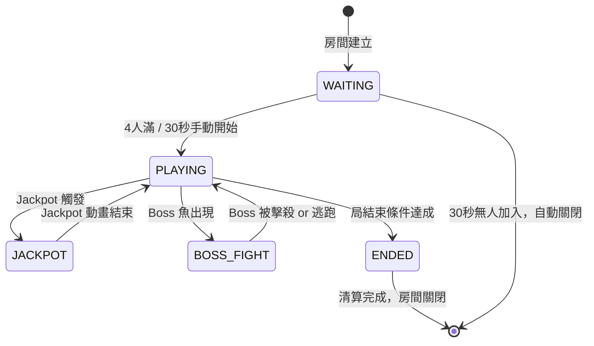

# PRD — Product Requirements Document
<!-- 對應學術標準：IEEE 830 (SRS)，對應業界：Google PRD / Amazon PRFAQ -->

---

## Document Control

| 欄位 | 內容 |
|------|------|
| **DOC-ID** | PRD-FISHING-ARCADE-GAME-20260422 |
| **產品名稱** | Fishing Arcade Game（多人即時捕魚街機遊戲） |
| **文件版本** | v1.1 |
| **狀態** | DRAFT |
| **作者（PM）** | tobala（由 /devsop-gen-prd 自動生成） |
| **日期** | 2026-04-22 |
| **上游 BRD** | [BRD.md](BRD.md) §5 MoSCoW 功能清單、§3 Business Objectives、§7 Success Metrics |
| **審閱者** | Engineering Lead, Design Lead |
| **核准者** | tobala |

---

## Change Log

| 版本 | 日期 | 作者 | 變更摘要 |
|------|------|------|---------|
| v1.0 | 2026-04-22 | tobala | 初稿（自動生成自 BRD v0.1-draft Round 2） |
| v1.1 | 2026-04-22 | tobala | STEP-04 Review Round 1-4 修訂：新增 US-FISH-003（精英魚）、US-PRIV-003（更正權）、US-PRIV-004（撤回同意）；新增 ff_rtp_engine、ff_dual_currency、ff_elite_fish_enabled Feature Flags；補充 §17 PII Inventory（device_id、user_agent）；補充 §7.8 Analytics Events（consent_revoked、user_profile_updated、currency_spent）；共 37 個 findings 已修復 |

---

## 1. Executive Summary

本產品《Fishing Arcade Game》是一款基於 **TypeScript + Node.js + Colyseus 0.15 + Cocos Creator 4.x** 的真正即時多人捕魚街機遊戲，針對台灣及東南亞 22-40 歲休閒競技遊戲玩家。

**核心問題**：現有捕魚遊戲「形式多人、實質單機」，30 日留存率低於 30%，玩家缺乏真實競爭感與長期目標驅動。

**解決方案**：以 Colyseus 房間機制實現毫秒級多人狀態同步（p99 < 100ms），4 人真實搶魚競技 + 精算 RTP（85-95%）+ Jackpot 累積池，創造即時爽感與長期留存飛輪。

**商業目標**：上線 12 個月達 DAU 10,000，付費率 5%，月 ARPPU $20 USD，月營收 $10,000 USD（North Star：ARPPU）。

---

## 2. Problem Statement

### 2.1 現狀痛點

亞洲捕魚遊戲玩家的現狀：

- **實體街機廳衰退**：疫情後客流持續下降，玩家被迫遷移至手機端
- **手機端競品「形式多人、實質單機」**：4-6 人同場但無真實競爭機制，每顆子彈無競爭後果
- **技能系統淺薄**：單一武器、無策略選擇，重複感強，30 日留存率 < 30%
- **RTP 不透明**：玩家感覺被系統操控，信任危機

**玩家 workaround 行為**：
- 在多平台間切換尋找「更刺激」體驗
- 在社群媒體分享爆金截圖作為社交認同替代出口
- 花光遊戲幣即離開，無長期目標驅動

### 2.2 根本原因分析

```
問題現象：現有線上捕魚遊戲留存率低
  Why 1：遊戲體驗重複感強，缺乏長期目標
    Why 2：技能系統淺薄、策略選擇空間不足
      Why 3：多人競技機制流於形式，感覺不到對手
        Why 4：玩家決策缺乏真實競爭後果
          Why 5（根本原因）：無法獲得「勝利感」與「社交認同」，快速流失
```

**技術根因**：競品基於 2015-2020 年 Lua / 舊架構，無法提供真正即時多人同步（p99 > 500ms）。

### 2.3 機會假設

- 假設 A1：若引入真實即時多人競技（Colyseus p99 < 100ms），30 日留存率將比競品高 ≥ 20%
- 假設 A6：若提供 Jackpot + 成長養成系統，付費用戶月 ARPPU 可達 $20（vs 競品 $10-15）

### 2.4 System Context Diagram



---

## 3. Stakeholders & Users

### 3.1 Stakeholder Map

| 角色 | 關係 | 主要關切 | 溝通頻率 |
|------|------|---------|---------|
| tobala（Owner / Founder） | 出資 / 核准 | ROI、上市時間、技術可行性 | 每日 |
| 投資人 / 募資對象 | 財務贊助 | 財務回報、市場風險、ROI 時程 | 月 |
| 工程師（前後端） | 技術實作 | 可行性、工具鏈、工作量 | 每日 |
| 遊戲美術外包 | 美術交付 | 資源規格清楚、付款條件 | 每週 |
| 法務顧問（台灣） | Legal Advisory | 虛擬貨幣合規、博彩元素界定 | 月 |
| 目標玩家 | End User | 遊戲體驗、公平性、獎勵機制 | - |

### 3.2 User Personas

#### Persona A：競技型付費玩家「阿凱」

| 欄位 | 內容 |
|------|------|
| **背景** | 28 歲，台北上班族，下班後打手遊放鬆，每週遊戲時間 10-15 小時 |
| **目標** | 在多人房間中「壓制」對手、觸發 Jackpot 被全場看到 |
| **痛點** | 現有捕魚遊戲感覺不到對手，「多人」只是同場擺爛 |
| **技術熟悉度** | 高（手遊老玩家，熟悉虛擬貨幣系統） |
| **使用頻率** | 每日 3-5 局（平均每局 15 分鐘）|
| **成功樣貌** | 每局都有「搶 Boss 魚」的緊張感，觸發 Jackpot 時全屏特效炸開 |

#### Persona B：休閒娛樂玩家「小玲」

| 欄位 | 內容 |
|------|------|
| **背景** | 34 歲，台灣南部，利用通勤時間玩遊戲，月遊戲消費 $5 USD |
| **目標** | 碎片時間快速娛樂，偶爾有意外驚喜（Jackpot） |
| **痛點** | 現有遊戲太無聊，沒有目標感，花完金幣就沒意思了 |
| **技術熟悉度** | 中（會基本內購，不太研究系統）|
| **使用頻率** | 每日 1-2 局（通勤 20 分鐘）|
| **成功樣貌** | 每次開局有「說不定這局爆了」的期待感，不需要花大錢就能樂在其中 |

---

## 4. Scope

### 4.1 In Scope — MVP P0（本版本交付）

- [x] 即時 4 人房間（Colyseus WebSocket，p99 < 100ms）
- [x] 基礎砲台系統（單一武器，倍率調整，整數分母 RNG）
- [x] 3 種魚類（普通魚 / 精英魚 / Boss 魚，不同倍率 + Boss 特效）
- [x] RTP 85-95% 動態命中率系統（服務器端概率控制）
- [x] 金幣 + 鑽石雙軌貨幣系統
- [x] 基本道具內購（高倍砲台、補充鑽石）
- [x] Jackpot 池系統（累積顯示 + 透明觸發條件）
- [x] Jackpot 機率揭示 UI（App Store / Google Play 合規強制）
- [x] 隱私政策同意流程 + 帳號刪除申請入口（台灣 PDPA 最低合規）

### 4.2 In Scope — Phase 2 P1（下一版本）

- [ ] 雷射炮、散射炮、鎖定炮（進階武器系統）
- [ ] 技能系統（冰凍 / 全屏炸彈 / 自動鎖定）
- [ ] VIP 等級系統（月訂閱 $8-12 USD + 專屬特權）
- [ ] 6 人房間（從 4 人擴展）
- [ ] 每週 / 節日活動系統
- [ ] 房間內即時排行榜

### 4.3 Future Scope — P2（後期候選）

- 🔮 好友邀請系統（口碑推廣）
- 🔮 玩家統計歷史（個人戰績）
- 🔮 東南亞多語言本地化

### 4.4 Out of Scope（明確排除，MVP）

- ❌ PvP 排行榜聯賽（超出原始範疇，需 ECR）
- ❌ NFT / 區塊鏈道具（法規風險高）
- ❌ 未成年保護分層 UI（MVP 透過平台年齡分級排除 17+/18+）
- ❌ 中文簡體本地化 / 中國大陸用戶（Phase 1 不涵蓋）
- ❌ 實體街機硬體整合
- ❌ 第三方遊戲平台 SDK（Steam / PlayStation）
- ❌ PC 桌面原生應用

---

## 5. User Stories & Acceptance Criteria

### 5.1 即時多人房間（P0）

**User Story：**
> 作為 **競技型付費玩家阿凱**，
> 我希望能 **加入 4 人即時競技房間並立即開始搶魚**，
> 以便 **感受到真實多人競爭的緊張感與每秒決策張力**。

**REQ-ID：** US-ROOM-001（對應 BRD §5.3 P0 即時 4 人房間）
**優先度：** P0（Must Have）
**關聯 BRD 目標：** OBJ-4 技術 SLA、A2 技術可行性假設

**Acceptance Criteria：**

| REQ-ID / AC# | Given（前提） | When（行動） | Then（結果） | 測試類型 |
|--------------|-------------|------------|------------|---------|
| US-ROOM-001 / AC-1 | 玩家已登入，主畫面顯示 | 點擊「快速配對」 | 3 秒內加入等待中或新建的 4 人房間，顯示其他玩家名稱 | E2E |
| US-ROOM-001 / AC-2 | 房間已有 4 人 | 新玩家嘗試加入 | 系統自動新建房間，不阻塞舊房間 | Integration |
| US-ROOM-001 / AC-3 | 玩家在房間中 | 其他玩家射擊 | 本玩家客戶端 p99 < 100ms 內看到對方砲彈命中畫面 | Performance |
| US-ROOM-001 / AC-4 | 玩家網路中斷 | 斷線後 5 秒 | 顯示「重連中...」，10 秒內自動重連回原房間；超時顯示「返回大廳」 | Integration |
| US-ROOM-001 / AC-5 | 房間中少於 4 人 | 等待超過 30 秒 | 若僅 1 人則顯示「等待玩家中（1/4）」；若 2 人以上可手動「開始遊戲」 | E2E |

**邊界條件：**
- 最大同時房間數：500 間（OBJ-4 SLA）
- 最少 1 人可開局（等待模式）
- 最多 4 人 / 房（MVP，Phase 2 擴展至 6 人）

---

### 5.2 基礎砲台射擊（P0）

**User Story：**
> 作為 **休閒娛樂玩家小玲**，
> 我希望能 **調整砲台倍率並射擊不同魚類獲得金幣**，
> 以便 **在每局 10-30 分鐘內獲得即時獎勵回饋**。

**REQ-ID：** US-FISH-001（對應 BRD §5.3 P0 基礎砲台 + RTP 系統）
**優先度：** P0（Must Have）
**關聯 BRD 目標：** OBJ-5 留存率、A1 多人競技核心假設

**Acceptance Criteria：**

| REQ-ID / AC# | Given（前提） | When（行動） | Then（結果） | 測試類型 |
|--------------|-------------|------------|------------|---------|
| US-FISH-001 / AC-1 | 玩家在遊戲房間中 | 點擊魚類目標 | 100ms 內砲彈射出，命中判斷由服務器端執行（客戶端無法影響） | Integration |
| US-FISH-001 / AC-2 | 普通魚被命中 | 服務器端 RTP 判定成功 | 金幣獎勵按倍率計算顯示於畫面，全房間廣播命中事件 | Integration |
| US-FISH-001 / AC-3 | RTP 檢查 | 連續 10,000 局模擬 | 實際 RTP 落在 85%-95% 範圍內，誤差 < 0.1% | Unit |
| US-FISH-001 / AC-4 | 玩家金幣為 0 | 嘗試射擊 | 無法射擊，顯示「金幣不足，請充值或等待免費金幣恢復」 | E2E |
| US-FISH-001 / AC-5 | 多名玩家同時射擊同一條魚 | 命中時刻 | 僅一名玩家獲得獎勵（服務器端原子判定），其餘玩家扣除子彈不獲獎 | Integration |

**邊界條件：**
- 砲台最小倍率：1x，最大倍率：100x（MVP）
- 魚群最大同時數量：50 條/房間
- 子彈最大同時在場：每玩家 10 顆

---

### 5.3 Boss 魚系統（P0）

**User Story：**
> 作為 **競技型付費玩家阿凱**，
> 我希望能 **看到 Boss 魚出現並與其他玩家搶先捕獲**，
> 以便 **獲得高倍率獎勵與全場注目的爽感**。

**REQ-ID：** US-FISH-002（對應 BRD §5.3 P0 3 種魚類）
**優先度：** P0（Must Have）
**關聯 BRD 目標：** OBJ-5 留存率、A1 社交競爭假設

**Acceptance Criteria：**

| REQ-ID / AC# | Given（前提） | When（行動） | Then（結果） | 測試類型 |
|--------------|-------------|------------|------------|---------|
| US-FISH-002 / AC-1 | 遊戲進行中，每局計時器累計達到 N 分鐘（N 由數值設計確認，AC 凍結前填入，**BLOCKED 依賴數值設計**）| Boss 魚出現觸發條件達成 | 全房間玩家收到 Boss 魚出現廣播，Boss 魚顯示特效動畫與高倍率標示 | Integration |
| US-FISH-002 / AC-2 | Boss 魚存活 | 玩家命中 Boss 魚 | 服務器扣除 Boss 血量，廣播最新 Boss HP 狀態給全房間 | Integration |
| US-FISH-002 / AC-3 | Boss 魚 HP 歸零 | 最後一擊玩家命中 | 最後一擊玩家獲得高倍率獎勵，全屏特效播放，全房間廣播「[玩家名] 擊殺 Boss！」 | E2E |
| US-FISH-002 / AC-4 | Boss 魚 60 秒未被擊殺 | Boss 超時 | Boss 魚游出畫面消失，無人獲得獎勵，服務器廣播「Boss 逃脫」 | Integration |

**邊界條件：**
- Boss 魚同一局最多出現次數：數值設計確認前暫定 3 次
- Boss 血量（HP）：服務器端整數儲存，最小扣血 1

---

### 5.3.1 精英魚系統（P0）

> **注意**：精英魚（Elite Fish）是與 Boss 魚（§5.3）並列的獨立魚種，非 Boss 魚子系統。兩者同屬 BRD P0「3 種魚類」需求。精英魚倍率（中等）介於普通魚與 Boss 魚之間，有獨立 Kill Switch（`ff_elite_fish_enabled`），可獨立關閉。

**User Story：**
> 作為 **玩家**，
> 我希望能 **看到精英魚出現並以較高砲台倍率射擊獲得中等獎勵**，
> 以便 **在普通魚與 Boss 魚之間有中間獎勵層，維持期待感節奏**。

**REQ-ID：** US-FISH-003（對應 BRD §5.3 P0 3 種魚類 — 精英魚）
**優先度：** P0（Must Have）
**關聯 BRD 目標：** OBJ-5 留存率

**Acceptance Criteria：**

| REQ-ID / AC# | Given（前提） | When（行動） | Then（結果） | 測試類型 |
|--------------|-------------|------------|------------|---------|
| US-FISH-003 / AC-1 | 遊戲進行中，精英魚出現條件達成（M% 機率/波次，**BLOCKED 依賴 OQ5 數值設計確認**）| 精英魚觸發 | 全房間玩家收到精英魚出現廣播，客戶端顯示精英魚特效動畫與倍率標示（2-5x，數值設計確認前暫定）| Integration |
| US-FISH-003 / AC-2 | 精英魚存活，玩家命中 | 服務器 RTP 判定命中成功 | 金幣獎勵 = 子彈費用 × 精英魚倍率，全房間廣播命中事件 | Integration |
| US-FISH-003 / AC-3 | 精英魚被命中但未擊殺（精英魚有 HP > 1）| 同一或不同玩家繼續射擊 | 服務器廣播精英魚當前 HP 狀態，最後一擊玩家獲得全部獎勵 | Integration |
| US-FISH-003 / AC-4 | 精英魚 30 秒未被擊殺 | 精英魚逾時 | 精英魚游出畫面，服務器廣播逃脫事件，本次無人獲獎 | Integration |
| US-FISH-003 / AC-5 | RTP 引擎啟動，包含精英魚出現波次的 10,000 局模擬 | 模擬完成 | 精英魚命中率分布符合設計倍率範圍（2-5x），精英魚平均 RTP 貢獻不超過全局 RTP 85-95% 上限的 30%（整體 RTP 由 US-RTP-001 AC-1 的 100,000 局統一驗收，本 AC 為精英魚子場景前置驗證）| Unit |

**邊界條件：**
- 精英魚倍率需嚴格介於普通魚（1x）與 Boss 魚（5x+）之間
- 精英魚同一房間同時最多 N 條（數值設計確認）

---

### 5.4 RTP 動態命中率系統（P0）

**User Story：**
> 作為 **系統管理員 / 運算後台**，
> 我希望能 **在服務器端精確控制命中率維持 RTP 85-95%**，
> 以便 **確保遊戲公平性並保護商業模式可持續性**。

**REQ-ID：** US-RTP-001（對應 BRD §5.3 P0 RTP 85-95% 動態命中率系統）
**優先度：** P0（Must Have）
**關聯 BRD 目標：** OBJ-2 付費轉化、A1 公平感假設、R2 RTP 精度風險

**Acceptance Criteria：**

| REQ-ID / AC# | Given（前提） | When（行動） | Then（結果） | 測試類型 |
|--------------|-------------|------------|------------|---------|
| US-RTP-001 / AC-1 | 房間 RTP 引擎啟動 | 執行 100,000 局模擬 | 整體 RTP 誤差 < 0.1%（落在 85%-95% 範圍） | Unit |
| US-RTP-001 / AC-2 | 任意玩家射擊 | 命中判定執行 | 判定結果 100% 在服務器端執行，客戶端封包無法影響命中結果 | Security |
| US-RTP-001 / AC-3 | 使用浮點數計算 | 執行 100,000 局 | 禁止：RTP 誤差累積超過 0.1%（使用整數分母 RNG 防止） | Unit |
| US-RTP-001 / AC-4 | 動態 RTP 調整，單一玩家在同一局累計投入金幣超過 T 金幣（T 由數值設計確認，**BLOCKED 依賴 OQ5 關閉前填入**）| 服務器動態調整命中率 | 服務器端動態調整命中率維持全房間 RTP 在 85-95%，無需重啟服務 | Integration |

---

### 5.5 金幣 + 鑽石雙軌貨幣系統（P0）

**User Story：**
> 作為 **休閒娛樂玩家小玲**，
> 我希望能 **透過免費金幣持續遊玩，在想要更高倍率時購買鑽石**，
> 以便 **在不強制消費的情況下享受遊戲，有付費動機時可方便購買**。

**REQ-ID：** US-CURR-001（對應 BRD §5.3 P0 金幣 + 鑽石貨幣系統）
**優先度：** P0（Must Have）
**關聯 BRD 目標：** OBJ-2 付費轉化

**Acceptance Criteria：**

| REQ-ID / AC# | Given（前提） | When（行動） | Then（結果） | 測試類型 |
|--------------|-------------|------------|------------|---------|
| US-CURR-001 / AC-1 | 玩家首次登入 | 帳號建立完成 | 玩家獲得初始金幣 N（**BLOCKED** — 等待 OQ5 數值設計確認，截止開發月 1 底），鑽石 0 | Integration |
| US-CURR-001 / AC-2 | 玩家金幣 < 最低砲台費用 | 等待 10 分鐘 | 系統自動恢復免費金幣 M（**BLOCKED** — 等待 OQ5 確認），玩家可繼續遊戲 | Integration |
| US-CURR-001 / AC-3 | 玩家嘗試提現鑽石 | 任何提現請求 | 系統拒絕，顯示「鑽石為娛樂虛擬幣，不可提現或折換現金」 | E2E |
| US-CURR-001 / AC-4 | 多個並發消費請求 | 同一帳號並發扣款 | 服務器端原子操作，無重複扣款（冪等設計） | Integration |

---

### 5.6 鑽石道具內購（P0）

**User Story：**
> 作為 **競技型付費玩家阿凱**，
> 我希望能 **購買高倍率砲台或補充鑽石**，
> 以便 **在競爭中取得優勢並延長遊戲時間**。

**REQ-ID：** US-CURR-002（對應 BRD §5.3 P0 基本道具內購）
**優先度：** P0（Must Have）
**關聯 BRD 目標：** OBJ-2 付費率 5%、OBJ-3 月 ARPPU $20

**Acceptance Criteria：**

| REQ-ID / AC# | Given（前提） | When（行動） | Then（結果） | 測試類型 |
|--------------|-------------|------------|------------|---------|
| US-CURR-002 / AC-1 | 玩家點擊商城 | 選擇鑽石套餐 | 跳轉 App Store / Google Play IAP 系統，顯示正確價格（TWD / USD）| E2E |
| US-CURR-002 / AC-2 | IAP 支付成功 | App Store 回傳 receipt | 服務器驗證 receipt 後發放鑽石，2 秒內玩家餘額更新 | Integration |
| US-CURR-002 / AC-3 | IAP 支付中途失敗 | 網路中斷或取消 | 玩家鑽石不增加，金流不扣款（IAP 平台保護）；30 秒後可重試 | Integration |
| US-CURR-002 / AC-4 | Receipt 重複提交 | 同一 receipt 重複驗證 | 服務器冪等設計，拒絕重複發放，記錄告警日誌 | Security |
| US-CURR-002 / AC-5 | 玩家選擇購買高倍率砲台道具（鑽石道具）| IAP 驗證成功 | 玩家砲台倍率提升至 X 倍（X 由數值設計確認，AC 凍結前填入），UI 顯示剩餘時間倒數（若限時）或永久升級標示；砲台效果在 3 秒內生效 | E2E |

---

### 5.7 Jackpot 池系統（P0）

**User Story：**
> 作為 **競技型付費玩家阿凱**，
> 我希望能 **看到 Jackpot 獎金池即時累積並有機會觸發大獎**，
> 以便 **獲得超預期的高額獎勵與全場矚目的社交成就感**。

**REQ-ID：** US-JACK-001（對應 BRD §5.3 P0 Jackpot 池系統）
**優先度：** P0（Must Have）
**關聯 BRD 目標：** OBJ-5 留存率、A1 留存動機

**Acceptance Criteria：**

| REQ-ID / AC# | Given（前提） | When（行動） | Then（結果） | 測試類型 |
|--------------|-------------|------------|------------|---------|
| US-JACK-001 / AC-1 | 房間中有玩家投入金幣 | 每筆下注完成 | Jackpot 池數字即時更新（全服廣播），客戶端顯示跳動動畫 | Integration |
| US-JACK-001 / AC-2 | Jackpot 觸發條件達成 | 服務器判定 Jackpot | 全屏特效播放，獲獎玩家獲得當前池中全部獎勵，Jackpot 池重置為基礎種子金額（例：10,000 金幣，具體數值由數值設計確認，AC 凍結前填入）| E2E |
| US-JACK-001 / AC-3 | 服務器重啟 | 重啟後 | Jackpot 池狀態從持久化存儲恢復，不丟失累積金額 | Integration |
| US-JACK-001 / AC-4 | 同時多人滿足觸發條件 | 並發觸發 | 服務器原子判定，僅一名玩家獲得 Jackpot，其他玩家繼續遊戲 | Integration |
| US-JACK-001 / AC-5 | 玩家下注 X 金幣（X 為任意有效值）| 服務器處理該筆下注 | Jackpot 池增加 X × Y%（Y 為設計累積比例，由數值設計確認，AC 凍結前填入），誤差 < 0.01 金幣 | Unit |

---

### 5.8 Jackpot 機率揭示 UI（P0）

**User Story：**
> 作為 **App Store / Google Play 審核合規方**，
> 我希望 **Jackpot 觸發機率在商店頁面與遊戲內清楚揭示**，
> 以便 **符合 App Store / Google Play 隨機道具機率揭示政策，避免下架風險**。

**REQ-ID：** US-JACK-002（對應 BRD §5.3 P0 Jackpot 機率揭示 UI + §13.0 App Store 合規依賴）
**優先度：** P0（Must Have — 法規強制）
**關聯 BRD 目標：** §9.1 平台政策合規

**Acceptance Criteria：**

| REQ-ID / AC# | Given（前提） | When（行動） | Then（結果） | 測試類型 |
|--------------|-------------|------------|------------|---------|
| US-JACK-002 / AC-1 | 商店頁面 / 遊戲內道具說明 | 玩家查看 Jackpot 相關道具 | 顯示觸發機率（如「觸發機率 1:10,000」），格式符合開發月 1 確認之揭示格式 | Manual |
| US-JACK-002 / AC-2 | 遊戲內 Jackpot 說明頁 | 玩家點擊「Jackpot 說明」 | 顯示觸發條件、觸發機率、獎勵計算說明，語言對應玩家設備語言 | E2E |
| US-JACK-002 / AC-3 | Jackpot 機率變更時 | PM 更新機率設定 | 揭示 UI 同步更新（不硬編碼），商店描述由 PM 手動更新確認 | Manual |
| US-JACK-002 / AC-4 | Jackpot 設定頁面顯示機率 P（如 1:10,000）| 執行 100,000 局服務器端模擬 | 實際觸發率與揭示機率 P 的誤差 < 10%（符合 Apple/Google 機率揭示合規要求） | Unit |

---

### 5.9 隱私政策同意流程（P0）

**User Story：**
> 作為 **新玩家**，
> 我希望能 **在首次啟動時了解隱私政策並表達同意**，
> 以便 **清楚知道我的資料如何被使用，符合台灣 PDPA 個資法**。

**REQ-ID：** US-PRIV-001（對應 BRD §5.3 P0 隱私政策同意流程、§9.2 Data Governance）
**優先度：** P0（Must Have — 法規強制）
**關聯 BRD 目標：** §9.1 台灣 PDPA

**Acceptance Criteria：**

| REQ-ID / AC# | Given（前提） | When（行動） | Then（結果） | 測試類型 |
|--------------|-------------|------------|------------|---------|
| US-PRIV-001 / AC-1 | 玩家首次啟動 App | App 啟動完成 | 顯示隱私政策同意彈窗，必須「同意」方可進入遊戲主畫面 | E2E |
| US-PRIV-001 / AC-2 | 玩家點擊「不同意」 | 彈窗中點擊拒絕 | 顯示說明「本服務需要您同意才能使用」，提供「關閉應用」選項 | E2E |
| US-PRIV-001 / AC-3 | 玩家同意後 | 同意記錄保存 | 資料庫記錄同意時間戳、IP、隱私政策版本（符合台灣 PDPA §7、§8 同意義務及 §18 安全維護措施）| Integration |
| US-PRIV-001 / AC-4 | 隱私政策更新 | 新版本政策發布 | 現有玩家下次登入時再次顯示同意彈窗，要求重新同意 | E2E |

---

### 5.10 同意撤回（MVP 最小可行）

**User Story：**
> 作為 **任何玩家**，
> 我希望能 **撤回對行銷通知的同意**，
> 以便 **行使台灣 PDPA 第 11 條賦予的隨時撤回同意權利**。

**REQ-ID：** US-PRIV-004（對應 PDPA 第 11 條同意撤回義務）
**優先度：** P0（Must Have — 法規強制，MVP 最小實作）

**Acceptance Criteria：**

| REQ-ID / AC# | Given（前提） | When（行動） | Then（結果） | 測試類型 |
|--------------|-------------|------------|------------|---------|
| US-PRIV-004 / AC-1 | 玩家已登入 | 進入設定 → 隱私設定 | 顯示同意管理頁：「行銷通知同意」開關（已同意者顯示開啟） | E2E |
| US-PRIV-004 / AC-2 | 玩家關閉「行銷通知同意」開關 | 點擊確認撤回 | 資料庫 `user_consents` 記錄 `revoked_at` 時間戳；Firebase Analytics `marketing_*` 前綴事件立即停止上報（客戶端 SDK 關閉對應事件類別）；後續不再傳送行銷推播 | Integration |
| US-PRIV-004 / AC-3 | 玩家撤回必要同意（隱私政策）| 系統提示說明 | 顯示「撤回必要同意等同申請刪除帳號」，引導至帳號刪除流程（US-PRIV-002）| E2E |
| US-PRIV-004 / AC-4 | 玩家已撤回行銷通知同意（開關關閉）| 玩家重新開啟開關並確認同意 | 資料庫新增一筆 `granted_at` 記錄（`revoked_at` 清空）；Firebase Analytics `marketing_*` 事件恢復上報；同意管理頁顯示開關為開啟 | E2E |

> **注意**：完整資料存取權（匯出 JSON）與可攜性保留至 Phase 2；撤回必要同意觸發刪除流程符合 PDPA 最小化合規。

---

### 5.11 更正個人資料（MVP）

**User Story：**
> 作為 **任何玩家**，
> 我希望能 **編輯我的暱稱與 Email**，
> 以便 **行使台灣 PDPA 第 11 條及 GDPR 更正權（Right to Rectification）**。

**REQ-ID：** US-PRIV-003（對應 §17.3 GDPR/PDPA Rights Matrix — 更正權 MVP）
**優先度：** P0（Must Have — 法規強制，MVP 最小實作）

**Acceptance Criteria：**

| REQ-ID / AC# | Given（前提） | When（行動） | Then（結果） | 測試類型 |
|--------------|-------------|------------|------------|---------|
| US-PRIV-003 / AC-1 | 玩家已登入 | 進入設定 → 個人資料 → 編輯暱稱 | 顯示暱稱編輯欄位（最長 50 字元），點擊儲存後立即生效並廣播更新給同房間玩家 | E2E |
| US-PRIV-003 / AC-2 | 玩家修改 Email | 輸入新 Email 並點擊送出 | 系統發送確認信至新 Email；舊 Email 繼續有效至確認完成；確認信連結 24 小時內有效 | Integration |
| US-PRIV-003 / AC-3 | 玩家輸入無效 Email 格式 | 點擊送出 | 顯示「請輸入有效的 Email 格式」，不發送確認信，不修改資料庫 | E2E |
| US-PRIV-003 / AC-4 | 玩家輸入的新 Email 已被另一帳號使用 | 點擊送出 | 顯示「此 Email 已被使用，請輸入其他 Email」，不發送確認信，不修改資料庫（對應 §11.3 users.email 唯一索引）| Integration |

---

### 5.12 帳號刪除申請入口（P0）

**User Story：**
> 作為 **任何玩家**，
> 我希望能 **申請刪除我的帳號與個人資料**，
> 以便 **行使台灣個資法的資料刪除權利**。

**REQ-ID：** US-PRIV-002（對應 BRD §5.3 P0 帳號刪除申請入口、§9.2 Data Governance）
**優先度：** P0（Must Have — 法規強制）
**關聯 BRD 目標：** §9.1 台灣 PDPA

**Acceptance Criteria：**

| REQ-ID / AC# | Given（前提） | When（行動） | Then（結果） | 測試類型 |
|--------------|-------------|------------|------------|---------|
| US-PRIV-002 / AC-1 | 玩家登入狀態 | 進入設定 → 帳號 → 刪除帳號 | 顯示確認說明（30 天後永久刪除，刪除後無法恢復），要求輸入「DELETE」確認 | E2E |
| US-PRIV-002 / AC-2 | 玩家確認刪除 | 輸入 DELETE 並確認 | 帳號進入「待刪除」狀態，30 天後自動匿名化；立即顯示「申請已提交，30 天後生效」 | Integration |
| US-PRIV-002 / AC-3 | 待刪除期間 | 玩家重新登入 | 顯示「帳號待刪除（剩 N 天）」，提供「取消刪除」選項 | E2E |
| US-PRIV-002 / AC-4 | 30 天後 | 自動批次任務執行 | 玩家帳號資料匿名化（Email、暱稱替換為隨機字符），付費紀錄依稅法保留 7 年 | Integration |

---

## 6. User Flows

### 6.1 主流程（Happy Path）— 玩家遊玩一局



### 6.2 錯誤流程



### 6.3 狀態機（遊戲房間狀態）



---

## 7. Non-Functional Requirements (NFR)

### 7.1 效能（Performance）

| 指標 | 目標值 | 量測方式 | 降級策略 |
|------|--------|---------|---------|
| WebSocket 事件傳遞 p99 | < 100ms | Colyseus metrics + k6 | 優先級佇列 |
| API 回應時間 P99（HTTP） | < 500ms | APM | Circuit Breaker |
| 房間狀態廣播頻率 | 20 次/秒（50ms tick） | 服務器計時器 | 降頻至 10 次/秒 |
| 客戶端 FPS（Cocos） | ≥ 30 FPS（中端手機） | 設備效能測試 | LOD 降級 |
| IAP 驗證回應 | < 3s | APM | 排隊重試機制 |
| WebSocket 射擊事件吞吐量 | ≥ 10,000 msg/s（500 房間 × 4 人 × 5 次/秒），P99 < 100ms（量測工具：k6 WebSocket 壓測，非 HTTP APM）| k6 壓測 | 水平擴展 + 限流 |

### 7.2 可用性（Availability）

| 環境 | SLA | RTO | RPO |
|------|-----|-----|-----|
| Production | 99.9%（< 8.7h/year）| 30 分鐘 | 5 分鐘 |
| Staging | 99.0% | 4 小時 | 1 小時 |

### 7.3 可擴展性（Scalability）

- 短期（MVP）：支援 500 並發房間（2,000 個同時在線玩家）
- 中期（Phase 2）：支援 2,500 並發房間，水平擴展無需重構
- 資料量：2 年遊戲行為日誌 + 7 年付費紀錄，查詢效能不退化
- k8s HPA：CPU > 70% 自動擴容，最大 5 個 Pod

### 7.4 安全性（Security）

- 認證：JWT（Access Token 15min + Refresh Token 30 天）
- 授權：RBAC（玩家 / 管理員 兩層）
- 資料加密：傳輸中 TLS 1.3+，靜態 AES-256（PII 欄位）
- 反作弊：服務器端命中判斷（客戶端無法篡改），設備 ID 反重複帳號
- PII 處理：Email、暱稱加密儲存；日誌中遮罩 user_id（顯示 `user-****-****`）
- IAP 防刷：Receipt 驗證 + 冪等設計，防重複發放鑽石
- 合規：台灣 PDPA、App Store / Google Play 政策

### 7.5 可用性（Usability）

- 無障礙標準：WCAG 2.1 Level A（MVP）→ Level AA（Phase 2，3 個月）
- 支援語言：繁體中文（MVP）、英文 / 越南語 / 泰語（Phase 2）
- 支援裝置：iOS 14+ / Android 9+，手機（主）+ 平板（次）
- 最低硬體規格：2GB RAM，8 核以下中端機型流暢運行

### 7.6 可維護性（Maintainability）

- 測試覆蓋率：≥ 80%（unit + integration）
- 程式碼複雜度：Cyclomatic Complexity ≤ 10
- 文件完整性：所有後端 API 有 OpenAPI spec；Colyseus Schema 有型別定義
- RTP 引擎獨立模組：可熱更新數值設定，不需重啟服務

### 7.7 可觀測性（Observability）

#### 7.7.1 Logging 規格

| 欄位 | 要求 |
|------|------|
| 格式 | 結構化 JSON（含 timestamp、level、service、trace_id、room_id、user_id 遮罩） |
| 等級 | ERROR / WARN / INFO / DEBUG（Production 預設 INFO） |
| 必含欄位 | `request_id`、`user_id`（遮罩）、`room_id`、`duration_ms`、`http_status` |
| 禁止記錄 | 明文密碼、完整 IAP receipt、未遮罩 Email |
| 保留期 | Production：90 天；Staging：14 天 |
| 收集工具 | 待 Engineering 確認（Datadog / ELK / GCP Logging） |

#### 7.7.2 Metrics 必須項目

| 指標名稱 | 類型 | 說明 | 告警觸發條件 |
|---------|------|------|------------|
| `game_room_count` | Gauge | 當前活躍房間數 | > 450（接近 500 上限） |
| `game_ws_latency_p99` | Histogram | WebSocket p99 延遲 | > 100ms 持續 3 分鐘 |
| `game_rtp_deviation` | Gauge | RTP 偏差（實際 vs 設計） | > 0.1% |
| `game_iap_failure_rate` | Gauge | IAP 驗證失敗率 | > 5% |
| `game_dau` | Gauge | 日活躍用戶 | < 1,000（異常下降） |
| `game_jackpot_pool` | Gauge | Jackpot 池當前金額 | > 設計上限 × 1.5 |

#### 7.7.3 Distributed Tracing 需求

- 所有跨服務呼叫傳遞 `trace_id`（W3C TraceContext）
- 採樣率：Production 10%（IAP 請求 100% 採樣）；Staging 100%
- 工具：待 Engineering 確認（Jaeger / GCP Trace）
- Trace 保留期：7 天

#### 7.7.4 Alert 閾值定義

| 告警名稱 | 觸發條件 | 嚴重度 | 通知管道 | 處置 SLA |
|---------|---------|--------|---------|---------|
| RoomCapacityWarning | 活躍房間 > 450 持續 5 分鐘 | P1 | Slack | 回應 15 分鐘（啟動擴容） |
| HighWSLatency | p99 > 100ms 持續 3 分鐘 | P1 | Slack + 電話 | 回應 15 分鐘 |
| RTPDeviation | RTP 偏差 > 0.1% | P0 | PagerDuty（電話） | 回應 5 分鐘 |
| ServiceDown | Health check 連續失敗 3 次 | P0 | PagerDuty（電話） | 回應 5 分鐘 |
| IAPFailureHigh | IAP 失敗率 > 5% 持續 10 分鐘 | P1 | Slack | 回應 30 分鐘 |

#### 7.7.5 Dashboard 要求

| Dashboard 名稱 | 受眾 | 必含面板 |
|--------------|------|---------|
| Game Health | On-Call 工程師 | 房間數、p99 延遲、RTP 偏差、活躍玩家 |
| Business KPI | PM / tobala | DAU、付費率、ARPPU、Jackpot 觸發次數 |
| Infrastructure | SRE | CPU / Memory / Pod 數、k8s 擴容事件 |
| Security | 管理員 | IAP 異常請求、反作弊觸發次數 |

### 7.8 Analytics Event Instrumentation Map

| 功能 | Event Name | 觸發動作 | 必要 Payload | 關聯 KPI | 實作狀態 |
|------|-----------|---------|-------------|---------|:-------:|
| 快速配對 | `room_match_started` | 點擊快速配對 | `{user_id, room_id, timestamp}` | DAU、留存率 | 🔲 |
| 射擊命中 | `fish_caught` | 成功命中魚類 | `{user_id, fish_type, multiplier, gold_earned, room_id}`（`fish_type` 合法值：`normal \| elite \| boss`）| ARPPU、Boss/精英魚射擊比例 | 🔲 |
| Boss 擊殺 | `boss_killed` | Boss HP 歸零 | `{user_id, boss_type, gold_earned, room_id, players_in_room}` | 留存率 | 🔲 |
| Jackpot 觸發 | `jackpot_triggered` | Jackpot 條件達成 | `{user_id, jackpot_amount, room_id}` | 留存率、付費率 | 🔲 |
| 內購完成 | `iap_purchase_completed` | IAP 驗證成功 | `{user_id, product_id, amount_usd, diamond_granted}` | ARPPU、付費率 | 🔲 |
| 內購失敗 | `iap_purchase_failed` | IAP 驗證失敗 | `{user_id, product_id, error_code}` | 付費轉化率 | 🔲 |
| 隱私同意 | `privacy_consent_granted` | 用戶同意隱私政策 | `{user_id, policy_version, timestamp}` | PDPA 合規 | 🔲 |
| 帳號刪除申請 | `account_deletion_requested` | 用戶申請刪除帳號 | `{user_id, requested_at}` | PDPA 合規 | 🔲 |
| 同意撤回 | `consent_revoked` | 玩家關閉行銷通知同意（US-PRIV-004）| `{user_id, consent_type, revoked_at}` | PDPA 合規 | 🔲 |
| 個人資料更新 | `user_profile_updated` | 玩家儲存暱稱/Email 更新（US-PRIV-003）| `{user_id, field_updated, timestamp}` | PDPA 合規 | 🔲 |
| 金幣消費 | `currency_spent` | 玩家射擊扣除金幣 | `{user_id, amount_gold, currency_type, room_id, timestamp}` | ARPPU、金幣流通量分析 | 🔲 |

**Event 命名規範：** `{object}_{past_participle}` 全小寫底線（如 `fish_caught`、`currency_spent`）
**Analytics 工具鏈：** Firebase Analytics（MVP）

---

## 8. Constraints & Dependencies

### 8.1 技術限制

- 必須使用 Cocos Creator 4.x + TypeScript + Colyseus 0.15（使用者指定，BRD §8.1）
- 不得引入 Unity / Phaser / Godot（替換成本高，延誤 3-6 個月）
- 服務器端命中判斷不可移至客戶端（反作弊硬性要求）
- RTP 計算必須使用整數分母 RNG（浮點精度風險，BRD R2）

### 8.2 業務限制

- 預算：$200,000 USD（開發 $100K / 行銷 $60K / 運維 $40K），不可超支
- 上線截止日：2026 年 10 月（開發月 6）
- 必須通過台灣 PDPA 最低合規（OQ1 前提條件）
- App Store / Google Play Jackpot 機率揭示必須在開發月 1 確認格式後實作

### 8.3 外部依賴

| 依賴項 | 類型 | 負責方 | 風險等級 | 備援方案 |
|--------|------|--------|---------|---------|
| App Store / Google Play IAP | 外部平台 | Apple / Google | HIGH | 無直接替代，確保 Receipt 驗證健壯 |
| Colyseus 0.15 | MIT 框架 | 開源社群 | LOW | Fork 自維護（MIT 允許） |
| 美術外包工作室 | 外部 Vendor | tobala | MEDIUM | 預備 2 家供應商 |
| 法務顧問（台灣） | 外部 Legal | tobala | HIGH | OQ1 期限 2026-04-30 |
| Firebase Analytics | 外部服務 | Google | LOW | 可替換 Mixpanel / Amplitude |
| 雲端服務商（GCP/AWS）| 外部 Infra | Engineering | MEDIUM | IaC Terraform 降低鎖定 |
| Beta 測試玩家（N ≥ 50） | 外部 User | PM / tobala | HIGH | 開發月 3 前啟動招募 |

### 8.4 關鍵假設（Assumptions）

| # | 假設內容 | 若假設錯誤的風險等級 | 驗證方式 | 驗證截止日 | 負責人 |
|---|---------|-------------------|---------|-----------|--------|
| A-1 | 即時多人競技（搶魚機制）能使 30 日留存率比競品高 ≥ 20%（核心假設）| HIGH | MVP 上線 30 日 A/B 測試（多人 vs 單人）| 2026-11（上線後第 5 週）| PM |
| A-2 | DAU 10K 下，單台 VPS + Colyseus 能穩定支撐 500 並發房間（p99 < 100ms）| HIGH | k6 壓力測試（500 並發房間模擬）| 開發月 1 底（PoC）| Engineering |
| A-3 | TypeScript + Cocos Creator 4.x 可在 6 個月內完成 MVP | MEDIUM | 開發月 1 PoC 完成度評估 | 2026-06（開發月 1 底）| Engineering |
| A-4 | 台灣虛擬貨幣付費機制（鑽石系統）不存在重大法規障礙 | HIGH | OQ1 法務顧問意見書 | 2026-04-30 | 法務顧問 |
| A-6 | 付費玩家月 ARPPU 可達 $20 USD | HIGH | Beta 測試（N ≥ 50）付費行為觀察 + 上線後 3 個月追蹤 | Beta：開發月 5；正式：2027-01 | PM |

### 8.5 向後相容性宣告

| 欄位 | 內容 |
|------|------|
| **本版本是否有 Breaking Change** | 否（全新產品，無既有版本）|
| **受影響的 API 版本** | N/A |
| **Breaking Change 清單** | N/A |
| **Deprecation Timeline** | N/A |
| **Migration Guide 責任** | N/A |
| **向下相容保障期** | N/A |

---

## 9. Success Metrics & Launch Criteria

### 9.1 成功指標（KPIs）

| 指標 | Baseline（現競品）| 目標（上線後 12M）| 量測工具 |
|------|----------------|---------------------|---------|
| ARPPU（North Star）| $10-15 USD/月 | $20 USD/月 | 金流後台 |
| 月營收 | $0（新品）| $10,000 USD | 財務報表 |
| DAU | 0 | 10,000 | Firebase Analytics |
| 付費率 | 3%（競品）| 5% | Firebase + 金流後台 |
| 30 日留存率 | < 30%（競品）| ≥ 40% | Firebase Analytics |
| 7 日留存率 | 不詳 | ≥ 50% | Firebase Analytics |
| WebSocket p99 延遲 | > 500ms（競品估算）| < 100ms | Colyseus metrics |
| RTP 精度誤差 | 不詳 | < 0.1%（10 萬局模擬）| 單元測試 |

### 9.2 護欄指標（Guardrail Metrics）

| 指標 | 當前值 | 可接受下限 | 若跌破的處置 |
|------|--------|-----------|------------|
| 服務器錯誤率 | 0%（新品）| < 1% | 立即 Rollback |
| WebSocket p99 延遲 | N/A | < 100ms | 降頻廣播（20Hz → 10Hz）|
| RTP 偏差 | 0% | < 0.1% | 暫停命中判定，緊急修復 |
| IAP 失敗率 | N/A | < 5% | 告警 + 手動補發機制 |

### 9.3 上線 Go / No-Go 清單

**Go 條件（全部必須通過）：**
- [ ] 所有 P0 AC 通過 QA 驗收
- [ ] 測試覆蓋率 ≥ 80%
- [ ] WebSocket p99 < 100ms（k6 500 並發房間壓測驗證）
- [ ] 100,000 局 RTP 模擬誤差 < 0.1%
- [ ] 安全掃描無 CRITICAL / HIGH 漏洞
- [ ] App Store / Google Play Jackpot 機率揭示格式確認並實作
- [ ] 台灣 PDPA：隱私政策同意 + 帳號刪除功能完整實作
- [ ] OQ1 法務意見書取得（或應急方案已確認）
- [ ] Runbook 已完成，Rollback 方案已驗證
- [ ] 監控 Dashboard 已就緒，告警通道已測試
- [ ] STRIDE 威脅建模完成，涵蓋 RTP 操控、IAP Receipt 偽造、封包重放三大攻擊面

**No-Go 條件（任一存在就不上線）：**
- [ ] OQ1 法務意見書未取得且無應急方案
- [ ] RTP 系統在壓測中出現 > 0.1% 偏差
- [ ] Jackpot 機率揭示未通過 App Store 審查確認

---

### 9.4 Experiment & A/B Test Plan

#### 實驗優先序矩陣

| 實驗名稱 | 假說 | 主要指標 | 流量分配 | 最短測試週期 |
|---------|------|---------|:-------:|:-----------:|
| 多人 vs 單人競技（核心） | 若啟用真實多人搶魚，30 日留存率將提升 ≥ 20% | 30 日留存率 | 50/50 | 5 週（上線後）|
| Jackpot 顯示位置 | 若 Jackpot 池放置主畫面頂部，每日射擊局數提升 ≥ 10% | 平均局數/人/日 | 50/50 | 2 週 |
| 初始金幣數量 | 若初始金幣 × 2，D1 留存提升 ≥ 15%（降低入門門檻）| D1 留存率 | 80/20（小流量）| 1 週 |

#### Guardrail Metrics（實驗護欄指標）

以下指標任一惡化 > 5%，立即暫停實驗：
- 服務器錯誤率（系統穩定性）
- WebSocket p99 延遲（遊戲體驗品質）
- IAP 失敗率（付費轉化保護）

### 9.5 Definition of Done（完成定義）

#### Product DoD（產品完成標準）

| 項目 | 驗收標準 |
|------|---------|
| ✅ User Story 覆蓋 | 所有 P0 AC 均有對應 BDD scenario 並通過 |
| ✅ Analytics Events | 所有 §7.8 Event 在 Firebase Dashboard 確認觸發 ≥ 5 次測試 |
| ✅ 法規合規 | PDPA 隱私同意 + 帳號刪除 + Jackpot 揭示全部實作且法務確認 |
| ✅ RTP 驗收 | 100,000 局模擬誤差 < 0.1% 驗收通過 |
| ✅ Metrics Baseline | Launch 前記錄基準值（競品數據）供效益評估 |

#### Engineering DoD（工程完成標準）

| 項目 | 驗收標準 |
|------|---------|
| ✅ 單元測試 | Coverage ≥ 80%（RTP 引擎 100%）|
| ✅ 整合測試 | 所有 API endpoint 有 integration test，WebSocket 事件有整合測試 |
| ✅ E2E 測試 | 快速配對 → 遊戲一局 → IAP 購買 三條 Happy Path E2E 自動化通過 |
| ✅ Code Review | PR 已通過 2 名 reviewer，無 CRITICAL 問題 |
| ✅ Security Scan | SAST 無 HIGH/CRITICAL，IAP receipt 無硬編碼 secret |
| ✅ Performance Gate | WebSocket p99 ≤ 100ms @ 500 並發房間 |
| ✅ Feature Flag | 所有 P0 非法規強制功能在 Feature Flag 保護下可快速關閉（法規強制功能如 US-PRIV-003/004 無需 Kill Switch，但有後台管控機制）|
| ✅ Runbook | 新功能 Runbook 加入 docs/runbooks/ |

---

## 10. Rollout Plan

| 階段 | 對象 | 流量比例 | 觀察期 | 成功條件 |
|------|------|---------|--------|---------|
| Alpha | 內部（tobala + 工程師）| 100% 內部 | 3 天 | 無 CRITICAL bug，p99 < 100ms |
| Beta | 招募玩家（N ≥ 50） | 100% Beta 玩家 | 1 個月（開發月 5）| 7 日留存 ≥ 50%，IAP 錯誤 < 5% |
| GA | 全用戶（台灣 App Store / Google Play）| 100% | 6 週 | DAU 趨勢成長，RTP 偏差 < 0.1% |

### 10.2 Feature Flag 規格

| Flag 名稱 | 預設值 | 目標群組 | 啟用條件 | Kill Switch | 預計移除日 |
|-----------|--------|---------|---------|------------|-----------|
| `ff_jackpot_enabled` | ON | 所有玩家 | 永遠啟用（MVP 必要功能）| 是（5 分鐘內生效）| GA + 30 天穩定後移除 |
| `ff_boss_fish_enabled` | ON | 所有玩家 | 永遠啟用 | 是 | GA + 30 天 |
| `ff_iap_enabled` | OFF（Alpha）→ ON（Beta+）| Beta 玩家起 | Beta 測試開始 | 是（立即關閉 IAP）| GA + 30 天 |
| `ff_privacy_consent` | ON | 新用戶 | 首次啟動 | 否（法規強制，不可關閉）| 永久保留 |
| `ff_multiplayer_4p` | ON | 所有玩家 | 永遠啟用 | 是（降級為單機模式）| GA + 30 天 |
| `ff_rtp_engine` | ON | 所有玩家 | 永遠啟用 | 是（5 分鐘內生效，降級為固定 85% RTP 安全模式）| GA + 30 天穩定後移除 |
| `ff_dual_currency` | ON | 所有玩家 | 永遠啟用 | 是（關閉免費金幣自動恢復，防止異常金幣增發）| GA + 30 天 |
| `ff_elite_fish_enabled` | ON | 所有玩家 | 永遠啟用 | 是（獨立關閉精英魚，不影響 Boss 魚或基礎射擊）| GA + 30 天 |

**Flag 管理原則：**
- 所有 P0 非法規強制功能均有獨立 Kill Switch Feature Flag
- 法規強制功能（US-PRIV-003 更正權、US-PRIV-004 撤回同意）因 PDPA 義務不設 Kill Switch，但可透過後台管理員介面控制處理流程
- 精英魚（ff_elite_fish_enabled）與 Boss 魚（ff_boss_fish_enabled）獨立分離，確保最小化 Kill Switch 影響範圍
- Flag 在功能穩定 GA 後 30 天內評估移除（避免 Flag debt）
- Flag 狀態變更需記錄在 Decision Log

---

## 11. Data Requirements

### 11.1 核心資料表

| 資料表名稱 | 操作類型 | 說明 |
|-----------|---------|------|
| `users` | CREATE | 玩家帳號基本資料 |
| `user_wallets` | CREATE | 金幣 / 鑽石餘額（原子操作） |
| `game_sessions` | CREATE | 遊戲局紀錄 |
| `transactions` | CREATE | 金幣/鑽石收支明細 |
| `iap_receipts` | CREATE | IAP 驗證紀錄（防重複） |
| `jackpot_pool` | CREATE | Jackpot 池狀態（持久化） |
| `jackpot_history` | CREATE | Jackpot 觸發歷史（合規稽核） |
| `user_consents` | CREATE | 隱私政策同意記錄 |
| `deletion_requests` | CREATE | 帳號刪除申請記錄 |
| `rtp_logs` | CREATE | RTP 計算日誌（稽核用，永久保留）|

### 11.2 Data Dictionary（核心欄位）

| 欄位名稱 | 型別 | 長度 | 必填 | 說明 | 範例值 | PII |
|---------|------|------|------|------|--------|-----|
| `users.id` | UUID | - | 是 | 玩家唯一 ID | `a1b2c3d4-...` | 否 |
| `users.email` | VARCHAR | 255 | 是 | 玩家 Email（加密儲存）| `user@example.com` | **是** |
| `users.nickname` | VARCHAR | 50 | 是 | 顯示名稱 | `阿凱007` | **是** |
| `users.created_at` | TIMESTAMPTZ | - | 是 | 帳號建立時間 | `2026-05-01T10:00:00Z` | 否 |
| `user_wallets.gold` | BIGINT | - | 是 | 金幣餘額（整數，最小單位 1）| `10000` | 否 |
| `user_wallets.diamond` | INTEGER | - | 是 | 鑽石餘額 | `100` | 否 |
| `transactions.type` | VARCHAR | 20 | 是 | 交易類型（earn/spend/iap/jackpot）| `earn` | 否 |
| `transactions.amount` | BIGINT | - | 是 | 交易金額（正數=收入，負數=支出）| `-50` | 否 |
| `iap_receipts.receipt_hash` | VARCHAR | 64 | 是 | SHA-256(receipt)，防重複發放 | `abc123...` | 否 |
| `jackpot_pool.current_amount` | BIGINT | - | 是 | 當前 Jackpot 池金額 | `500000` | 否 |
| `user_consents.consent_type` | VARCHAR | 100 | 是 | 同意類型（privacy_policy / marketing）| `privacy_policy` | 否 |
| `user_consents.granted_at` | TIMESTAMPTZ | - | 條件 | 同意時間戳 | `2026-05-01T10:01:00Z` | 否 |
| `user_consents.policy_version` | VARCHAR | 20 | 是 | 隱私政策版本 | `v1.0` | 否 |
| `user_consents.revoked_at` | TIMESTAMPTZ | - | 條件 | 撤回同意時間戳（US-PRIV-004），NULL 代表未撤回 | `2026-05-15T08:30:00Z` | 否 |
| `user_consents.user_agent` | TEXT | - | 否 | PDPA §7/§18 同意記錄完整性，Log 遮罩 OS 版本後 | `Mozilla/5.0 (iPhone...)` | **是** |
| `users.device_id` | VARCHAR | 64 | 否 | SHA-256 Hash 儲存（不可逆），反作弊 / 反重複帳號用途 | `a3f8c1d2...` | **是** |

### 11.3 資料品質要求

| 要求項目 | 規格 |
|---------|------|
| 完整性 | 必填欄位空值率 < 0.1% |
| 準確性 | 錢包餘額與交易明細加總一致（每日核對）|
| 時效性 | 交易記錄延遲 < 100ms（遊戲對局中）|
| 唯一性 | `users.email`、`iap_receipts.receipt_hash` 唯一索引 |
| 格式驗證 | `transactions.type` 限 enum；`users.email` 符合 RFC 5322 |

### 11.4 資料來源

| 資料 | 來源系統 | 同步方式 | 頻率 |
|------|---------|---------|------|
| IAP 購買確認 | App Store / Google Play | Webhook + 主動驗證 | 即時 |
| 遊戲行為日誌 | Colyseus 遊戲服務器 | 事件驅動寫入 | 即時 |
| DAU / 留存率 | Firebase Analytics | SDK 上報 | 即時 |

### 11.5 PII 欄位清單

| 欄位名稱 | PII 類型 | 處理方式 | 法規依據 | 保留期限 |
|---------|---------|---------|---------|---------|
| `users.email` | 聯絡資料 | AES-256-GCM 加密 + Log 遮罩 | 台灣 PDPA §2 | 帳號存活期 + 30 天（刪除申請後）|
| `users.nickname` | 識別資料 | 明文儲存，Log 遮罩部分字元 | 台灣 PDPA §2 | 帳號存活期 + 30 天 |
| `game_sessions.ip_address` | 網路識別碼 | 不加密，Log 匿名化（後兩段遮罩）| 合法利益 | 90 天後自動刪除 |
| `user_consents.ip_address` | 網路識別碼 | 不加密（同意記錄完整性）| PDPA 同意記錄義務 | 帳號存活期 |
| `user_consents.user_agent` | 裝置識別資料 | 不加密，Log 遮罩 OS 版本以後欄位 | PDPA §7、§18 法規義務 | 帳號存活期 |
| `users.device_id` | 裝置識別資料 | Hash 儲存（SHA-256），不可逆 | 合法利益（反作弊）| 90 天後移除明文，Hash 保留 |

> **Email 匿名化說明**：帳號刪除申請後 30 天執行匿名化（Email 替換為隨機字符）；`transactions` 記錄依稅法保留 7 年，但僅保留匿名化後的 `user_id` 和交易金額，不再含識別性 Email。AES-256-GCM 加密範疇限於 `users.email` 欄位；`nickname` 明文儲存（低敏感 PII，Log 遮罩已足夠）；若未來增加姓名、手機等高敏感欄位，須同等加密。

---

## 12. Open Questions

| # | 問題 | 影響層級 | 若不解決的後果 | 負責人 | 期限 | 狀態 |
|---|------|---------|------------|--------|------|:----:|
| OQ1 | 台灣虛擬貨幣 / 博彩法規是否允許鑽石系統？ | 策略 | 整個付費模型無法鎖定 | 法務顧問 | 2026-04-30 | 🔲 OPEN |
| OQ2 | Cocos Creator 4.x 與 Colyseus 0.15 最佳整合模式？ | 技術 | EDD 客戶端架構設計可能返工 | Engineering | 開發月 1 底 | 🔲 OPEN |
| OQ3 | 東南亞市場法規差異（越南/泰國/印尼）| 法規 | 影響 Phase 2 上市時程 | Legal/PM | 2026 Q3 | 🔲 Phase 2 |
| OQ4 | App Store / Google Play Jackpot 機率揭示確切格式？ | 合規 | 影響 UI 設計 + 商店審查 | PM | 開發月 1 | 🔲 OPEN |
| OQ5 | 初始金幣數量與免費恢復機制數值？ | 功能 | **BLOCKED ACs**：US-CURR-001/AC-1、US-CURR-001/AC-2、US-RTP-001/AC-4、US-FISH-002/AC-1、US-FISH-003/AC-1 無法通過 Go/No-Go 驗收直至本 OQ 關閉 | PM + 數值設計師 | 開發月 1 底（2026-06）| 🔲 OPEN |

---

## 13. Glossary

| 術語 | 定義 |
|------|------|
| **RTP**（Return to Player）| 回報率：玩家下注金額中平均可返還比例，本產品 85-95% |
| **Jackpot 池** | 累積式大獎獎金池，由所有玩家下注固定比例自動累積 |
| **Colyseus 房間** | Colyseus 框架中隔離的多人遊戲實例，支援多玩家共享狀態 |
| **DAU** | Daily Active Users，日活躍用戶，目標 10,000 |
| **ARPPU** | Average Revenue Per Paying User，付費用戶平均月收入，目標 $20 USD |
| **整數分母 RNG** | 以整數分母表示概率，防止浮點精度誤差累積 |
| **精英魚** | 中等難度特殊魚類，倍率介於普通魚（1x）與 Boss 魚（5x+）之間（設計暫定 2-5x），有獨立 HP，需擊殺才能獲獎；同房間最多 N 條並存（N 由數值設計確認）|
| **Boss 魚** | 高倍率高難度特殊魚類，需多人協力或高倍砲台捕獲 |
| **鑽石** | 付費虛擬幣，用於購買高倍砲台與道具；不可提現 |
| **金幣** | 免費虛擬幣，由捕魚行為獲得，用於基礎遊戲消費 |
| **p99 延遲** | 99th percentile 網路延遲，目標 < 100ms |
| **CPI** | Cost Per Install，每次安裝成本，目標 < $3 USD |
| **IAP** | In-App Purchase，應用內購買（透過 App Store / Google Play）|
| **PDPA** | 台灣個人資料保護法 |
| **OQ** | Open Question，待解問題 |
| **ECR** | Engineering Change Request，工程變更請求 |
| **Kill Switch** | 可即時關閉功能的 Feature Flag，5 分鐘內生效 |
| **marketing_* 事件** | Firebase Analytics 行銷類事件命名前綴（如 `marketing_push_clicked`）；僅在玩家主動 opt-in 行銷通知同意（US-PRIV-004）後由客戶端 SDK 上報；撤回同意後立即停止上報 |

---

## 14. References

- BRD：[BRD.md](BRD.md)（DOC-ID: BRD-FISHING-ARCADE-GAME-20260421）
- IDEA：[IDEA.md](IDEA.md)（IDEA-FISHING-ARCADE-GAME-20260421）
- 募資企劃書：[docs/req/魚機遊戲募資企劃書.md](req/魚機遊戲募資企劃書.md)
- 競品參考：[docs/req/ref-README.md](req/ref-README.md)（taishan6868/Fishing-game-source-code）
- 技術選型：[docs/lang-select.md](lang-select.md)
- Colyseus 官方文件：https://docs.colyseus.io/
- Cocos Creator 4.x 官方文件：https://docs.cocos.com/creator/manual/en/

---

## 15. Requirement Traceability Matrix (RTM)

| REQ-ID | BRD 目標 | User Story 章節 | AC# | 設計章節（PDD） | 技術方案（EDD） | 測試案例 ID | Feature Flag | 狀態 |
|--------|---------|----------------|-----|----------------|----------------|-----------|------------|------|
| US-ROOM-001 | OBJ-4 技術 SLA、A2 | §5.1 | AC-1~AC-5 | PDD §待補填 | EDD §待補填 | TC-ROOM-001 | ff_multiplayer_4p | DRAFT |
| US-FISH-001 | OBJ-5 留存率、A1 | §5.2 | AC-1~AC-5 | PDD §— | EDD §— | TC-FISH-001 | ff_multiplayer_4p（基礎射擊包含於多人功能範圍）| DRAFT |
| US-FISH-002 | OBJ-5 留存率、A1 | §5.3 | AC-1~AC-4 | PDD §— | EDD §— | TC-FISH-002 | ff_boss_fish_enabled | DRAFT |
| US-FISH-003 | OBJ-5 留存率（精英魚）| §5.3.1 | AC-1~AC-5 | PDD §— | EDD §— | TC-FISH-003 | ff_elite_fish_enabled | DRAFT |
| US-RTP-001 | OBJ-2 付費轉化、R2 | §5.4 | AC-1~AC-4 | PDD §— | EDD §— | TC-RTP-001 | ff_rtp_engine | DRAFT |
| US-CURR-001 | OBJ-2 付費轉化 | §5.5 | AC-1~AC-4 | PDD §— | EDD §— | TC-CURR-001 | ff_dual_currency | DRAFT |
| US-CURR-002 | OBJ-2/OBJ-3 | §5.6 | AC-1~AC-5 | PDD §— | EDD §— | TC-CURR-002 | ff_iap_enabled | DRAFT |
| US-JACK-001 | OBJ-5 留存率 | §5.7 | AC-1~AC-5 | PDD §— | EDD §— | TC-JACK-001 | ff_jackpot_enabled | DRAFT |
| US-JACK-002 | §9.1 平台合規 | §5.8 | AC-1~AC-4 | PDD §— | EDD §— | TC-JACK-002 | ff_jackpot_enabled | DRAFT |
| US-PRIV-001 | §9.1 PDPA | §5.9 | AC-1~AC-4 | PDD §— | EDD §— | TC-PRIV-001 | ff_privacy_consent | DRAFT |
| US-PRIV-002 | §9.1 PDPA | §5.12 | AC-1~AC-4 | PDD §— | EDD §— | TC-PRIV-002 | N/A（法規強制）| DRAFT |
| US-PRIV-003 | PDPA 更正權 | §5.11 | AC-1~AC-4 | PDD §— | EDD §— | TC-PRIV-003 | N/A（法規強制，無需 Kill Switch）| DRAFT |
| US-PRIV-004 | PDPA 撤回同意 | §5.10 | AC-1~AC-4 | PDD §— | EDD §— | TC-PRIV-004 | N/A（法規強制，無需 Kill Switch）| DRAFT |

---

## 16. Approval Sign-off

| 角色 | 姓名 | 簽核日期 | 意見 |
|------|------|---------|------|
| PM | tobala | 🔲 待簽核 | |
| Engineering Lead | 🔲 待指定 | 🔲 待簽核 | |
| Design Lead | 🔲 待指定 | 🔲 待簽核 | |
| QA Lead | 🔲 待指定 | 🔲 待簽核 | |
| Legal / Compliance | 法務顧問（台灣）| 🔲 **OQ1 意見書出具後方可簽核** | |

---

## 17. Privacy by Design & Data Protection

### 17.1 Privacy by Design 七大原則合規

| # | 原則 | 本產品實作方式 | 合規狀態 |
|---|------|------------|---------|
| 1 | Proactive not Reactive | 威脅建模（STRIDE）在 EDD 設計階段完成，必須涵蓋 RTP 操控、IAP Receipt 偽造、封包重放三大攻擊面；Go/No-Go §9.3 新增 STRIDE 完成檢查點 | ☐ EDD 確認後 |
| 2 | Privacy as Default | 資料蒐集預設最小化（僅 Email + 暱稱）；Firebase Analytics 行銷事件（marketing_* 前綴）需玩家主動 opt-in（US-PRIV-004），預設不傳送；設備 ID Hash 儲存，不明文 | ☐ 待 US-PRIV-004 實作 |
| 3 | Privacy Embedded into Design | PII 欄位（Email）AES-256-GCM 加密；Log 遮罩 user_id | ☐ 待實作 |
| 4 | Full Functionality | 隱私保護不降低遊戲功能；PDPA 合規與遊戲體驗並行 | ☐ 待確認 |
| 5 | End-to-End Security | TLS 1.3 + AES-256 靜態加密 + JWT 金鑰輪換 | ☐ 待實作 |
| 6 | Visibility and Transparency | 隱私政策首次啟動顯示；Jackpot 機率公開揭示 | ☐ 待實作 |
| 7 | Respect for User Privacy | 帳號刪除申請入口（30 天匿名化）；資料下載功能（Phase 2）| ☐ MVP 部分實作 |

### 17.2 個人資料盤點（PII Inventory）

| 欄位名稱 | 資料表 | PII 類別 | 蒐集目的 | 法律依據（PDPA）| 保留期限 | 加密方式 |
|---------|--------|---------|---------|--------------|---------|---------|
| `email` | `users` | 聯絡資料 | 帳號識別、通知 | 契約必要（PDPA §6I）| 帳號存活期 + 30 天 | AES-256-GCM |
| `nickname` | `users` | 識別資料 | 遊戲顯示名稱 | 契約必要 | 帳號存活期 + 30 天 | 明文（無敏感性）|
| `ip_address` | `game_sessions` | 網路識別碼 | 安全分析、反作弊 | 合法利益 | 90 天 | 不加密（匿名化日誌）|
| `ip_address` | `user_consents` | 網路識別碼 | PDPA 同意記錄完整性 | 法規義務 | 帳號存活期 | 不加密 |
| `user_agent` | `user_consents` | 裝置識別資料 | PDPA 同意記錄完整性（裝置環境證明）| 法規義務（PDPA §7、§18）| 帳號存活期 | 不加密（Log 遮罩 OS 以後欄位）|
| `device_id` | `users`（反重複帳號索引）| 裝置識別資料 | 反作弊 / 反重複帳號（BRD §7.4）| 合法利益（PDPA §19I）| 90 天後自動 Hash 移除明文 | Hash 儲存（SHA-256，不可逆）|

### 17.3 使用者隱私權實作矩陣

| GDPR / PDPA 權利 | 功能需求 | 實作期限 | 負責人 |
|---------|---------|---------|--------|
| 存取權 | 設定 → 匯出我的資料（JSON）| Phase 2 | Engineering |
| 更正權 | 設定 → 編輯暱稱 / Email（US-PRIV-003）| MVP | Engineering |
| 刪除權 | 設定 → 申請刪除帳號（US-PRIV-002）| MVP | Engineering |
| 限制處理 | 帳號暫停功能（待刪除期間）| MVP | Engineering |
| 可攜性 | 資料匯出 JSON/CSV | Phase 2 | Engineering |
| 反對權 | 行銷通知退訂 | Phase 2 | Engineering |
| 撤回同意 | 隱私設定 → 撤回行銷通知同意（US-PRIV-004，MVP）；撤回必要同意 → 引導帳號刪除（US-PRIV-002）| MVP（行銷同意）/ Phase 2（完整）| Engineering |

### 17.4 同意管理（Consent Management）

**同意收集規範**：
- 同意必須為自願、具體、知情且明確（不得預先勾選）
- 必須記錄同意時間戳、IP、隱私政策版本

**同意記錄 Schema：**
```sql
CREATE TABLE user_consents (
    id              UUID         PRIMARY KEY DEFAULT gen_random_uuid(),
    user_id         UUID         NOT NULL REFERENCES users(id),
    consent_type    VARCHAR(100) NOT NULL,  -- 'privacy_policy', 'marketing'
    granted         BOOLEAN      NOT NULL,
    granted_at      TIMESTAMPTZ,
    revoked_at      TIMESTAMPTZ,
    policy_version  VARCHAR(20)  NOT NULL,
    ip_address      INET,
    user_agent      TEXT,
    created_at      TIMESTAMPTZ  NOT NULL DEFAULT NOW()
);
```

### 17.5 DPIA 觸發條件評估

| 情況 | 本產品是否適用 |
|------|------------|
| 大規模 PII 處理（> 10 萬用戶）| ☐ 上線 12 個月後評估（DAU 目標 10K，接近但未超過）|
| 敏感資料（健康/生物識別）| 否（僅 Email + 暱稱）|
| AI/ML 個人評分 | 否（RTP 為統計概率，不針對個人）|
| 跨境傳輸 | ☐ 若選 GCP 美國區服務器，需評估 PDPA 跨境傳輸要求 |

---

## 18. Accessibility Requirements

### 18.1 WCAG 2.1 合規目標

| 等級 | 目標 | 時程 |
|------|------|------|
| WCAG 2.1 Level A | 發佈即達標 | MVP（2026-10）|
| WCAG 2.1 Level AA | 發佈後 3 個月 | Phase 2（2027-01）|
| WCAG 2.1 Level AAA（核心功能）| 12 個月內 | Phase 3（2027-10）|

### 18.2 無障礙需求清單

| # | 需求 | WCAG 基準 | 優先級 | 遊戲場景說明 |
|---|------|---------|-------|------------|
| A11y-01 | 所有 UI 圖片 / 圖示提供替代文字 | 1.1.1 | P0 | 魚類圖示、砲台圖示需有 alt 說明 |
| A11y-02 | 色彩對比度 ≥ 4.5:1（文字）/ 3:1（大文字）| 1.4.3 | P0 | 金幣/鑽石數字顯示對比度 |
| A11y-03 | 核心 UI 可透過輔助觸控操作 | 2.1.1 | P0 | 商城、設定、隱私同意彈窗 |
| A11y-04 | 所有表單欄位有明確 Label | 1.3.1 | P0 | 登入 Email 欄位、刪除確認輸入框 |
| A11y-05 | 螢幕閱讀器基本相容 | 4.1.3 | P1 | 隱私政策彈窗、帳號刪除流程 |
| A11y-06 | 頁面可縮放至 200% 不失效 | 1.4.4 | P1 | 非遊戲畫面（設定、商城） |
| A11y-07 | 焦點狀態視覺可見 | 2.4.7 | P1 | 商城按鈕、設定菜單 |
| A11y-08 | 錯誤訊息清楚識別 | 3.3.1 | P1 | IAP 失敗、金幣不足提示 |
| A11y-09 | 避免使用閃爍元素（> 3Hz）| 2.3.1 | P0 | Jackpot 特效需 ≤ 3Hz 或可關閉 |
| A11y-10 | 支援減少動態效果（prefers-reduced-motion）| 2.3.3 | P1 | Jackpot 動畫、魚群動態 |

---

*此 PRD 由 /devsop-gen-prd 自動生成（Full-Auto 模式）。*
*基於 BRD-FISHING-ARCADE-GAME-20260421，依 templates/PRD.md 全 18 章節結構產出。*
*OQ1 取得後需更新 §12 OQ1 狀態；Phase 2 啟動後需更新 §4 範圍及相關 User Stories。*
